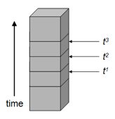
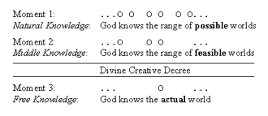

1.  **Creatio ex nihilo**

    1.  **Scriptural Data**

        1.  **Genesis 1:1 *In the beginning God created the heavens and the earth***

Is an independent sentence expressing creation out of nothing\
Is not a dependent part of Verse 2. This would be wrong: Verse 1,2:\
*“In the beginning, when God created the heavens and the earth, the earth was without form and void”\*
Wrong because:\
1 the word *bereshith* can be an absolute point in time\
2 the syntax of verse 1 does not dictate a subordinate clause\
3 creation out of nothing cannot be declared unbiblical if the verse in question would make it biblical\
4 G1:1 is not the typical dependent clause creation narrative: “*When @ was not yet, then God made @”*\
5 G1:1 stands out on purpose from the typical creation narratives and is therefore independent\
6 G1:1 as independent sentence matches the meriting style of the rest of Genesis 1

G1:1 just a chapter title? If so, creation would start at G1:3, when there was already formless stuff\
Better not a title: then actual creation starts at G1:1, and is creation of everything out of nothing\
True because of above 1, 3 and: Verses 1 and 2 are connected with “and”, thus same stream of thought

2.  **Affirmation of Creatio ex nihilo in other Old Testament Passages**

Isaiah 44:24: God made all things and was alone when he did\
Isaiah 45:18: God made the heavens and the earth\
Psalm 33:9: God spoke into existence\
Psalm 90:2: God existed before any stuff\
Job 26:7: God places the earth into “nothing”\
Proverbs 8:22-31: Wisdom was made before the material stuff

3.  **Affirmation of Creatio ex nihilo In Intertestamental Period**

2 Maccabees 7:28: God made heaven and earth out of what did not exist

4.  **Affirmation of Creatio ex nihilo In New Testament**

Romans 11:36: From/Through/To Him are all things\
Romans 4:17: God calls into existence the things that do not exist\
Hebrews 11:3: God created the universe by His command\
Revelation 4:11: God created all things by His will\
1 Corinthians 8:6: Jesus created all things for the Father\
John 1:1-3: Jesus was God and with God in the beginning and He created all things\
Colossians 1:15-17: everything, visible and invisible, stuff and living beings, was created by Jesus

2.  **Systematic Summary**

    1.  **Originating Creation and Continuing Creation**

Originating Creation brings something into existence for the first time\
Continuing Creation brings something into existence every moment after, it recreates it continually\
-\> that is traditional standard doctrine, but makes no sense really, since no endurance over time

2.  **Creation and Conservation**

Better categories:\
Creation brings something into existence for the first time\
Conservation preserves something in existence moment by moment

Creation defined more precisely:

> Something *(e)* comes into existence at a time *t* if and only if:\
> (i) *e* exists at *t*.\
> (ii) *t* is the first time at which *e* exists.\
> (iii) *e*’s existing at *t* is a tensed fact.

Conservation defined more precisely:

> God conserves *e* if and only if:\
> God acts upon *e* to bring about *e*’s existing from some time *t* until some later time *t\** through every sub-interval of *t* to *t\**.

3.  **Creation and the Dynamic (tensed) Theory of Time**

Dynamic (tensed) time: God is the conductor in a live Orchestra performance\
-\> God is in time, -\> definitions above apply

4.  **Problems With a Static (tenseless) View of Time**

Static (tenseless) time: God plays a DVD of the Orchestra performance and holds the remote\
-\> God is outside of time, -\> definitions above do not make sense

*Figure 1- A tenseless view of time*

5.  **Conservation and the Dynamic Theory of Time**

God conserving something over time implies that the something preserves identity, which matches dynamic time, but not static time. For static time we need to replace conserving with sustaining, but that has less scriptural support.

6.  **God’s Existing Timelessly without Creation**

God Himself relates to time as such:\
\* Without creation only the Trinity exists and does so timelessly\
\* At the moment of creation God enters dynamic time

2.  **Continuing Creation**

    1.  **Scriptural Data**

Col 1:16-17: in him all things hold together\
Hebrews 1:3: upholding the universe by his word\
Acts 17:28: for In Him we live and move and have our being

2.  **Concurrence**

God is literally the cause of everything that happens in the world\
Only by his “concurring with” or “agreeing with” does anything happen.\
Everything that happens is in line with his will and his eternal plan for the world

3.  **\**

4.  **Providence**

God’s governance of the world in such a way as to achieve his purposes\
His sovereignty over the world and human affairs in the world according to His plan

1.  **Scriptural Data** (summary by D.A. Carson, Divine Sovereignty and Human Responsibility)

    1.  **Divine Supremacy / Sovereignty**

\(1\) God is the Creator, the Ruler and the Possessor of all things\
(2) God is the ultimate personal cause of all that happens\
(3) God’s election or choosing of his people to be saved\
(4) God is the unacknowledged source of good fortune or success

2.  **Human Freedom**

\(1\) people face a multitude of divine exhortations and commands\
(2) people are said to obey, believe and choose God\
(3) people sin and rebel against God\
(4) people’s sins are judged by God – God holds them morally responsible for their sins and punishes them\
(5) people are tested by God\
(6) people receive divine rewards for their obedience\
(7) the elect are responsible to respond to God’s initiative; in other words, God’s election is not just unilateral but the elect have the responsibility to respond to God’s gracious initiative,\
(8) prayers are not mere showpieces scripted by God – this is especially evident in the Imprecatory Psalms where the psalmist is crying out in anger to God\
(9) God literally pleads with sinners to repent and be saved.

2.  **\**

3.  **Systematic Summary**

    1.  **Calvinism**

“universal divine causal determinism”: people do not freely choose, but always do exactly what God planned; He shapes our desires such that when we do what He planned, it does not feel forced but feels like it is what we want / decide (“compatibilist freedom”), but really God made the decision for us before time began. *Calvin: “we hold that God is the disposer and ruler of all things, – that from the remotest eternity, according to his own wisdom, he decreed what he was to do, and now by his power executes what he decreed. Hence we maintain, that by his providence, not heaven and earth and inanimate creatures only, but also the counsels and wills of men are so governed as to move exactly in the course which he has destined.”* (Inst. 1.16.8)

Logical chain: God’s knowledge -\> His decree -\> His execution of the plan -\> man’s will -\> man’s actions

God controls circumstances outside and inside our brain.

2.  **Arminianism**

**“**incompatibilist view of human freedom”: We choose freely, God foreknows our choices, God declares our choices to be His plan.

Logical chain: man’s will -\> man’s actions -\> God’s knowledge -\> His decree -\> His concurrence

3.  **Molinism**

“God decrees freedom permitting circumstances”: Peoples free choices reduce the set of logically possible worlds to the set of feasible worlds. God chooses from those the one He desires, which includes actively shaping each person’s moment by moment circumstances such that our free choices align as much as possible with God’s purposes.

Logical chain: man’s will in any feasible world -\> man’s actions in any feasible world\
-\> God’s knowledge incl. effects of shaping circumstances in any feasible world\
-\> His picking the best feasible world -\> His decree\
-\> His concurrence with free will but incl. ideally shaping circumstances\
-\> man’s will and actions as in the foreknowledge of the picked feasible world

God controls circumstances only outside our brain. E.g. power outlet covers to prevent baby tampering

iv\) God changed his mind?\
i.e. Nineveh first pronounced to be destroyed, after Jonah’s preaching Nineveh is saved\
or Israelites pronounced to be destroyed, but not after Moses prayer\
or names erased from book of life\
in principle God always gives mercy to the repentant sinner, He is free to not talk about that when a sinner is still sinning.

4.  **Assessment of the Different Views of Divine Providence**

    1.  **Calvinism and Universal Divine Causal Determinism**

\* Is unable to logically explain Divine Sovereignty and Human Freedom, compatibilist freedom is not real freedom to do other than chosen.

\* Cannot be rationally affirmed. Because if true, then belief that true is not based on logical analysis but on determinism. So it couldbe true, but can not be known to be true – no rational reasons for it.

\* Makes God the author of sin, since He is the ultimate cause of all human action, including sins. Thus humans are not morally accountable for their actions.

\* Nullifies human agency, God is the only agent in the universe, we are only marionettes

\* Makes reality into a farce

2.  **Arminianism**

**\*** Is unable to logically explain Divine Sovereignty and Human Freedom, free will foreknown at the point of creating this particular world, removes God’s ability to plan other than what He simply knows will happen.

3.  **Molinism**

\* Is able to logically explain Divine Sovereignty and Human Freedom: God does plan every little detail of each person’s life circumstances before he creates the world. Then he creates it in a way that does give people genuine free will.

? But God does not really have control – people decide on their own.\
Not really, people do way their options. By causing different options to exist God can indirectly influence many decisions (but not all).

? But God has too much control, not distinguishable from Calvinism, since there are infinitely many circumstances He could vary.\
Not really, there are only a finite amount of circumstances since they need to be able to affect causally the person making a decision, so a change far away or in the future makes no difference. And even if, people would still have genuine free choice.\
The only problem would be that middle knowledge cannot be used to declare worlds as infeasible, e.g. those where there is evil.

5.  **Miracles**

    1.  **Ordinary Providence and Extraordinary Providence**

Ordinary Providence: God’s governance of the world through natural causes and natural laws\
Extraordinary providence: God’s special miraculous act\
i) special providence through natural causes ii) genuine miracles\
Prayer makes a difference! ... in both cases

2.  **Scriptural Data** … lots!

3.  **19th Century Collapse of Belief In Miracles** (what happened)

Gottfried Less: i) show an event really happened ii) show that it was really miraculous\
ii) no, naturalistic explanation instead (Jesus’s apparent death, walking on floating wood)\
i) no, legends instead

4.  **18th Century Crucible – The Attack on Miracles** (why it happened)

    1.  **The Newtonian World Machine** 1687

Deists: The world is like a gigantic clock, made and wound up by God and now operates according to Newtonian natural laws as a deterministic machine with no need for God to do anything, especially not miracles. But the design of the machine is evidence for God’s existence.

2.  **Benedict de Spinoza** (miracles are impossible) 1670

Deist: God knows everything that happens and wills everything that happens – both his knowledge and will are identical and both flow from his perfect nature. From them logically follow the natural laws that are thus also an expression of Gods perfect nature. A miracle would be an act of God in violation of natural laws and thus in violation of his own nature: impossible.

Actually believing in God violating natural laws through miracles would undermine God’s perfection and drive people to atheism.

3.  **David Hume** (miracles con not be identified as such) 1738

Rational belief should be held with a degree of certainty matching the probability that the evidence warrants.

EVEN IF miracles would have 100% certain evidence for them, still it would be counterbalances by the 100% certain mountain of evidence that the laws of nature are unchangeable, so miracles cannot violate them. With both sides 100% certain, one should at most be agnostic.

BUT IN FACT, the evidence for miracles is very far from certain, not even convincing:\
i) no miracle in history is attested by a sufficient number of educated and honest men who are of such social standing that they would have a great deal to lose by lying\
ii) people crave the miraculous and they will believe absurd stories as the abundance of false miracle tales proves\
iii) miracles occur only among barbarous peoples\
iv) all religions have their miracle claims and therefore they cancel each other out because they support contradictory doctrines

“The only true miracle is that people can be stupid enough to believe in Christianity” -Hume

5.  **The Defense of Miracles**

    1.  **Contra The Newtonian World Machine**

The world is not really deterministic.\
Personal experience tells us otherwise and so does Quantum Mechanics: there is never an exact place and time we can measure for any particle. There is an inherent probabilistic uncertainty (Heisenberg).

And a miracle is NOT a violation of natural laws, with a miracle God is not breaking a law like we might break a law by stealing – an intended ugly association.\
**Natural laws of nature are idealizations** that describe what will happen if no natural or supernatural factors are interfering with the idealized conditions stated in the law.\
**A miracle is a naturally impossible event**, i.e. an event which lies outside of the causal powers of nature at that particular time and place (e.g. both special providence and genuine miracles).

What makes a miracle possible? The existence of God. Thus to deny the possibility of miracles one has to show that it is impossible for God to exist. Thus have to show that all natural theology arguments for God are wrong. (Leibnitz, Kalam, Design, Moral, Ontological, InformationOrigin arguments, etc.).

2.  **Contra Spinoza**

God’s knowledge actually does not flow from His nature. God has free will and could have made a different universe or no universe at all. And then His nature would be the same but His knowledge different. So while it is part of this nature to necessarily know everything that is true, the actual content of His knowledge is contingent, based on what He decided to create.

God is not simple, his nature, knowledge and will are distinct\
-\> natural laws are not a logical chain from His nature\
-\> God performing a miracle does not contradict His nature\
-\> God’s perfection is not undermined, no reason for atheism

3.  **\**

4.  **Contra Hume**

“extraordinary events require extraordinary evidence.” NO! Winning the lottery is extraordinary. And we can believe an ordinary newspaper that we got the winning number.

The probability that evidence warrants is not only how well and reliably it explains the alleged miracle, but also how hard it is to explain the evidence if the alleged miracle did not happen:\
Bayes Theorem Odds form:\
**Pr**obability(**M**iracle) = **Pr**(**M**iracle Is True(**ev**idence & **b**ack**g**round)) / **Pr**(~~**M**iracle~~(**ev**. & **bg**.))

= Pr(M(bg)) / Pr(~~M~~(bg)) \* Pr(Ev(M & bg)) / Pr(Ev(~~M~~ & bg))

e.g. M = winning lottery number in newspaper

Pr(M(bg)): low: 1 in 13 million

Pr(~~M~~(bg)): high: so many other numbers could be written

Pr(Ev(M & bg)): very high: the editor will wanted get the number correctly copied

Pr(Ev(~~M~~ & bg)): very low: the error checking for this highly sensitive number would have to have failed

- Total probability that the number is correct: quite high, second two outweigh first two

e.g. M = God raised Jesus from the dead

Pr(M(bg)): not low: God could do this, no one can keep Him from doing it, if Jesus really was divine as he said, then God would want to raise Him more than anyone else

Pr(~~M~~(bg)): not high: only high if God does not exist, but that would require refuting all natural theology argumints for God

Pr(Ev(M & bg)): high: the death, burial, empty tomb and seen alive reports fit M & bg

Pr(Ev(~~M~~ & bg)): low: no good naturalistic explanation for the death, burial, empty tomb and seen alive reports

- Total probability that the number is correct: very high

In addition any evidence for natural laws never being broken is irrelevant, since miracles do not break them.\
-\> Hume’s EVEN IF argument completely fails, evidence can establish a Miracle\
-\> Hume’s BUT IN FACT argument completely fails, evidence for the resurrection is excellent, and the 4 general complains about miracles do not apply: for a specific miracle the specific evidences need to be examined

6.  **\**

7.  **Angels and Demons**

    1.  **Angels**

        1.  **Reason for Angels**

Heb 1:14: angels were created as ministering spirits who serve God in the plan of salvation for humanity

Isaiah 6:3: angels were created to serve in glorifying God

angels were created as indicators of his presence in the universe

Not as mediator between spiritual and material realm, since it would start a chain of mediators of mediators – not needed since we can talk to God directly

2.  **Nature of Angels**

**Angels are created beings** Colossians 1:16: “in him all things were created, in heaven and on earth, visible and invisible, whether thrones or dominions or principalities or authorities – *all things were created* through him and for him.”

**Angels are too many to count** Daniel 7:10 “ … ten thousand times ten thousand stood before Him … ”\
Hebrews 12:22 “…innumerable angels in festal gathering”

**Angel ranking: Satan \> Archangel \> Angel**\
Daniel 10:12-14a The regular angel needed Michael’s help in fighting the Prince angel\
Jude 9: “… archangel Michael, vs. devil, … did not presume to pronounce a reviling judgment upon him, but said, ‘The Lord rebuke you.’”

**Angels are “in” time** and **Angels cannot be in 2 places an once** Daniel 10:12-14 the prayer answering angel was delayed for 3 weeks because he fought the Prince angel

**Angels are very powerful** 2 Thessalonians 1:7 “… His mighty angels in flaming fire”\
2 Kings 19:35 “the angel of the LORD … slew 185,000 in the camp of the Assyrians …”

**Angels can choose to be seen or not on a per person basis**\
2 Kings 6:8-18 Even when present they can choose to be seen or not on a per person basis

**Angels can appear/disappear without traveling** Acts 12:5-10 the angel appeared in the prison

**Some Angels are very wise** Samuel 14:20: “the wisdom of the angel of God to know all things that are on the earth” (weak, since “the angel of God” could be God himself)

**Angels have a spirit nature**: Hebrews 1:14 “they are all ministering spirits”

**Angels can appear in human form**:\
Judges 13:8-20: Manoah first did not even recognize the angel as such, thought he was a regular person\
Hebrews 13:1-2: “… show hospitality to strangers, for thereby some entertained angels unknowingly”

**Angels can appear in female human form** Zechariah 5:9 Then I looked up and saw two women approaching with the wind in their wings. Their wings were like those of a stork (weak, because this is part of a vision, in which not everything must be real)

**Angels are persons with free will**

**Angels are NOT**:\
not people that died and became angels and grew wings,\
not all angels when manifesting physically have wings,\
but not past-eternal, not necessarily existing, not infinitely perfect, not having innate knowledge

3.  **Work of Angels**

**Angels guide the destiny of nations** Daniel 10:13-20: Persia, Israel, and Greece

**Angels minister to the people of God** “ministered” is typically “to serve drink and food.”**\**
Hebrews 1:14: “Are they not all ministering spirits sent forth to serve, for the sake of those who are to obtain salvation?”\
e.g. 1 Kings 19:5-8: An angel helps Elijah flee\
Matthew 4:11: “The devil left him, and behold, angels came and ministered to him.”\
Luke 22:43, “And there appeared to him an angel from heaven, strengthening him. And being in an agony he prayed more earnestly; and his sweat became like great drops of blood falling down to the ground.”\
Psalm 91:9-12: “\[…\] He will give his angels \[…\] to guard you in all your ways \[…\]”

**Angels execute God’s justice** 2 Kings 19:35, “And that night the angel of the LORD went forth, and slew a hundred and eighty-five thousand in the camp of the Assyrians; and when men arose early in the morning, behold, these were all dead bodies.”\
Acts 12:21-23: “On an appointed day Herod put on his royal robes, took his seat upon the throne, and made an oration to them. And the people shouted, “The voice of a god, and not of man!” Immediately an angel of the Lord smote him, because he did not give God the glory; and he was eaten by worms and died.”\
2 Thessalonians 1:7-8 “\[…\] Jesus \[…\] with his mighty angels in flaming fire, inflicting vengeance upon those who do not know God \[…\]”\
Revelation 16:1“\[…\] a loud voice \[…\] telling the seven angels, ‘Go and pour out on the earth the seven bowls of the wrath of God.’”

**Angels will gather and accompany Christians at the second coming of Christ**\
Matthew 24:29-31: “\[…\] after the tribulation \[…\] He will send out his angels with a loud trumpet call, and they will gather his elect from the four winds, from one end of heaven to the other.”\
Matthew 25:31 “When the Son of man comes in his glory, and all the angels with him \[…\]”\
1 Thessalonians 4:14-17 \[…\] the Lord himself will descend from heaven \[…\] with the archangel’s call \[…\]”\
2 Thessalonians 1:7-8 “\[…\] Jesus \[…\] with his mighty angels in flaming fire, inflicting vengeance upon those who do not know God \[…\]”

**Angels were involved in the giving of the law** Acts 7:53 “You who received *the law as delivered by angels* and did not keep it.” Hebrews 2:2-3 “For if the *message declared by angels* was valid and every transgression or disobedience received a just retribution, how shall we escape if we neglect such a great salvation?”

**Michael** Daniel 10:13, 21 “\[…\] Michael, **one of the chief princes**, came to help me, so I left him there with the prince of the kingdom of Persia \[…\] what is inscribed in the book of truth: there is none who contends by my side against these except Michael, your prince.”\
Daniel 12:1-2 “At that time shall arise Michael, **the great prince who has charge of your people**. \[…\] at that time your people shall be delivered, every one whose name shall be found written in the book. And many of those who sleep in the dust of the earth shall awake, some to everlasting life, and some to shame and everlasting contempt.”\
Jude 9: “… archangel Michael, vs. devil, … did not presume to pronounce a reviling judgment upon him, but said, ‘The Lord rebuke you.’”\
Revelation 12:7-8 says, “Now war arose in heaven, Michael and his angels **fighting against the dragon**; and **the dragon** and his angels fought, but they **were defeated** and there was no longer any place for them in heaven.”

**Gabriel** Daniel 8:16-17 “\[…\] I heard a man’s voice \[…\] “Gabriel, make this man understand the vision.” So he came near where I stood; and when he came, I was frightened and fell upon my face. But he said to me, “Understand, O son of man, that the vision is for the time of the end.””\
Daniel 9:20-22 “\[…\] while I was speaking in prayer, the man **Gabriel, whom I had seen in the vision** at the first, came to me **in swift flight** at the time of the evening sacrifice. He came and he said to me, “O Daniel, I have now come out **to give you wisdom and understanding**.””\
Luke 1:19-20: “And the angel answered him, “I am Gabriel, **who stand in the presence of God**; **and I was sent to speak to you**, and **to bring you this good news**. And behold, you will be silent and unable to speak until the day that these things come to pass, because you did not believe my words, which will be fulfilled in their time.””\
Luke 1:26-27 “the angel **Gabriel was sent from God** to a city of Galilee named Nazareth, **to** a virgin betrothed to a man whose name was Joseph, of the house of David; and the virgin’s name was **Mary**.”

2.  **Satan and the Demons**

    1.  **Names of Satan**

Satan\
Devil – Diabolos, The adversary\
Beelzebub –– from Baal-Zebub\
Beelzebul – lord of the flies\
Prince of demons, Prince of the air\
Ruler of the world – god of this world – god of this age\
Murderer\
Liar – Father of Liars – Father of lies, The tempter – deceiver\
The dragon, The serpent - ancient serpent\
The evil one - The wicked one\
The accuser, The slanderer\
Angel of light – 2 Cor 11:14\
The enemy\
Lucifer?

2.  **Origin of Satan** (part 23-24)

No principal eternal God vs. Satan. No ying-yang.\
Satan is part of all that was created, he depends in his existence on God: Colossians 1:15-16

Isaiah 14:12-17 is about the king of Babylon\
Ezekiel 28:11-19 is about the king of Tyre

Job 1:6 Sons of God with Satan before the LORD. Satan: “I’ve come from going to and fro upon the earth.”

Luke 10:17-18: I saw Satan fall like lightning from heaven

Some angels have sinned: 2 Peter 2:4: “For if God did not spare the angels when they sinned, but cast them into hell and committed them to pits of nether gloom to be kept until the judgment . . .”

Jude 6: “And the angels that did not keep their own position but left their proper dwelling have been kept by him in eternal chains in the nether gloom until the judgment of the great day.”

Satan was prideful: 1 Timothy 3:6 “must not be a recent convert, or he may be puffed up with conceit and fall into the condemnation of the devil;”

1 John 3:8 “He who commits sin is of the devil; for the devil has sinned from the beginning. The reason the Son of God appeared was to destroy the works of the devil.”

Elect angels: 1 Timothy 5:21 says, “In the presence of God and of Christ Jesus and of the *elect angels* I charge you to keep these rules without favor, doing nothing from partiality.”

Genesis 1:1 In the beginning God created the heavens and the earth (+ Satan is a created angelic being)\
Genesis 1:28 (Day 6): Be fruitful, multiply, fill the earth.\
Genesis 1:31 (Day 6 end) all that He had made, and it was very good\
Genesis 2:1 all creation was completed reconfirmation that Satan must be around)\
Genesis 3 Now the serpent was … (the fall)\
… So Satan was created before day 6, likely on day 1, as part of the heaven and earth. And he was part o the day six state of “everything was very good”, so Satan should still have been before his fall there. As the father of all lies he must have been around in Genesis 3 to use or possess the serpent, and this must have been after the angelic fall. But on So Satan’s fall was between day 6 and the fall. Be fruitful was the first command which Adam and Eve are not reported to have broken, so likely there was only a one month window between day 6 and the fall.

3.  **Nature of Satan and Demons** (part 24-25)

Demons are **intelligent personal beings**: Acts 16:16-18\
Satan is **deceitful and clever** 2 Corinthians 11:3, 13-15; Revelation 12:9\
Demons are **evil spirits that can possess people**: Luke 10:17-20\
Demons are **demonic spirits**: Revelation 16:14a

Demons are **malevolent/evil/unclean**: Matthew 12:43-45; Mark 1:27; Mark 3:11; Acts 8:7; 1 John 3:8; John 17:15; Matthew 6:13;

Demons have **levels of authority**: Ephesians 6:12; Jude 8-10; 2 Peter 2:10-11\
Satan has authority over the earth: 1 John 5:19

Demons **can possess people and make them super strong**: Mark 5:1-4; Acts 19:13-16;

Demons **must submit to the authority of Jesus’ name**: Mark 5:7-13; Luke 10:17

Demons **know they will be cast into hell**: Matthew 8:29

Demons **can oppress Christians**, so stay away from anything occultist or new-age.

“Demon of fear” or “Demon of low self-esteem” are not real, do not have any scriptural basis

4.  **Destiny of Demons**

they **are defeated creatures**: John 12:31-32; Colossians 2:14-15

they **will end up in the lake of fire**: Revelation 20:10; Matthew 25:41

5.  **Work of Demons**

try to **destroy the servants of God**: 1 Thessalonians 3:5; 2 Corinthians 2:11; 1 Timothy 3:6-7

**blind unbelievers’ eyes to the Gospel**: 2 Corinthians 4:3-4; 2 Timothy 2:24-26

try to **nullify the preaching of the kingdom of God**: Mark 4:15

**possess people**: John 13:27; Mark 1:32; Luke 9:42

**accusing believers before God**: Revelation 12:10

**harass God’s servants**: 1 Thessalonians 2:18; 1 Peter 5:8

6.  **Work of Demons: the Nephilim**

The Nephilim (“fallen ones, giants”) were the offspring of sexual relationships between the sons of God and daughters of men in [Genesis 6:1–4](http://biblia.com/bible/esv/Genesis%206.1%E2%80%934). There is much debate as to the identity of the “sons of God.” It is our opinion that the “sons of God” were fallen angels (demons) who mated with human females. These unions resulted in offspring, the Nephilim, who were “heroes of old, men of renown” ([Genesis 6:4](http://biblia.com/bible/esv/Genesis%206.4)). According to Hebraic and other legends (the Book of Enoch and other non-biblical writings), they were a race of giants and super-heroes who did acts of great evil. Their great size and power likely came from the mixture of demonic “DNA” with human genetics.

What happened to the Nephilim? The Nephilim were one of the primary reasons for the great flood in Noah’s time. Immediately after the mention of Nephilim, God’s Word says, “The LORD saw how great man’s wickedness on the earth had become, and that every inclination of the thoughts of his heart was only evil all the time. The LORD was grieved that he had made man on the earth, and his heart was filled with pain. So the LORD said, ‘I will wipe mankind, whom I have created, from the face of the earth—men and animals, and creatures that move along the ground, and birds of the air—for I am grieved that I have made them’” ([Genesis 6:5–7](http://biblia.com/bible/esv/Genesis%206.5%E2%80%937)). God proceeded to flood the entire earth, killing everyone and everything other than Noah, his family, and the animals on the ark. All else perished, including the Nephilim ([Genesis 6:11–22](http://biblia.com/bible/esv/Genesis%206.11%E2%80%9322)).

Were there Nephilim after the flood? [Genesis 6:4](http://biblia.com/bible/esv/Genesis%206.4) tells us, “The Nephilim were on the earth in those days—and also afterward.” It seems that the demons repeated their sin sometime after the flood as well. However, it likely took place to a much lesser extent than it did prior to the flood. When the Israelites spied out the land of Canaan, they reported back to Moses: “We saw the Nephilim there (the descendants of Anak come from the Nephilim). We seemed like grasshoppers in our own eyes, and we looked the same to them” ([Numbers 13:33](http://biblia.com/bible/esv/Numbers%2013.33)). This passage does not say the Nephilim were genuinely there, only that the spies *thought* they saw the Nephilim. It is more likely that the spies witnessed very large people in Canaan and in their fear believed them to be the Nephilim. Or it is possible that after the flood the demons again mated with human females, producing more Nephilim. It is even possible that some traits of the Nephilim were passed on through the heredity of one of Noah’s daughters-in-law. Whatever the case, these “giants” were destroyed by the Israelites during their invasion of Canaan ([Joshua 11:21–22](http://biblia.com/bible/esv/Joshua%2011.21%E2%80%9322)) and later in their history ([Deuteronomy 3:11](http://biblia.com/bible/esv/Deuteronomy%203.11); [1 Samuel 17](http://biblia.com/bible/esv/1%20Samuel%2017)).

What prevents the demons from producing more Nephilim today? It seems that God put an end to demons mating with humans by placing all the demons who committed such an act in isolation. Jude verse 6 tells us, “The angels who did not keep their positions of authority but abandoned their own home—these he has kept in darkness, bound with everlasting chains for judgment on the great Day.” Obviously, not all demons are in “prison” today, so there must have been a group of demons who committed further grievous sin beyond the original fall. Presumably, the demons who mated with human females are the ones who are “bound with everlasting chains.” This would prevent any more demons from attempting such sin.

7.  **Christian Response to Demons**

Stay away from anything glorifying demons or witchcraft: [Deuteronomy 18:9–12](http://biblia.com/bible/esv/Deuteronomy%2018.9%E2%80%9312)\
Practicing witchcraft under the Mosaic Law was death ([Exodus 22:18](http://biblia.com/bible/esv/Exodus%2022.18); [Leviticus 20:27](http://biblia.com/bible/esv/Leviticus%2020.27))\
Saul was initially blessed by God, but no longer after consulting a medium: [First Chronicles 10:13](http://biblia.com/bible/esv/First%20Chronicles%2010.13)

In the New Testament, “sorcery” is translated from the Greek word *pharmakeia*, from which we get our word *pharmacy* ([Galatians 5:20](http://biblia.com/bible/esv/Galatians%205.20); [Revelation 18:23](http://biblia.com/bible/esv/Revelation%2018.23)). Witchcraft and spiritism often involve the ritualistic use of magic potions and mind-controlling drugs. Using [illicit drugs](http://www.gotquestions.org/sin-drugs.html) can open ourselves up to the invasion of demonic spirits. Engaging in a practice or taking a substance to achieve an altered state of consciousness is a form of witchcraft.

Narnia vs. Harry Potter: In Narnia the humans never engage in witchcraft, and ask Aslan for supernatural help. Harry Potter, a human, engages in witchcraft and is portrait as role model hero to identify with and to strive to copy.

we should **submit to God and resist the devil**: James 4:7

**watch and pray**: Matthew 26:41

we need to **clothe ourselves with the full armor of God:** Ephesians 6:11-18

Ask “What would Jesus do?” is not enough, since it takes a lifelong effort to build a Christ-like character to be able actually do what Jesus would do. This character building comes from **wearing the full armor of God: involves seeking truth, righteousness, gospel, faith, salvation, indwelling of the Holy Spirit, knowledge of the Word.**
