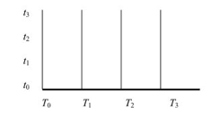

Transcript of William Lane Craig's [Defenders 2](http://www.reasonablefaith.org/defenders-2-podcast) class.

Today we begin a new section on our survey of Christian doctrine entitled the Doctrine of Creation.

# Creatio ex nihilo

## Scriptural Data

### Genesis 1

First we want to look at the biblical material pertinent to the Doctrine of Creation. I would invite you to take your Bibles and to turn to the very first book of the Bible, the book of Genesis, the very first chapter and the very first verse. Genesis 1:1, the first verse of the Bible, says ***“In the beginning God created the heavens and the earth.”*** With that terse and majestic statement, the author of Genesis 1 differentiated his outlook from all of the ancient creation stories of Israel’s neighbors. The expression “the heavens and the earth” denotes in Hebrew the total of physical reality. Hebrew had no word for “the universe” so when they wanted to express the totality of physical reality, they would use this expression “the heavens and the earth.” So verse 1 says simply “In the beginning God created the universe.”

Notice that there is no preexistent material that is presupposed. We find no warring gods, no primordial dragons, as we do in other ancient creation myths; only God who simply creates the universe. The word for create there is *bara*, a word which is used with only God as its subject and which does not presuppose any kind of material substratum – it does not presuppose a material cause in addition to God who is the efficient cause, who simply creates his effects. So at face value, at least, the opening line of the Bible seems to teach the doctrine of **creatio ex nihilo**, that is to say, **creation out of nothing**. It was certainly understood in this way by later biblical authors as we will see in a minute. But many modern commentators have denied this face value reading of Genesis 1:1. Usually their claim will be that verse 1 should not be read as an independent clause. Rather, verse 1 is a subordinate clause that modifies verse 2. So the passage should properly be translated ***“When God created the heavens and the earth in the beginning”*** or ***“In the beginning, when God created the heavens and the earth, the earth was without form and void”*** and so forth. In that way it might appear that God’s creation of the world was not a creation out of nothing but it was simply fashioning an orderly cosmos out of this preexistent chaotic state which was without form and void. This issue has been long discussed and it seems to me that Claus Westermann, in his very thorough discussion of this text in his commentary on the book of Genesis[\[1\]](http://www.reasonablefaith.org/defenders-2-podcast/transcript/s8-01#_ftn1), has convincingly shown that verse 1 should be understood to be an independent clause rather than a subordinate clause. Let me summarize Westermann’s five main points.

Number one, the first point that he makes is that there is **no evidence that the word *bereshith*** – which means “in the beginning”, the verse begins bereshith bara elohim or “in the beginning God created” – **can’t be used in an absolute state at the beginning of a sentence to indicate a point in time**. For example, he says, Isaiah 46:10 appears to use *bereshith* to indicate such an absolute beginning.[\[2\]](http://www.reasonablefaith.org/defenders-2-podcast/transcript/s8-01#_ftn2) In Isaiah 46:9-10 it speaks of “I am God, and there is none like me, declaring the end from the beginning” and there it appears to be an absolute beginning that is meant. So a definite article with the word *bereshith* is not necessary in order to indicate an absolute definite beginning point. *Bereshith* can indicate an absolute beginning point in time. Confirmation of this conclusion, Westermann says, comes from the oldest textual witnesses that we have to Genesis 1:1. He speaks here, for example, of the Masoretic punctuation. When the Masoretic text of Hebrew was produced in which the vowel points and the punctuation was introduced into the consonants, they punctuated verse 1 as an independent clause and not as a subordinate clause. Similarly, the oldest translations of the Hebrew text render verse 1 as an independent clause. Undoubtedly he is thinking there of the Septuagint which is the translation of the Hebrew Old Testament into Greek which treats verse 1 as an independent sentence. And finally, the New Testament as well took verse 1 as a main clause and *bereshith* as designating an absolute beginning. One thinks, for example, of John 1:1, *“In the beginning was the Word and the Word was with God and the Word was God.”* So the Masoretic punctuation, the oldest translations of the Hebrew text and the New Testament all took verse 1 to be an independent clause with *bereshith* designating an absolute beginning. That is the first point.

The second point Westermann makes is that **the syntax of verse 1 does not prove that *bereshith* is part of an adverbial construct chain as it would be in a subordinate clause**. He says an argument that is often given in favor of taking verse 1 as a subordinate clause is that you have an identical construction appearing in Hosea 1:2 which expresses such a circumstantial idea. In Hosea 1:2 this same construction is translated *“When the LORD spoke at first through Hosea”*, etc, etc. Westermann points out, however, that this argument is inconclusive because, after all, Genesis 1 has to be read in the context of the book of Genesis, not of Hosea. The book of Hosea is written by a different author at a different time in history for a different audience and so it is quite illegitimate to impose it upon the book of Genesis. You need to read the book of Genesis in its own context. When we do this he points out that in Genesis 5:1, when the author wishes to express a circumstantial idea, he uses a grammatical form that is called an infinite construct which is the usual form for such circumstantial clauses. In Genesis 5:1 it says, *“When God created man, he made him in the likeness of God.”* So it really is Hosea’s syntax that is unusual and it provides no grounds for re-interpreting Genesis 1:1 in its light. The author of Genesis 1:1, had he wished to express a circumstantial idea, would have used the normal infinite construct just as he did in chapter 5, verse 1. That’s the second point.

The third point that Westermann makes is that theological arguments alone cannot resolve this question simply because that presupposes we already understand verses 1 to 3. So **you cannot say that the idea of an absolute beginning or creation out of nothing would have been theologically unintelligible for ancient Hebrews** – you can’t avoid an exegesis of these verses in order to determine their meaning. You have to first understand them before you can decide what is and is not possible theologically. \[**Creation out of nothing cannot be declared unbiblical if the verse in question would make it biblical**.\] This exegesis has to be carried out within the context of the chapter and then the wider context of ancient creation narratives.[\[3\]](http://www.reasonablefaith.org/defenders-2-podcast/transcript/s8-01#_ftn3) That’s the third point – theological arguments alone can’t resolve the issue.

The fourth point that Westermann makes is when we do carry out such an exegesis within the wider context of ancient creation stories what you discover is that **Genesis 1:1 is unique**. It is **without parallel in ancient creation myths**. The usual form of these ancient creation myths according to Westermann was as follows: “When \_\_\_\_\_ was not yet, then God made \_\_\_\_\_.” This was the typical way these myths were formulated – “When \_\_\_\_\_ (and you fill in the blank) was not yet, then God made \_\_\_\_\_.” The first clause would express the state of affairs prior to God’s action and then the second clause would describe God’s subsequent activity in making something out of that state. Interestingly enough, we find this very typical narrative form in the second chapter of Genesis verses 5 to 7. Genesis 2:5-7 says, *“When no plant of the field was yet in the earth and no herb of the field had yet sprung up . . . then the LORD God formed man,”* etc, etc. So according to Westermann, this was the more typical form of ancient creation stories. He believes that the author of Genesis 1 took this typical formula “when \_\_\_\_\_ was not yet” and he made this Genesis 1:2 *– “the earth was without form and void and darkness was upon the face of the deep and the Spirit of God was moving over the face of the waters.”* Then he took the typical formula “then God made” and he made that verse 3, *“and God said let there by light.”* So in verses 2 and 3, you have a vestige, or a reflection, of this typical ancient creation narrative formula “When \_\_\_\_\_ was not yet then God made \_\_\_\_\_.” But the author then prefixed both of these with his own sentence in verse 1, *“In the beginning God created the heavens and the earth.”* Therefore, verse 1 is not a temporal subordinate clause. It lies completely outside the typical formula, the typical structure; it is the author’s own formulation. Westermann says, “It acquires a monumental importance which distinguishes it from other creation stories.”[\[4\]](http://www.reasonablefaith.org/defenders-2-podcast/transcript/s8-01#_ftn4) He says,

Verse 1 has no parallel in the other creation stories, while all three sentences of verse 2 are based on traditional material. The tradition history of the creation stories provides us with an answer to the question about the inter-relationship of the first verses of Genesis which is certain.[\[5\]](http://www.reasonablefaith.org/defenders-2-podcast/transcript/s8-01#_ftn5)

This fourth point that Westermann makes is that when you compare the structure of Genesis 1:1-3 with the other creation stories then he believes the answer to the question is certain that **verse 1 stands outside the typical formulaic structure and is an independent clause formulated by the author**.

Finally, the fifth point that he makes, number 5, is that **the style of the author of Genesis 1 favors taking verse 1 as a main clause**. He says it would be completely out of harmony with the author’s style in Genesis 1 to arrange the first three verses into one complete sentence.

Therefore, for all five of these reasons, the most plausible interpretation of verse 1 is that it is not a subordinate circumstantial clause. Rather, it **is a main clause and an independent sentence which asserts God’s creation of everything there is**.

As important as this conclusion is, it doesn’t yet decide the question decisively in favor of *creatio ex nihilo*. For now we have to consider the relationship of verse 1 to verses 2 and 3.[\[6\]](http://www.reasonablefaith.org/defenders-2-podcast/transcript/s8-01#_ftn6) Here it might be thought that what verse 1 does is simply describe the raw material out of which the earth and the rest of the world was made. In the beginning, God made the universe – he made the raw material – and then he fashions this into a world in verses 2 and following. But against this interpretation, it has been objected that the expression “heavens and the earth” in verse 1 doesn’t designate just sort of raw material but it designates an ordered cosmos. Also, the creation of chaos is a contradiction in terms. God doesn’t create a chaos. So the thought is that verse 1 doesn’t describe simply the raw material of the universe being created, rather, **perhaps verse 1 is to be thought of as a sort of title or heading to the chapter which summarizes the contents of what is described in verses 2 and following**. So *“in the beginning God created the heavens and the earth”* would be a sort of subheading or a title for what is then described in the rest of the chapter. And, on this understanding, creation itself actually only begins at verse 3 and maybe thought not to entail *creatio ex nihilo*. So we are right back to where we started again if we take verse 1 as simply a chapter title or heading. We are back to thinking of creation as really beginning with the earth in this formless and void state.

How should we assess this question? Against taking verse 1 to be merely a title or a chapter heading, I think it can be objected that the grammatical relationship between verse 1 and 2 then becomes an insuperable problem. For verse 1 is connected to verse 2 by the Hebrew word *waw*, which is the Hebrew word “and.” In the Hebrew it actually says “in the beginning God created the heavens and the earth and the earth was without form and void.” This “and”, this conjunction, indicates a relationship of connection between God’s primary act of creation and then his subsequent acts of creation. What is suggested by the Hebrew grammar has actually been rigorously proved by computer-aided grammatical analysis. My colleague John Sailhammer at Trinity Evangelical Divinity School carried out such a study and he said that the computer analysis shows that in Hebrew, whenever you have a construction that consists of *waw*, this conjunction “and”, plus a non-predicate and a predicate, like a subject and a verb, *waw* plus a non-predicate and a predicate, then the clause that precedes the *waw* furnishes either background information or circumstantial information to what follows, depending upon the relation of this construction to the main verb. Whenever this construction precedes the main verb, as it does in verse 2, then he says it is background information which is being given. So, accordingly, verse 1 is not simply a chapter heading or a title. Rather, it is a historical statement which gives background information to verse 2 so that it does mean that in the very beginning God created the heavens and the earth and then it goes on to describe what he does with the earth.

What about the **tension then between verses 1 and 2** that we mentioned before – **that heavens and the earth already denotes an orderly cosmos and that the creation of chaos would be a contradiction in terms**? I think that when you reflect on the meaning of the Hebrew words here that in fact the tension, I think, really doesn’t exist. We could take verse 1 to be universal in its scope and designate God’s creation of the entire cosmos and then what happens in verse 2 is a radical narrowing of the focus down to God’s creation of the earth, or some commentators have even suggested the land (that is, the Promised Land).[\[7\]](http://www.reasonablefaith.org/defenders-2-podcast/transcript/s8-01#_ftn7) So in the beginning God created the universe and then suddenly the focus dramatically narrows and the earth was without form and void, etc. So we have a general creation of the universe in verse 1 and then what is described in verse 2 and following is what God does with the earth. \[Ingmar: this interpretation is not necessary. A formless and void earth is still not chaos, it already exhibits orderly operation of all the natural laws God put in place.\]

As for the problem of chaos, the description of the earth as *“without form and void”*, or in the Hebrew *tohuwabohu*, in Hebrew this doesn’t connote a primordial chaos in the Greek sense. That is to say, a state of affairs in which there are no laws of nature in which anything can happen. That is not what is meant by *tohuwabohu*. Rather, it means that the earth was an uninhabitable wasteland or desert waste, a desert wilderness or something of that sort. That is how this word is normally used. In the succeeding verses what is described is God’s transforming this uninhabitable waste into a paradise for man to dwell in. So what we have described in verse 2 is not the creation of some sort of a chaos but rather it is the transformation of an uninhabitable earth into a paradise and a habitable place fit for human activity.

Someone might object to this interpretation of the first chapter by saying, well then what about the creation of the heavenly bodies in verse 14 where it says God says “Let there be lights in the firmament of the heavens” and it describes how God created the sun and the moon? Doesn’t that indicate that a more universal creation is in view after all and not simply the transformation of the earth into a habitable place for human beings? Well, that is the question that we will take up next time.[\[8\]](http://www.reasonablefaith.org/defenders-2-podcast/transcript/s8-01#_ftn8)

Read more: <http://www.reasonablefaith.org/defenders-2-podcast/transcript/s8-01#ixzz3JpXlY4x2>

# Doctrine of Creation (Part 2) 

Transcript of William Lane Craig's [Defenders 2](http://www.reasonablefaith.org/defenders-2-podcast) class.

We began discussing last time the Doctrine of Creation and specifically the topic of creation out of nothing – that God has made the universe and all that is in it without any sort of material cause. He, himself, is the cause of the matter and energy out of which physical things are made.

We began to look at the first chapter of the Bible in Genesis where it says, “In the beginning God created the heavens and the earth.” We saw that that, at face value, seems to teach creation out of nothing. God alone exists in the beginning and he created the universe. Some have sought to deny this by interpreting verse 1 as a subordinate clause rather than an independent clause, “*When* in the beginning God created the heavens and the earth, the earth was without form and void,” etc. But we saw from Claus Westermann a five point case for taking verse 1 to be an independent clause that, therefore, does teach a beginning of the universe.

We then inquired as to whether or not verse 1 might be taken to be merely a chapter title or a sort of heading – a summary of what transpires in the rest of the chapter. I argued against that because the verse includes, in the Hebrew, “and” – “God created the heavens and the earth *and* the earth was without form and void” indicating a chronological connection between verses 1 and 2. It is not simply a chapter title or a heading. On this interpretation we can take verse 1 to indicate that God, in the beginning, created all the matter and energy in the universe – he created the universe – and then in verse 2 the focus dramatically narrows to the earth and the remainder of the chapter describes how God then transformed the earth from an uninhabitable waste (which is what *tohuwabohu* in Hebrew indicates – an uninhabitable waste) into a paradise fit for human beings. \[Or there is no narrowing focus, God simply made the earth and its locally surrounding heavens first – a very straight forward reading not shown to be wrong by Craig.\]

Someone might object to this interpretation by saying that in verse 14 the creation of the heavenly bodies indicates that a universal creation is in view, after all, in the remainder of chapter 1, not simply the transformation of earth into a habitable place. Genesis 1:14-15 says,

*And God said, “**Let there be** lights in the firmament of the heavens to separate the day from the night; and let them be for signs and for seasons and for days and years, and let them be lights in the firmament of the heavens to give light upon the earth.” And it was so.*

However, it is very interesting that the Hebrew construction used here is not the same as in God’s previous creatural acts such as in verse 3 where it says, “And God said, ‘Let there be light’; and there was light” and verse 6, “And God said, ‘Let there be a firmament in the midst of the waters’,” etc. The construction here in the Hebrew is the word *hayah* plus an infinitive. What this literally means is “Let the lights in the firmament *be for* the marking of days and seasons and separation of day and night;” unlike the earlier passages of 3 and 6 where God says “let there be” these things. In verse 14 what it says is “let the lights in the firmament be for this purpose.” So what is described here is not the creation of the lights in the firmament but rather the designation of the purpose that they will serve marking seasons and times and so forth. It specifies what they are for and thereby already presupposes that they exist. It presupposes that the lights and the firmament are already there and then God declares their purpose.

Someone might say, well, that is well and good but look then at verse 16 and following where it goes on to describe God’s creation of these things.[\[1\]](http://www.reasonablefaith.org/defenders-2-podcast/transcript/s8-02#_ftn1) It says,

*And God **made** the two great lights, the greater light to rule the day, and the lesser light to rule the night; he **made** the stars also. And God set them in the firmament of the heavens to give light upon the earth, to rule over the day and over the night, and to separate the light from the darkness. And God saw that it was good. And there was evening and there was morning, a fourth day.*

So it might be said that verses 16-19 do countenance here God’s creation of the sun and the moon and the stars; we are not talking just about a transformation of the earth. We are talking here about a more cosmic creation. As powerful as this objection is, it overlooks a very interesting and intriguing feature of Genesis 1. That is the sort of duplex nature of the creation narrative in chapter 1. Many commentators have observed that Genesis seems to combine, or interweave, two patterns of creation. One is creation by God’s Word; the other is creation by God’s action. We see, for example, creation by his creative Word in verses 3, 6, 9 and 11. In verse 3, “And God said, ‘Let there be light’,” in verse 6, “And God said, ‘Let there be a firmament’,” in verse 9, “And God said, ‘Let the waters under the heavens’,” in verse 11, “And God said, ‘Let the earth bring forth vegetation,” and so on. This would be creation by God’s powerful Word – he speaks and these things are done. On the other hand, you have this other tradition, or pattern, of creation by his action that appears in verses 7, 12, 16, and 21. In verse 7, “And God made the firmament,” in verse 12, “The earth brought forth vegetation, plants yielding seed,” etc., in verse 16, “And God made the two great lights,” in verse 21, “So God created the great sea monsters and every living creature that moves.” How do you explain, or what is the explanation, for this odd duplex pattern that kind of duplicates itself in Genesis 1? You have creation by the Word and then creation by God’s act. What is the best explanation for this?

One explanation would be that the author of Genesis has taken two independent creation narratives and he has braided them together rather like a rope or a braid where you take these two traditions and you interweave them together. So you have Genesis 1 with a braid of these two traditions. On the other hand, the unity and the coherence of this chapter suggest an alternative explanation which might be more satisfactory in light of its coherence and unity. That could be that this duplex pattern is a pattern of report and the author’s commentary on it. For example, in verse 12 when it says, “The earth brought forth vegetation, plants yielding seed,” etc., it doesn’t actually describe something that God does. This is what the earth does; the earth brings forth these things. And verse 12 doesn’t really follow temporally on verse 11 because verse 11 says, “Let the earth bring forth vegetation” and it ends by saying “And it was so.” It was done. This happened. So verse 12 doesn’t follow temporally on what’s done in verse 11. Rather, verse 12 **is the author’s parenthetical commentary on the report given** in verse 11. God has said “Let the earth bring forth things” and then the author comments about this. Similarly, look at verse 15. Verse 15 also concludes “And it was so.” God says “Let the lights in the heavens be for the purpose of marking seasons and days and years” and it was so, indicating that this has been done. In that case, verses 16-18 would simply be the author’s commentary on this. He would be saying that it is God who made these things, unlike all of the creation myths of Israel’s neighbors.[\[2\]](http://www.reasonablefaith.org/defenders-2-podcast/transcript/s8-02#_ftn2) The sun and the stars and the moon are not astral deities. They are not gods or supernatural entities. They are just things that God made. He is saying God made them. That is all. There is a complete demythologizing here in Genesis 1 of nature that goes on. So it describes how God says, “Let the lights in the heavens be for this purpose” and then he makes the commentary “God made the great lights, God set them in the heavens, they are not deities, they are just things that God made.” This would make sense of what is otherwise the very, very peculiar problem that the sun and the moon would otherwise be created after the existence of day and night. You already have day and night in the first day where it says *“There was evening and there was morning. One day.”* And then you have the second day and the third day. So how can the sun not be created until the fourth day if there are already days and light and darkness – night and day – prior to this? This would make better sense of verses 16-18 then thinking that it wasn’t until the fourth day that God made the sun and the stars and the moon, because then you have got this inexplicable situation of day and night existing prior to the creation of the sun that the earth is illuminated by. If this is right, that would mean that verses 14 and following do not indicate that God actually created the heavenly bodies on the fourth day. Rather it is on the fourth day that God declares the function of these heavenly bodies in marking days and seasons and times and years which were of course very important for the religious life of Israel given that it followed a Sabbath pattern and there were certain feasts and things of that sort.

\[That is an interesting and believable view. However, it is a little complicated. God simply made the earth and its locally surrounding heavens first is much more straight-forward. Craig’s main issue with this is that there would be no days prior to day four. But on day one we have Gen 1:3 *“Let there be light”,* which could have been a directional light, and with the earth already rotating that would give light and dark from day one on. This view is preferable because it is less complicated and closer to the text.\]

If this makes sense then we can understand verse 1 as being universal in its scope. In the beginning, God created the cosmos, the universe, the heavens and the earth. Then verse 2 shifts radically down to the earth, narrows the focus, and the earth was without form and void and the rest of the chapter then describes God’s transformation of the earth into a habitable place for man and thereby the tension between verses 1 and 2 is removed. \[Or Verse one describes the creation of the earth and its local heavens, maybe even the angelic realm, and verse 2 continues with detail on the earth.\] It seems to me that \[in either case\] there is no good reason to interpret Genesis 1:1 any differently than it has normally been interpreted. Namely, it teaches that **God alone existed in the beginning and that he created everything else out of nothing**. That is the natural interpretation of the verse and it is the interpretation of the New Testament authors. If that interpretation is to be wrong then I think we would need to have some very powerful reasons for thinking otherwise – reasons which I do not think exist.

## Discussion

*Question:* **Does this mean that there was no actual creative act on the fourth day at all?** The fourth day was just about declaring a purpose for that which had already been created?

> *Answer:* Right. I asked my Old Testament colleague, John Sailhammer, about the Hebrew of this passage. I said, “John, it is never translated that way as far as I know. Are you absolutely certain that this is the way the Hebrew reads?” And he said, “Yes, there is no doubt. What it says is ‘Let the lights in the firmament be for’, etc, etc.” So it doesn’t *need* to be understood as an actual creative act on the fourth day.

*Question:* I heard an interesting interpretation of “evening and morning” the other day especially when you compare it to the commentary on this passage in the book of Exodus when they are using it to refer to the Hebrew’s work week. You work during the day and you sleep at night and you work again the next day. The evening and morning was not necessarily a literal evening and morning but saying God did his work then and, like the Hebrews, had an evening period of not working, then he gets back to work the next day and there was evening and morning and so forth. If that were the case – and I am not trying to make an argument for a long period of time between those, it is irrelevant to what I am saying – it would avoid the question of the sun and the moon having to be around from the beginning when God created the light.[\[3\]](http://www.reasonablefaith.org/defenders-2-podcast/transcript/s8-02#_ftn3)

> *Answer:* Yes. There are a number of interpretations of Genesis 1 that I think are open for the biblically faithful Christian. When we get to this section we will talk about this again more later on when we talk about origins. But my question for that view would be: then what is meant in verses 4 and 5 when it says that God separated the light from the darkness and he called the light day and the darkness he called night? That doesn’t just sound like his ceasing from work and then his beginning work again. It does sound to me there that they are talking about periods of daylight and periods of darkness.

*Question:* When you use the words “made” and “created”, are those words a process or an event?

> *Answer:* I don’t think that you can determine the meaning of words apart from the context. You need to see how they are used in the context. For example, it uses the same word “create” not only in verse 1, “For God created the heavens and the earth,” but when it talks about his creation of the sea monsters which is in verse 21, “So God created the great sea monsters and every living creature that moves.” Whereas elsewhere it uses the word “made” – “God made the firmament” and “God made the great lights” and so forth. But he created the sea monsters. I don’t think there the author means to be drawing some kind of significant distinction between “to make” and “to create.” It is not as though the firmament and the stars and so forth were made out of previous material but the sea monsters were created *ex nihilo*. It seems to me that you need to understand it in the context. And in the context it seems to me that verse 1 is talking about creation *ex nihilo* – creation out of nothing. It is the very beginning. But thereafter when he makes these things they could well be made out of material causes that are around that he then fashions into the thing that exists. For example, it says that he gathered the dust of the earth when he made man and then breathed into him the breath of life. He didn’t just make man *ex nihilo*.

*Question:* On the light appearing in verse 3 and then the sun and the moon appearing on the fourth day, some have suggested that God is the light initially and creates this pattern and then subsequently creates the sun and the moon. Can you solidify that?

> *Answer:* Yeah, I don’t know. I find that hard to believe because it says in verse 5, “God called the light ‘day.’” God is not literally photons. He is not radiation. That would be pantheism to suggest that he is literally the light in that way. So while God is certainly a spiritual light in that he illumines our minds and so forth, I take it that Genesis 1 is talking about daylight and nighttime, darkness.

*Question:* Going back to Genesis 1:2, God said let there be light, there was light and he saw that it was good. Do you see the Trinity in that at all?

> *Answer:* I don’t. It does mention the Spirit of God – doesn’t it? – moving over the face of the waters. But I think it is dangerous to try to read back into these narratives *ex post facto* too rich a theology. It seems to me you need to read it from the standpoint of the original author and how would an ancient Hebrew who was writing these words think of them. What was his meaning? I am therefore very cautious about interpreting things back into them. I say that, not just about theology, but also about modern science. I think that certain people make huge mistakes when they try to say, “Ah, verse 1 is referring to the Big Bang” and then “This is referring to certain other events that we know through modern biology or science.” That is called eisegesis, rather than exegesis. You are not discerning what the meaning of the text is; you are reading in between the lines and importing things into the text.[\[4\]](http://www.reasonablefaith.org/defenders-2-podcast/transcript/s8-02#_ftn4) I think we need to be very cautious about that kind of hermeneutic, which is how you interpret literature. You need to let the author speak for himself in his own terms.

*Question:* God reveals himself in this creation. Verse 1 is a creation of everything in this realm. God has existed well before that so has God always had creations so he could express himself in and, if so, then would this creation have to be metaphorically describing previous ones as well? Maybe that is why you have things written in this way.

> *Answer:* It doesn’t tell us in Genesis 1 when God created the angelic realms. We know biblically that in addition to the physical universe also part of creation would be these angelic or spiritual realms. We don’t really have any indication in the text when they were created. Did he create these angelic spiritual realms prior to his creation of the physical universe or was it afterwards? It seems to me that either way that you take it, you don’t want to say that creation is co-eternal with God. God didn’t have to create – creation is the freely willed choice on God’s part and, therefore, there is a state of affairs in the actual world which is God existing alone without creation. We will see some verses that indicate that in a moment – where God talks about “who was with me in the beginning when I made everything?” and the answer is nobody. There was nothing there. So it seems to me that whether you take the spiritual realms to be created prior to the physical universe or at the same time or subsequent to the physical universe, we should not affirm that there is anything that is co-eternal with God. It’s just God himself.

*Followup:* I wasn’t saying anything existed with him co-eternally. What I was saying (this is what was passed on to me from people in the church a long time ago) is that the angelic realms existed before; the first great fall was with them and this last creation, all of this creation, was to resolve that issue.

> *Answer:* That I don’t agree with. I have heard this floated as well that somehow the angelic fall was defective and that therefore God has created this physical universe as some way of doing remedial work on this earlier spiritual creation. I don’t see any basis for that in the Scriptures. There is just nothing that I know of to suggest that the purpose of this universe is to rectify some kind of a previous spiritual creation that went wrong. Indeed, just the opposite seems to be the case it seems to me. This creation is something that God made, he saw that it was good and then this creation fell into sin and corruption and the whole project of Christ and the plan of salvation is to rescue this creation, not some sort of prior spiritual realm. It is this creation that is the object of God’s salvific plan.

*Question:* First of all a quick comment. In verse 16, “and God made the two great lights,” the verb there is *asah*, “to make”, not *bara* – *bara* is the making out of nothing. So this is not the creation of the sun out of nothing.

> *Answer:* I don’t think *bara* has to carry that connotation. Like I said, in the creation of the sea monsters, there the word is *bara*, verse 21. But I don’t think that commits you to saying that God created everything else out of material things but the sea monsters popped into existence ex nihilo in the water. I think you can’t determine the meaning of a word in isolation from its context. In the context here, I think *bara* in verse 21 is used with the same sort of meaning as *asah* – to make something.

*Question:* In verse 14, it says, “And God said, ‘Let there be lights in the firmament of the heavens to separate the day from the night; and let them be for signs and for seasons and for days and years’” is that second part of that verse a subordinate clause or is it an independent clause?

> *Answer:* I don’t know. I haven’t looked at it recently so I couldn’t say.[\[5\]](http://www.reasonablefaith.org/defenders-2-podcast/transcript/s8-02#_ftn5)

## Other Old Testament Passages

Let me say that many other Old Testament passages confirm this reading of Genesis 1:1 as teaching *creatio ex nihilo*. For example, Isaiah 44:24 says, ***“I am the LORD, who made all things, who stretched out the heavens alone, who spread out the earth – Who was with me?”*** This again suggests the idea that God existed alone and it was he, then, who created the world. Isaiah 45:18 says***, “For this is what the Lord says —***

***God is the Creator of the heavens.***

***He formed the earth and made it.***

***He established it;***

***He did not create it to be empty,***

***but formed it to be inhabited —***

***"I am Yahweh,***

***and there is no other.”***\
God did not create it to be a chaos; he created the world in order to be a habitable place for human beings. In the Psalms we have various creation Psalms and there is no suggestion in any of these that God was confronted with some sort of pre-existing material that he had to work on. Psalm 33:9, for example, says, ***“For He spoke, and it came into being;\
He commanded, and it came into existence.”***\
Here it is just God’s fiat, his declaration by his Word, and the world was created.

God’s eternality thus contrasts with the temporality of creation. Psalm 90:2 says,\
***“Before the mountains were born,\
before You gave birth to the earth and the world,\
from eternity to eternity, You are God.”***\
This seems to suggest God’s existence alone without any other thing with him. It would have been unthinkable that there was some sort of co-eternal, uncreated stuff existing along side God. Look at Job 26:7,\
***“He stretches the northern skies over empty space;\
He hangs the earth on nothing.”***\
For Job, these creatural acts are just a whisper of God’s power.

Finally, I want to look especially at Proverbs 8:22-31. This is God’s creation of the world through his wisdom who is personified as a woman who exists with God in the beginning and she says,

***22 The Lord made me\
at the beginning of His creation,\
before His works of long ago.***

***23 I was formed before ancient times,\
from the beginning, before the earth began.***

***24 I was born\
when there were no watery depths\
and no springs filled with water.***

***25 I was delivered\
before the mountains and hills were established,***

***26 before He made the land, the fields,\
or the first soil on earth.***

***27 I was there when He established the heavens,\
when He laid out the horizon on the surface of the ocean,***

***28 when He placed the skies above,\
when the fountains of the ocean gushed out,***

***29 when He set a limit for the sea\
so that the waters would not violate His command,\
when He laid out the foundations of the earth.***

***30 I was a skilled craftsman beside Him.\
I was His delight every day,\
always rejoicing before Him.***

***31 I was rejoicing in His inhabited world,\
delighting in the human race.***

What is especially significant about this is not only did wisdom exist with God before the world was made but notice especially the phrase “***I was born\
when there were no watery depths***” because it is the depths that are described in Genesis 1:2, ***“\[…\] darkness covered the surface of the watery depths, and the Spirit of God was hovering over the surface of the waters.”*** Even before the depths spoken of in verse 2 were brought forth, God existed with his wisdom and he created everything else. It is God who created the depths, took their measure and then prescribed their limits. So this is a powerful statement reflecting on Genesis 1:1 of the doctrine of creation out of nothing.

Next time we will see how this doctrine emerges even more clearly during the intertestamental period and then on into the New Testament.[\[6\]](http://www.reasonablefaith.org/defenders-2-podcast/transcript/s8-02#_ftn6)

Read more: <http://www.reasonablefaith.org/defenders-2-podcast/transcript/s8-02#ixzz3JprRJh6d>

# Doctrine of Creation (Part 3) 

Transcript of William Lane Craig's [Defenders 2](http://www.reasonablefaith.org/defenders-2-podcast) class.

We have been looking at the biblical testimony to the doctrine of *creatio ex nihilo* and I argued that in the Old Testament we have creation out of nothing clearly affirmed. Especially significant is Proverbs 8 which reflects on the creation narrative in Genesis 1 and which says even before the depths were brought forth God’s wisdom was with him and created the depths. The depths are mentioned in Genesis 1:2 as the condition of the earth when it was first created by God and God existed with his wisdom even prior to that.

## Affirmation of *Creatio ex nihilo* In Intertestamental Period

In the intertestamental period, the doctrine of *creatio ex nihilo* comes to be literally affirmed. For example, in the book of 2 Maccabees. This is a book that is part of the Old Testament apocrypha. It is in Catholic Bibles but not in Protestant Bibles; it is an intertestamental Jewish writing. In 2 Maccabees 7:28 it says***, “Observe heaven and earth and consider all that is in them and acknowledge that God made them out of what did not exist and that mankind comes into being in the same way.”*** So by this intertestamental time, at least, we see an affirmation in Judaism of creation out of nothing.

**Affirmation of *Creatio ex nihilo* In New Testament**

The New Testament continues the affirmation that God has created the world out of nothing. Let’s look at some passages. First, from Paul in Romans 11:36, ***“For from Him and through Him and to Him are all things.”*** So everything that exists, Paul says, has its origination with God; it exists through him and he is the goal of everything that exists. He is the beginning and the end of all things that exist. So in chapter 4 of Romans, Paul is able to say the following in Romans 4:17, referring to Abraham, ***“in the presence of the God in whom he \[Abraham\] believed, who gives life to the dead and calls into existence the things that do not exist.”*** God is the one who gives life to the dead; he raises the dead. He calls into being the things that do not exist. There is creation out of nothing; God simply brings them into existence.

Also, the book of Hebrews 11:3 says, ***“By faith we understand that the universe was created by God's command, so that what is seen has been made from things that are not visible.”*** That is to say, what we see around us – the observable world – was not made out of phenomena – things that appear. The world was made by God but not out of things which appear, or phenomena, which is an affirmation again of creation out of nothing.

Finally, Revelation 4:11 is the praise given to God by the blessed in heaven,\
***“Our Lord and God,\
You are worthy to receive\
glory and honor and power,\
because You have created all things,\
and because of Your will\
they exist and were created.”***\
So anything that exists, everything that exists apart from God himself, exists by God’s will and was created by him.

**So the New Testament continues the pattern of affirming that God is the creator of everything that exists outside himself and that, therefore, the world is created out of nothing.**

The principle contribution of the New Testament to the Doctrine of Creation is its ascription of creation to Christ as the second person of the Trinity.[\[1\]](http://www.reasonablefaith.org/defenders-2-podcast/transcript/s8-03#_ftn1) This is what has been called the “cosmic Christ” – Christ, not in his incarnation, but rather in his role as the creator of everything. Let’s look at some passages that refer to this. 1 Corinthians 8:6 is a very interesting verse where Paul says,\
***“yet for us there is one God, the Father.\
All things are from Him,\
and we exist for Him.\
And there is one Lord, Jesus Christ.\
All things are through Him,\
and we exist through Him.”***\
Here we have interesting prepositions characterizing creation. God is the one from whom all things exist and for whom they exist and then Jesus Christ is the one *through* whom all things exist, *through* whom these things come into being. So Christ is the instrumental cause of creation. This is not a doctrine peculiar to Paul. This is clearly expressed in the prologue to John’s Gospel. Look at John 1:1-3, “***In the beginning was the Word***,” and this will later be identified with Jesus Christ, ***“1 In the beginning was the Word,\
and the Word was with God,\
and the Word was God.***

***2 He was with God in the beginning.***

***3 All things were created through Him,\
and apart from Him not one thing was created\
that has been created.”***\
Here Christ, the second person of the Trinity, the Word of God, is described as being in the beginning with God and is the one through whom the world is created. Also Colossians 1:15-17,

***15 He is the image of the invisible God,\
the firstborn over all creation.***

***16 For everything was created by Him,\
in heaven and on earth,\
the visible and the invisible,\
whether thrones or dominions\
or rulers or authorities —\
all things have been created through Him and for Him.***

***17 He is before all things,\
and by Him all things hold together.***

Here we have this image again of the cosmic Christ who is the creator of everything; not only the physical realm, but even the spiritual realms of angels and powers and principalities. All of these things come into being through Christ and were created through him. Finally, Hebrews 1:2-3 says,

***In these last days he has spoken to us by a Son, whom he appointed the heir of all things, through whom also he created the world. He reflects the glory of God and bears the very stamp of his nature, upholding the universe by his word of power.***

Here Christ again is described as the one through whom God has created the world. He reflects God’s glory. The author uses the image of a king who presses the image of his ring into wax, say on a letter or a seal that the king is sending as an official document, and he says that Christ bears the very stamp of God’s nature just as the wax bears the stamp of the king’s signet ring. Upholding the universe by his Word of power, Christ holds the universe in existence. He not only created it but he upholds it as well.

**So you have in the New Testament this augmentation of the Jewish doctrine of creation ex nihilo by ascribing it to Christ.** The fact that this doctrine is found in such diverse authors in the New Testament – in Paul, in John, in the book of Hebrews – shows that this isn’t some peculiar or idiosyncratic doctrine. This is a wide spread doctrine in the early church that Christ is the agent of creation. He is the one through whom the world and all spiritual realms were brought into being.

That completes the survey of the biblical data that I wanted to look at. What we will do next time is begin to do a systematic summary of the doctrine of creation *ex nihilo*. I will first attempt to define and delineate what the doctrine of *creatio ex nihilo* affirms and then we will begin to look at philosophical and scientific reasons to affirm this doctrine.[\[2\]](http://www.reasonablefaith.org/defenders-2-podcast/transcript/s8-03#_ftn2)

Read more: <http://www.reasonablefaith.org/defenders-2-podcast/transcript/s8-03#ixzz3LB2YUGfs>

**Doctrine of Creation (Part 4)**

Transcript of William Lane Craig's [Defenders 2](http://www.reasonablefaith.org/defenders-2-podcast) class.

We have been talking about the Doctrine of Creation and in particular we have looked at the biblical material supporting the doctrine of creation out of nothing. Now we are going to look at a systematic summary of this biblical material.

# Systematic Summary

## Originating Creation and Continuing Creation

How should we understand the doctrine of creation out of nothing? Traditionally, Christians have believed that God is the creator of the world in two senses. First, he initially brought the world into being and then subsequently he sustains, or conserves, the world in being moment by moment. These are usually thought to be two species, or types, of *creatio ex nihilo*, which is creation out of nothing. The first is called ***creatio originans***, or **originating creation**. This is bringing the universe, or the world, into being initially – the original creation. But then following *creatio originans* is ***creatio continuans***, or **continuing creation** – God’s ongoing creative activity. *Creatio continuans* was typically divided into two further categories. The first is ***conservatio*** which is God’s conservation of the world in being – his sustaining the world in existence moment by moment. Were he to withdraw his sustaining power, the universe would vanish; it would be annihilated in an instance. The second aspect of *creatio continuans* was called **concursus**. This is the notion that God concurs with the operation of causes in the world to produce their effects. For example, the fire wouldn’t actually burn unless God concurred in burning the leaves or the paper along with the power that the fire has. God concurs with the secondary causes in the world so as to bring about their effects and without that they wouldn’t have any effects.

We will set aside *concursus* for the time being and we want to ask about these two aspects of creation: *creatio originans* and *creatio continuans*. While this is a handy rubric easily memorized, I think if you begin to press it for precision it quickly becomes problematic. Think about creation. It seems to me that inherent in the idea of creation is that if God creates something at a certain time then that is the first moment at which it exists. It did not exist before that because God had not created it yet. So if God creates something at a certain time that is the first time at which that thing exists. But, what that would mean then is that if conservation of the world in being is a type of creation then everything is re-created anew at every moment of its existence. It would mean that at every moment there is a new thing that is created and therefore nothing really endures through time. Rather, you just have replicas of the previous thing produced at every subsequent moment. So it would imply you are not really the same person who walked into this room, you are just another one who looks and acts and thinks a lot like that person that came in the room. Indeed, you are not even the same person who just heard that sentence a moment ago because at every moment God would be creating something anew.[\[1\]](http://www.reasonablefaith.org/defenders-2-podcast/transcript/s8-031#_ftn1) This leads to a doctrine called *occasionalism*, which has been held by certain philosophers down through history, that nothing endures through time and that, therefore, really there is no causality in the world and everything is determined by God just recreating everything anew at every subsequent moment – which is a very bizarre doctrine I think you’d agree.

How should we elude this problem? We could say, “Alright, creation doesn’t involve something’s existing for the first time at the moment it is created. Something can be created by God even if that is not the first moment at which it exists.” But it seems to me that then you have really lost an essential element of the Doctrine of Creation. Biblically, at least, the Doctrine of Creation certainly does involve this temporal aspect that when God creates something that is the first moment at which it exists. That is when it comes into being. So if you remove that you have really lost something in creation. It seems to me that what we have to do is just break this rubric apart and say in fact that conservation is not really a type of creation. It is a misnomer to speak of *creatio continuans*. Although that is a nice rubric, it doesn’t really work.

### Creation and Conservation

Conservation and creation, therefore, are two distinct acts – two distinct concepts. Conservation is not a type of creation, is what I am trying to say. How can we understand these two notions? After all, from God’s point, it doesn’t seem there is any difference between creation and conservation. God produces the effect in being. His action, his power, seems to be exactly the same in creation as in conservation. So what is the difference between conservation and creation if the difference doesn’t lie in God and his action? I think that the difference between conservation and creation lies not in God or his action; rather, it lies in the object of his action. Namely, creation involves bringing something into being so that when God creates some entity, call it *e*, God brings that entity into being at the time at which he creates it.

We can analyze this notion in the following way:

***e* comes into being at a time *t* if and only if:**

**(i) *e* exists at *t*. Obviously, *e* has to exist at *t* if it comes into being at *t*.**

**(ii) *t* is the first time at which *e* exists. That’s inherent in the notion of creation; that when God creates an entity at a certain time, that is the first time at which that entity exists.**

**(iii) *e*’s existing at *t* is a tensed fact.**

I will say something more about that in a minute, but if this is an analysis of what it means to come into being – if these are the three conditions that are met for something’s coming into being – then we can say that God creates an entity *e* at *t* if and only if God brings it about that *e* comes into being at *t*. Creation is essentially the act of bringing it about that some entity comes into being. So God creates an entity *e* at *t* if and only if he brings it about that *e* comes into being at *t*. If you want to know what it means to come into being at *t* that is what it means – these three conditions.

God’s creating some entity involves that entity’s coming into being and notice that, therefore, this is an absolute beginning of existence for *e*. It is an absolute beginning of its existence. It is not a transition of *e* from non-existence to existence. Creation is therefore not a type of change.[\[2\]](http://www.reasonablefaith.org/defenders-2-podcast/transcript/s8-031#_ftn2) We should not think of *e* as some entity which first has the property of non-existence and then it trades in that property for the property of existence and so comes into being. Creation is not a change because there is no enduring subject that goes from non-being to being. That is a complete misconception. Rather, creation is an absolute beginning of existence for the entity that is created at that moment.

#### Discussion

*Question:* \[off-mic\] You mean this applies to creation ex nihilo?

> *Answer:* Actually, I think this applies to any kind of creation, even if God is creating something out of prior stuff, but I am thinking primarily in terms of creation out of nothing. So, yes, I am thinking of primarily creation out of nothing but I actually think it would apply even if he creates this thing out of prior stuff because even if the stuff out of which a thing is made pre-exists, the thing itself doesn’t pre-exist.

*Question:* I was wondering which of the church fathers came up with these ideas and was Calvin one who believed that creation is continual because it seems like that would fit into his other ideas.

> *Answer:* I can’t say on Calvin. Certainly this rubric that I shared was one that was popular among post-Reformation Protestant theologians; that is true. The doctrine of creation and coming into being that I am explaining here would be Thomas Aquinas’ idea except for the idea of being the first time at which a thing exists. For Aquinas, creatio ex nihilo does involve God bringing something into being but he doesn’t think that it has a first moment of its existence. There I would side with a later medieval theologian named John Duns Scotus[\[3\]](http://www.reasonablefaith.org/defenders-2-podcast/transcript/s8-031#_ftn3) who I think rightly criticized Thomas on this respect. I think Scotus is right in thinking that the idea of creation, biblically, has this temporal notion inherent to it that if God creates something at *t* that is the first time at which *e* exists.

*Question:* What is the definition of an entity? If you look at man, God created man. The discussion about right to life – are those creations? Are those entities?

> *Answer:* Yes, by entity here I am using it in a very general sense like the English word “thing.” Any “thing” that comes into existence is an entity.

*Question:* So births of individuals are creation originans, not continuans, right?

> *Answer:* Yes, that is right, especially if you think of the soul as something that is created specially by God. But this analysis of something coming into being, as I say, really applies whether the thing has a material cause or not. Because even if, say, the chair is made out of prior material, the chair itself doesn’t exist until that material is assembled by a creator in a certain way. When it does then the chair, as such, comes into being and it didn’t exist prior to that even if the stuff out of which it is made existed before it. Similarly with the human person at conception, the sperm and the egg pre-existed but that isn’t you. That may be the stuff out of which your body came to exist but it is not you.

\_\_\_\_\_\_\_\_\_\_\_\_\_\_\_\_\_\_\_\_\_\_\_\_\_\_\_\_\_\_\_\_\_\_\_\_\_\_

For this reason, I think, we can distinguish conservation from creation because conservation does presuppose a subject which is made to persist from one state to the next. In creation, God doesn’t act on a subject that is already there so to speak. Rather, he creates the subject. But in conservation God acts on a subject to preserve it to a later time. So the difference between conservation and creation lies not in God’s action but it lies in the subject or the object of that action. In creation, there is no presupposed object upon which God acts.[\[4\]](http://www.reasonablefaith.org/defenders-2-podcast/transcript/s8-031#_ftn4) That is why creation, as I said, isn’t a change. But preservation, or conservation, does presuppose the existence of an object which God preserves to the next moment.

On this basis, we can provide this analysis of what it is to conserve something:

**God conserves *e* if and only if God acts upon *e* to bring about *e*’s existing from some time *t* until some later time *t\** through every sub-interval of *t* to *t\**.**

In both cases the divine action may be the same, namely, he bestows being. He bestows existence. But I think you can see that they are quite different. In the case of creation, God’s bestowal of being can be instantaneous and, moreover, it doesn’t presuppose a prior object is there. But in conservation it is an action that takes place over time from one time to another and it presupposed that there is some object already there which God would then conserve to a later time.

#### Discussion

*Question:* So conservation is that something exists where creation is something new. **What about the new creation we are in Christ?** We are a conservation of ourselves but we are a new creation with him as Lord. So it is both together. It is not too different from the egg and the sperm but one is God and one is . . .

> *Answer:* I think you are quite right that you are the same person when you turn from being a non-Christian to being a Christian. In that sense, you are not a new creation. You are the same person; there is personal identity from being unsaved to being regenerate. What begins there, I think, would be a new relationship that Paul could speak of as a new creation and you are changed. You undergo a radical change at that point, but you are still the same person.

*Followup:* You are right because it is not replacement theology.

> *Answer:* Right, you are not replaced with another person.

*Followup:* Right, we still get to live with him. In fact, all we are is we are crowned with his will because we made him Lord and we accept his will as our own.

> *Answer:* Yes, and we are changed. We undergo a change when we are regenerated by the Holy Spirit but there is not a new person.

## Creation and the Tensed Theory of Time

Let me just highlight one aspect of this doctrine that I think deserves comment – that is that this notion of creation is committed to the idea of a tensed theory of time, or as we’ve called it in this class, a dynamic theory of time. Because if you adopt a tenseless or static theory of time, according to which all events past, present and future are all equally real, then nothing really comes into being. They just exist at their appointed stations and nothing ever really comes into existence. To say the universe has a beginning on a static theory of time is just to say that there is a front edge to the four-dimensional space-time block called the universe. The universe would begin to exist in no more sense than a piano begins to exist at its edge. It has a front edge to it. But if we say the universe really came into being then I think we are affirming the objectivity, the reality, of temporal becoming and therefore a tensed theory of time. This clause (iii) represents a really essential aspect of the Doctrine of Creation that is often overlooked. I think a serious, robust biblical Doctrine of Creation commits you to a dynamic theory of time. On a static theory, I do not think you really have a robust Doctrine of Creation because nothing really comes into being on that view.[\[5\]](http://www.reasonablefaith.org/defenders-2-podcast/transcript/s8-031#_ftn5) In fact, the universe just co-exists eternally with God in a relationship of dependency on him. He holds it in being but he never really brings it into being. So a robust Doctrine of Creation, I am suggesting, involves commitment to a dynamic theory of time.

#### Discussion

*Question:* Can you apply the notion of transition to something that does not exist? You were saying earlier that when something comes into existence, it comes into existence at that particular time but you said that it could not transition from something that did not exist. But the notion of transition – wouldn’t that infer that it has some properties that allowed it to transition from non-existence . . . ?

> *Answer:* Transition would but I would reject the language of transition and I would reject the language of change. Creation is not a kind of transition or change from non-being to being. That is why perhaps this expression “comes into being” might be misleading to you. That might sound like a transition, right? Like coming into the room – you came in from outside. But when I am using the expression “comes into being”, these three clauses define what that means. It just means *e* exists at *t*, *t* is the first time *e* exists and *e*’s existing at *t* is a tensed fact. That has no language of transition in it. So don’t be mislead by the phrase “comes into being” to think that that is like coming into the room. It is not a change or transition; it is an absolute beginning to be of the effect that God creates.

Next time we will look further at the doctrine of conservation and see to what extent the doctrine of conservation commits us to a tenses theory of time as well.[\[6\]](http://www.reasonablefaith.org/defenders-2-podcast/transcript/s8-031#_ftn6)

Read more: <http://www.reasonablefaith.org/defenders-2-podcast/transcript/s8-031#ixzz3LqNOrx4V>

**Doctrine of Creation (Part 5)**

Transcript of William Lane Craig's [Defenders 2](http://www.reasonablefaith.org/defenders-2-podcast) class.

We have been talking in recent lessons about the Doctrine of Creation and you’ll remember that I tried to distinguish between creation and conservation by saying that in creation this is God’s original bringing the world into being and conservation is God’s sustaining the world in being moment by moment. I argued that the difference between creation and conservation is not to be found in God or in his action, which is the same in both cases, but rather it is to be found in the object of the action, namely that in creation there is no object. The object is constituted by the act of creation whereas in conservation God acts upon an object which is, as it were, already there to preserve it in being over time.

You’ll recall that I argued that to say God creates some entity *e* at a time *t* should be understood to say that God brings it about that *e* comes into being at *t*. God creates an entity *e* at a time *t* if and only if God brings it about that *e* comes into being at *t*. That then raises the question of what does it mean to come into being and I provided the following analysis of what it means to come into being:

***e* comes into being at *t* if and only if:**

**(i) *e* exists at *t*.**

**(ii) *t* is the first time at which *e* exists.**

**(iii) *e*’s existing at *t* is a tensed fact.**

Then I distinguished that from conservation by the following:

**God conserves *e* if and only if God acts upon *e* to bring about *e*’s existing from some time *t* until some time *t\** later than *t* through every sub-interval in the interval *t* to *t\**.**

I highlighted the importance of a tensed theory of time for this concept of creation. Clause (iii) says that *e*’s existing at *t* is a tensed fact. That is to say *e* doesn’t exist at *t* in a sort of tenseless way. That is to say *e* actually comes into being at *t*. This is not just a tenseless existing of *e* at *t* in a way that, say, an inch exists on a yardstick. Rather, this entity actually comes into being at that moment. This is a tensed fact. So I argued that the doctrine of creation *ex nihilo* really does presuppose, I think, a tensed or dynamic theory of time. That is to say, a theory of time according to which all events in time are not on an ontological par. They are not all equally real. Future events don’t, in any sense, exist. Past events no longer exist. What exists is the present. Temporal becoming is a real and objective feature of the world.

**Problems With a Tenseless View of Time**

Let’s contrast this with a tenseless or static view of time. Let’s imagine that time is sort of like a block and there are different moments in time that are earlier and later than each other which we can represent by planes that bisect the block. *\[Dr. Craig draws an illustration on the board – see figure 1\]*

*Figure 1- A tenseless view of time*

So we can go here from *t*1 to *t*2 to *t*3 and so forth.[\[1\]](http://www.reasonablefaith.org/defenders-2-podcast/transcript/s8-5#_ftn1) And on a tenseless or static view of time, God just exists outside the space-time block. It has a beginning only in the sense that a yardstick has a beginning; namely, there is a first inch, but it doesn’t really come into being. God acts on all of the events in time in a sort of tenseless way. So this entity exists co-eternally with God in a sense. There is no state of affairs in the actual world which consists of God alone without the universe. My contention is that is not a sufficiently robust Doctrine of Creation to be biblical. The biblical Doctrine of Creation involves the affirmation that there is a state of affairs in the actual world in which just God alone exists and there is no universe or created order existing with him. But then God acts to bring the universe into being at its first moment at *t*=0. That highlights the fact that a robust biblical Doctrine of Creation, I think, affirms a tensed theory of time according to which the distinction between past, present and future is real, not just subjective, and temporal becoming is real, not just subjective.

#### Discussion

*Question:* First a comment. It seems like, under your view of the static-theory of time, nothing ever comes into being, ever. Because coming into begin requires tensed time.

*Answer:* Yes, I think that is right.

*Question:* Secondly, how do you explain the truth value of past statements? What is the truth maker for a fact about a past event on your view, which is presentism – that the present exists and the past and future are unreal or non-existent?

> *Answer:* OK, you are asking a very technical question here, philosophically. The view is called *truth-maker theory*. This is a view that some philosophers hold whereby they think that if any proposition is true there needs to be something in the world – something in reality – that makes it true. On a tensed theory of time you can’t say, for example, that dinosaurs existing during the Jurassic age make it true that there were dinosaurs during the Jurassic age. Why? Because they don’t exist anymore on the tensed theory of time and therefore they can’t be the truth makers for that proposition. I would say simply that that is a very good reason to reject truth-maker theory. I don’t think it is true that all propositions need to have truth makers. It is not implied by a view of truth that is correspondence. You can give a number of other counter examples of truths that plausibly don’t need truth makers either. Ethical truths, I would say. Also, counterfactual truths of certain sorts about what would be the case if something were the case, which isn’t the case. A very good book on this, I can’t remember the exact title now unfortunately, is a book by Trenton Merricks, who is a very fine young Christian philosopher, who has written a book called *Truth and Ontology* in which he argues very forcefully that this truth maker principle is simply wrong and is a too-restrictive view of truth.[\[2\]](http://www.reasonablefaith.org/defenders-2-podcast/transcript/s8-5#_ftn2) So I don’t think there needs to be any truth makers of these past tense propositions in order for it to be the case that, for example, there were dinosaurs in the Jurassic age.

*Question:* I went back and forth between the different theories of time and the thing that completely convinced me that God exists within time once He created time was the whole idea that you said **in God’s view Jesus would always be on the cross and evil would always exist and the devil would always be around.** There would be no completion of sin, it would always be there.

> *Answer:* Do you see the point that he is making? Let’s imagine that the event at *t*2 is, say, the crucifixion of Jesus. Well, even if it is true that at *t*3 the cross is vacant and the tomb is empty and Jesus is risen from the dead, on this tenseless theory of time Jesus is still (“still” is misleading but you see what I mean) He is still on the cross at *t*2. His crucifixion is earlier than the empty tomb and both of them are equally real.[\[3\]](http://www.reasonablefaith.org/defenders-2-podcast/transcript/s8-5#_ftn3) The evil that exists in creation is never really done away with. It is never vanquished. It is always there. It is just the later portions of the block that are free of the stain of evil. But the stain still permeates the first part of the block. So this is a different objection to the tenseless theory of time and I think a very powerful one as you do. I think it is not only incompatible with creation but it is really deeply disturbing with respect to what it implies about things like the crucifixion and the reality of evil and God’s triumph over death and evil.

*Question:* **Does this tensed view of time necessitate a rejection of the Einsteinian interpretation of relativity in which some objects can reach *t*2 before others?**

> *Answer:* Very, very good question. It does not entail a rejection of Einstein’s interpretation of relativity. What it would entail would be a rejection of Minkowski’s interpretation. If you remember several weeks ago when we talked about those results from CERN in which they detected neutrinos traveling faster than the speed of light[\[4\]](http://www.reasonablefaith.org/defenders-2-podcast/transcript/s8-5#_ftn4), I pointed out that there are three different physical interpretations of the equations of relativity theory: Einstein’s original interpretation, the space-time interpretation of Minkowski and then the interpretation of the Dutch physicist Lorentz. Einstein’s view, originally in 1905, is completely consistent with a tensed theory of time. He presumed that objects are three dimensional objects which endure through time. It is essentially a Newtonian view of space and time. It was only with Minkowski in 1908 that he said space and time as separate entities are doomed to fade away and only a kind of fusion of the two will remain which is this four-dimensional, geometrical space-time object. This picture of the block is a Minkowskian picture. It is a four-dimensional object (of course we can only draw three dimensions of it given our limitations, one dimension has to be suppressed) but this would be a four-dimensional block in which time is the vertical dimension of the block. A tensed theory would not be incompatible with Einstein and it would not be incompatible with Lorentz but it would be incompatible with this four-dimensional view of Minkowski. Given my commitment, theologically as well as philosophically, to a tensed theory of time, that is **why I would reject a Minkowskian interpretation that is the textbook presentation in most physics books today**.

*Question:* If I am understanding it correctly, since God has always existed, then upon creation he created time to which he entered time. Therefore, time would continue infinitely into the future. But it would then be part of time in the future.

> *Answer:* That is my view. That would be the position I would hold.

*Followup:* Are you suggesting that time did not exist prior to creation or did it always exist?

> *Answer:* That is a different question – whether or not time has always existed. That is a separate question. My own view is that there are good reasons to think that time is not infinite in the past but that time did have an absolute beginning and when God created time he entered into time in order to sustain relations with this changing spatio-temporal world that he has made. But that is a somewhat separate issue.

*Followup:* The timeless of God prior to creation . . .

> *Answer:* I would put it this way. I would say the timelessness of God *without* creation because if you say “prior”, that is a temporal word. Then you are implying that there was a time before he created time which is self-contradictory.[\[5\]](http://www.reasonablefaith.org/defenders-2-podcast/transcript/s8-5#_ftn5) So the way I like to talk about it is God’s situation *sans* creation or without creation or God alone without creation.

*Followup:* And therefore, given time and his involvement in time, would it not be that the future, after the world and the New Jerusalem, continue to be in the current time spectrum if you will.

> *Answer:* That is right. Think of what the Bible promises: to those who believed in him, he gave the power to become children of God so that they might have everlasting life.[\[6\]](http://www.reasonablefaith.org/defenders-2-podcast/transcript/s8-5#_ftn6) So this will be everlasting into the future.

*Followup:* It is still tensed.

> *Answer:* Yes, that is right. But to draw it back to our discussion of creation, I think you can see why, on the four-dimensional tenseless view, there is no state of affairs of God existing sans creation, or without creation. Creation is co-eternal with God.

*Followup:* He is outside of time.

> *Answer:* He is outside of time on this model and he just sustains this spatio-temporal block. Given the definition of creation that I’ve given, I don’t think you can characterize this *\[referring to “the block” in Figure 1\]* as creation. That is going to be the next point that I am going to get to. Say I am wrong – say the four-dimensional tenseless view is right. In that case, God didn’t create the four-dimensional block and yet in some way it depends on him for its being, right? It wouldn’t exist without him. So even though he doesn’t create it, what is the relation between God and the world then? Well, I am going to talk about that in the sequel here.

*Question:* About the tenseless view – why could God not create the time as a tenseless block? That also implies that time is infinite in the negative direction, so why couldn’t God be alone and then create this block with a beginning so to speak?

> *Answer:* I think the reason is that what that would do is to posit a sort of hyper-time in which God creates time. So you would have to first imagine God existing alone and then – boom! – God existing with the block. Well, that is a before and after relation so there would have to be a kind of hyper-time in which God created time and then you are back to the same problem again. God would still, then, be in time. So you would be simply kicking the problem upstairs, I think.

*Followup:* (*inaudible*)

> *Answer:* Yes, you still, then, are stuck with the dynamic-theory or the tensed theory in the end. So that would be only if you went this route of positing this time above time which is sort of a useless fifth wheel – it doesn’t do anything and it doesn’t get you anywhere.

*Question:* It would appear to me that the static-theory of time is perfectly valid but only for God because he has the unique ability to go to any point in eternity past and any point in eternity future and make it equally real for him. We are stuck with temporal becoming and the A-theory. I have another comment. To me, I would define time is what fills in between sequences – sequential events. I don’t believe God created time and then entered it. His existence requires time because if He acts or even if He just thinks, those are sequential events and something has to fill in between them and it may be that He has his own system of time, which is unique to him. He can toggle back and forth between his and ours. His has no temporal becoming – it is a B theory – He is not in any way limited in time but we are. He can toggle into our sense of time or his sense of time at his will. What do you think of that?

> *Answer:* Well, without wanting to recapitulate everything that we said when we did the attributes of God and talked about God’s relationship with time, I would say that while that view is one that many people find attractive, I can’t make sense of it. It seems to me that if you say that God is able to see all of time in a block like way and access all of it and it is all equally real for him then it must be all equally real and I just simply can’t make sense of how time could be a B-series for God but an A-series for us.[\[7\]](http://www.reasonablefaith.org/defenders-2-podcast/transcript/s8-5#_ftn7) It seems to me that that just is to say that we have the illusion of being in a kind of time in which becoming is real and we experience a difference between past, present and future but ultimately – really – it is not. It is really just a human illusion. That just is the tenseless view. In terms of whether time is always with God, that is going to depend on whether or not you think God is changeless or not. If you do think that God is thinking sequentially, as you put it, then you are absolutely right, there will be time in between God’s thoughts. They will be ordered in time. That is a classical Newtonian view. That is Isaac Newton’s view of God – that God and time are inseparable and that, therefore, time is infinite in the past; it is the duration of God. But if you hold to the classical doctrines of God’s changelessness, or even stronger his immutability, his unchangeableness, then God doesn’t experience a sequence of thoughts so you don’t have to fill in time in between the thoughts. God’s thoughts would simply be timeless. I have real sympathies for the idea of God being timeless, at least without creation. Therefore, I am not inclined to adopt this Newtonian view.

*Followup:* Why would his having a thought mean that He would change? His core would not change. Doesn’t that view require that He is different now that He has had thought A before He had thought B?

> *Answer:* You had talked about a sequence of thoughts where He thinks one thing and then He thinks something else. For example, the Son says to the Father “I love you” and the Father says to the Son “I love you” and these aren’t simultaneous, they are sequential. As you put it, there needs to be time to fill in the gaps. So that would give you a God in time, not a changeless God. That would be a God that is changing.

*Followup:* I just can’t see that as a change. Having a thought doesn’t really change his core attributes.

> *Answer:* Oh, sure it does. That is a stream of consciousness. Think of you – if you close your eyes and you just experience that stream of consciousness in your mind, that is clearly mental change that is just constantly going on and would require time. If you think of God as being changeless – especially without creation – I think it is more natural to think of God as timeless.

*Question:* Being an engineer and not a scientist, I have an application kind of question. How does God see the future? Does God see the future? Or does He create the future?

> *Answer:* Very good question. Notice how this question is put. I think there are interesting presuppositions being made. How does God foresee the future? Notice this kind of language – “he foresees what will happen” or “he has foresight of the future” – presupposes that God’s knowledge is on the model of sense perception. He looks and sees what is out ahead of us. On a tensed theory of time, it is difficult to make sense of that because the future isn’t there to see – it doesn’t exist. And so on a tensed view of time, the idea of God foreseeing the future doesn’t seem to make sense. I think that that is the correct conclusion to draw – it doesn’t make sense. Therefore, we should not think of God’s knowledge on the model of sense perception. That is easy and natural to do but I think it is mistaken. We should think of God’s knowledge more as a conceptualist model of knowledge. Plato thought that we never really learn anything, we just have innate ideas that we are born with and learning is simply recovering or becoming aware of those innate ideas that we already possess but are submerged in subconsciousness. That may not be a plausible model of human education but I think it is a very plausible model for God’s mind. God simply has an infinite store of knowledge of all and only true propositions and He doesn’t need to learn anything or to acquire his knowledge; He just has it innately.[\[8\]](http://www.reasonablefaith.org/defenders-2-podcast/transcript/s8-5#_ftn8) So we should think of his knowledge more in this conceptual model rather than a perceptual model. He would know the future simply in virtue of the fact that He knows all future tensed propositions; just as He knows all past tensed propositions and present tensed propositions He knows all future tensed propositions. Or all tenseless propositions. You can make a proposition tenseless by adding in a date, like “Christopher Columbus discovers America in 1492.” There the verb “discovers” is just a tenseless verb – it is neither past, present nor future. “Christopher Columbus discovers America in 1492” – if that is ever true it is always true. Similarly, I think God could have this kind of tenseless knowledge in the state of affairs of his existing alone without creation. If you press this conceptualist model further and say, “but how does He have knowledge of these future tensed propositions” there I think the theory of middle knowledge will provide extra insight into how God knows the future. If you have a doctrine of middle knowledge, foreknowledge of the future just falls out automatically as a consequence. I will simply refer you back to our discussion of divine omniscience when we did the attributes of God and look at the section on middle knowledge. If you weren’t in the class at that time, you can go on reasonablefaith.org where the podcasts are all there and available and you can listen to the lessons that were given on divine omniscience as part of our study of the attributes of God.

I think it has been good to have this discussion to review and clarify what we’ve been doing. Where I want to move next time is to ask the question, “Does the doctrine of conservation also presuppose a tensed theory of time?” I have argued that a robust biblical Doctrine of Creation presupposed that time is tensed, not tenseless. What about conservation – the doctrine that God preserves the world in being from one moment to the next? Does that also presuppose a tensed view of time? That will be the question that we will look at next time.[\[9\]](http://www.reasonablefaith.org/defenders-2-podcast/transcript/s8-5#_ftn9)

Read more: <http://www.reasonablefaith.org/defenders-2-podcast/transcript/s8-5#ixzz3LqNj3U1w>

**Doctrine of Creation (Part 6)**

Transcript of William Lane Craig's [Defenders 2](http://www.reasonablefaith.org/defenders-2-podcast) class.

We have been talking about the Doctrine of Creation and last time we simply had a sort of review and, I think, a helpful discussion time of the concept of creation in contrast to the notion of conservation. You will remember last time I argued that a robust, biblical Doctrine of Creation involves commitment to a so-called tensed, or dynamic, or A-theory of time as opposed to a tenseless, or static, or B-theory of time. That is to say, we should not think of time as part of a four-dimensional space-time block or manifold that just exists in a tenseless way co-eternally with God. Rather, things come into being and go out of being as time passes. Therefore, temporal becoming is a real and objective feature of reality and creation involves God literally bringing something into existence which formerly did not exist.

## Conservation and the Tensed Theory of Time

The question that I want to raise this morning is, does the doctrine of conservation of the world also commit you to a tensed theory of time or is it consistent with a tenseless view of time? At first blush, it might seem that the tenseless view of time would be much more consistent with the idea of time as a sort of four-dimensional space-time entity. \[Dr. Craig draws an illustration on the board – see figure 1\]

*Figure 1- A tenseless view of time*

Let’s imagine this is the space-time block and time is the vertical dimension of this block and we can imagine that events occur at various places in this four-dimensional space-time block. We can think of God as existing outside space-time and simply maintaining it in existence. He is being causally related to every point in space-time and keeping it in being. So we might think that on this construal of time, God could indeed be thought to conserve some entity, let’s say *e*, which exists here at, say, *t*1 until some later time *t*2. So God simply, tenselessly, sustains *e* in existence from some earlier time to some later time. But I think a moment’s reflection reveals this to be problematic. On a tenseless theory of time, it is false that *e* actually endures from *t*1 to *t*2. What you really have is just different slices of *e* that exist at these different times. So if you have the slice down here, the segment of this stick *e* what exists up here is really something else, *e’* let’s call it. It is a different slice. It is sort of like a loaf of bread where one end of the bread isn’t the same as the other end of the bread but the bread is just sliced up into different slices. Similarly, on this four-dimensional view of time, it is really false that *e* endures from some earlier time to some later time. *e* never “moves;” *e* is just “stuck” at its location but it is part of an extended space-time worm as we might call it, or four-dimensional object, and it is one initial segment of it in here and *e’* is a later segment and these are quite distinct entities. They are not the same at all. So on a tenseless theory of time, God really doesn’t conserve *e* in existence from some earlier time to some later time.[\[1\]](http://www.reasonablefaith.org/defenders-2-podcast/transcript/s8-06#_ftn1)

We can also see the problem with this notion if we think of some entity that exists only at a certain time, say, some entity *x* which exists only at *t*2. It just exists for a single instant. Clearly, *x* depends upon God for its existence, but he doesn’t conserve *x* in being, right? Because *x* doesn’t endure from one moment to another, it only exists at *t*2. It doesn’t exist at any other instant; it is simply something that exists at a single instant. So even though it depends on God for its existence, God can’t really be said to conserve *x* because *x* only exists at one instant. Or, what about the whole four-dimensional space-time manifold? What about the whole thing? Clearly this whole thing depends upon God for its existence and yet God can’t really be said to conserve it in being because he doesn’t preserve it from one moment to the next, it just exists tenselessly, co-eternally with God. Time is just an internal dimension of this block but the whole block just exists, in a sense, timelessly with God. Yet, it is clear that God is the source of being; of all of these entities. He is the source of being for *e*, *e’*, *x* and for the whole four-dimensional space-time block.

Similarly, suppose there are objects that exist but don’t exist in time? Like what? Well, the number 2. Or the set of all odd numbers {1, 3, 5 . . .}. Or the square root of 9. There might be all sorts of abstract objects that exist timelessly. A serious Doctrine of Creation would have to say that these things depend upon God for their existence if they are real. They can’t exist independently of God and yet God can’t be said to conserve these in being because they don’t exist in time, right? So they can’t be preserved from one moment of time to another. Remember, that is how we defined conservation – conservation is God’s acting on some entity to preserve it in existence from an earlier time to a later time. That would clearly be inapplicable to timeless entities if there were such things – such as abstract objects like numbers.

It seems to me that what we need here is some third category of how God relates to the world that is different from creation and conservation. What might we call that? Let me just invent a term – why don’t we say that God *sustains* these things in being? We are going to characterize *sustenance* as a different property than conservation or creation. So God creates things on a tensed theory of time when he brings things into being, he conserves things in being on a tensed theory of time when he preserves something from an earlier time to a later time. But if a tenseless theory of time is true, or if there are timeless objects like numbers, then God neither creates nor conserves them. Rather, I am saying he sustains them in being. This would be sustenance, another category in addition to creation and conservation.

How might we define sustaining? How about this: God sustains *e* if and only if either *e* exists tenselessly at some time *t* or *e* exists timelessly and God brings it about that *e* exists. I’ll repeat that. God sustains *e* if and only if either *e* exists tenselessly at *t* (that would be the case of things like *x* and *e* and *e’*) or *e* exists timelessly (that would be the case with these abstract mathematical objects that don’t exist in time) and God brings it about that *e* exists.[\[2\]](http://www.reasonablefaith.org/defenders-2-podcast/transcript/s8-06#_ftn2) That is what I am suggesting we mean by sustenance. God brings it about that these things exist but they exist either tenselessly in time or they are timeless.

So, what that implies is that the very idea of conservation is also committed to a tensed theory of time. It is not just creation that commits you to a tensed theory of time but, I think, conservation also commits you to a tensed theory of time. Conservation of a being is necessary if the being is to endure from an earlier time to a later time. If that same being is to exist through time then it requires God’s conservation. By contrast, on a tenseless theory of time, conservation is not only unnecessary, it is excluded. There cannot be any conservation on a tenseless theory of time; neither is there really creation in a robust sense of the universe. Rather, the proper relationship would be sustenance. God sustains things in being; he sustains the four-dimensional universe in being, he sustains in being everything in it and he would sustain in being anything that exists timelessly.

What that suggests is that if we do hold to a doctrine of creation and conservation that are, I think, robust, biblical doctrines, we are also committed to this tensed view of time – that time is dynamic, temporal becoming is real and we don’t exist in just a four-dimensional block universe.

Discussion

*Question:* Just looking at that and thinking of a bad analogy of a playwright and a play, why couldn’t it be said that God created the universe and then he created a plan for the universe and opened the curtains?

*Answer:* OK, think about what you just said. He created the universe *and then* he did something else. That “then” indicates a temporal relationship.

*Followup:* OK, created a universe which included a plan.

*Answer:* Yes, he certainly could do that. But in that case, I don’t think you have real creation. What you have got is simply God sustaining the universe in being with a beginning to the play, or beginning to the drama. This analogy that you have used is one that I think C. S. Lewis tried to use but faultily in my opinion. Lewis said that God is like the author who is outside the novel, or the play, and the novel or the play is what happens in the universe and God is outside of it – he knows the end from the beginning, he has written the whole thing. The difficulty with that is the novel or the play always are co-eternal with God. There is never any point at which God begins to write the novel and brings it into being. Once you say that then you are going to posit a time above time. You are going to have a second-order time. First there is just God alone and then he writes the novel and – boom! – the whole four-dimensional block exists. Then maybe say he is done with the novel and it’s just God again or something like that. And that means you have really a higher hyper-time and you are just back to the same difficulty again. God then has to still be in time. He would be in this hyper-time or second-order time.

*Question:* If we build this concept from the verse in Hebrews – that the universe was formed at God’s command, the universe is visible, God’s command is invisible – and if we understand that everything is made by God’s word (the invisible part), then he finished the creation in six days but his command has not yet finished. He continues. So the invisible command actually will become visible as human life lives out according to his purpose. So it is almost like the end of time is complete in God’s mind and then his invisible qualities are communicated with people of faith as Hebrews 11 demonstrated.[\[3\]](http://www.reasonablefaith.org/defenders-2-podcast/transcript/s8-06#_ftn3) Each person lives out his function as if it is a mathematical function of time and each person has just one value of time and as they live out their function they actually bring that invisible factor into visibility so we are able to see God’s plan unfold as it goes.

*Answer:* The question is – if I understand you right – is that unfolding of God’s plan that you talk about something that really happens? Does the plan really unfold, do things really happen, or is that just an illusion of human consciousness? If you say it really unfolds, then you are agreeing with a tensed view of time. If you say no, it doesn’t really unfold, it just looks like that then you are agreeing with a tenseless view of time. Like a movie film lying in the can – all of the frames are already existing, they are all in the can already and it just looks like they are happening when it is projected on the screen but in fact, really, it is all there. The difference between the dynamic and static theory of time is very much like the difference between the film as it lies in the can (and all the frames are there) and the movie watched on a screen where there is real becoming that is actually happening. I think you want to say, I hope, that this plan really does unfold, right?

*Followup:* It does because, as Hebrews 11 lists out all the people – the heroes – of faith, what they are doing is making it visible as it unfolds. When Jesus came, he actually showed us how to snap into the equation. He is the equation of the function and if we believe in him and learn to snap into that equation we will be able to live out this function God intended. So as each person, by faith, lives out that function, the picture will unfold with God’s purpose in a clear integrated way.

*Answer:* OK.

*Question:* The part of the problem with grabbing the whole of this greased monkey is a finite mind trying to understand the infinite. My favorite cosmological verse is Romans 4:17 that God calls all things as though they are – the not-being as being. So he is not bound by time, although he gives us a time spectrum to work through. There is a series going on with Brian Greene based on his book on time and space and these types of things and they had one episode on the shooting of the arrow. The arrow goes one way, not back the other way towards the archer and you demonstrate that that’s the way it should be with increasing entropy. You have that in time and space that we are locked into but God, in Romans 4:17, supersedes time and space and I am not sure we can necessarily come to a way that he does that. I always look at God operating in the infinite now.

*Answer:* Romans 4:17, I think, is an affirmation of creation ex nihilo. It says, “God gives life to the dead and calls into existence the things that do not exist.” That, to me, is an expression of a tensed theory of time. It’s not that these things tenselessly exist and later on they sort of are visible whereas before you can’t see them. God calls them into existence. It says he calls into being the things that do not exist. So I take that, again, to be supportive of this idea that things really do come into being and therefore this block universe view is theologically unacceptable. You have to be very, very careful in watching these popular scientific programs about time and space because they are almost overwhelmingly physicalistic and reductionistic.[\[4\]](http://www.reasonablefaith.org/defenders-2-podcast/transcript/s8-06#_ftn4) I think this identification of time’s arrow, so to speak, with the direction of increasing entropy is a perfect example of that. At the very most, increasing entropy is evidence of the arrow of time but it wouldn’t constitute the arrow of time. There is no reason to treat time in this reductionistic way. Time can exist without the second law of thermodynamics. It can exist without physical space even. Someone mentioned last time that just a series of mental events in a person’s stream of consciousness would generate a before and after. So be very critical when you listen to these programs on scientific understandings of time and space because they are so often reductionistic in a physicalistic way.

*Followup:* I would agree but that supported a tensed view of time and why we need to have one and this was physical support for such a thing.

*Answer:* OK.

*Question:* Could you speak to where the abstract objects do exist or maybe how they exist?

*Answer:* They don’t exist anywhere any more than they exist at any time. If there are these things, they are not in space. Remember, this is space and time here \[pointing to the illustration on the board – see figure 1\] – time is the vertical dimension and space is these lateral dimensions. We have repressed one dimension of space because we can’t picture it here on this blackboard but we suppress one dimension of space and we imagine these two dimensional spatial planes slicing this four-dimensional (three-dimensional in the picture) block. This is space, this is time. So if there are these abstract objects, like the square root of 9, they don’t exist anywhere and they don’t exist at any time. They would just transcend space and time. Now, that is problematic I think. I personally don’t think that these things do exist but a lot of people do so I want to think of how would a doctrine of the world’s dependency upon God look from their point of view even though I don’t agree with that point of view. The mainstream Christian position has been that these sorts of entities exist in God as God’s ideas so that they are not something separate from him. They are concepts in the mind of God. That has been the mainstream Christian position historically.

*Question:* It would seem to me that regardless of whether you look at a tensed or untensed theory of time, we still have this hyper-time problem. Whether God brings the universe into existence as a four-dimensional space-time block or as a linear progression of events there still would need to be a “time before time” in which God exists by himself before he brings the universe into existence.

*Answer:* Let me interrupt at this point. Even if that is the case, it would not need to be a higher time, or a hyper-time. It would just be an extension of the same time back before creation. So let’s imagine, here is the creation event (the Big Bang) and that time goes on from there. The question is: did time begin at the Big Bang or, as you suggest, is it the case that in fact prior to the Big Bang there was God and this just goes back infinitely. I think you can see that here we are not talking about another time dimension; it is just extending the same dimension backwards. To have a higher time dimension, you would have to have the dimensions be at right angles to each other so that if this is our time *t*0 and here is *t*1, *t*2, *t*3 and so forth that would have to endure through this hyper-time which is at a right angle to our time \[see figure 2\].

Figure 2- Hyper-time

So here would be the Big Bang \[the point at (T0, t0)\] and here would be the same event \[the point at (T1, t0)\] and here is the same event \[the point at (T2, t0)\] and this block would just endure through the hyper-time. So I think you can see that is very different from just saying time goes back forever just as it goes forward forever.[\[5\]](http://www.reasonablefaith.org/defenders-2-podcast/transcript/s8-06#_ftn5) It is not a higher time; it is not a second time dimension. It is just saying there was time before creation. That is an issue that is very much disputed among philosophers and theologians who think that God is in time. I would say most of them who think that God is in time now probably think that time goes back before creation forever. I don’t think that but I think that is what most of them would say.

*Question:* If I understand this model of the tenseless space-time continuum, I think one of the things that I don’t understand is how does it account for the causal relationship between events? In other words, if *e* is a loaf of bread and I decide to eat it at *t*1 and it no longer exists at *t*2 but if I decide to not to eat it then maybe it still exists at *t*2 and where does free will come in?

*Answer:* This has been recently a subject of discussion in the open forum on the Reasonable Faith website. I think you are raising an interesting question. You are saying, in what sense can *e* be the cause of *e’* because they don’t exist at the same time. It seems like causation requires that you would have some kind of influence from one moment to the next. That doesn’t seem to exist here in a sense. I think this is going to depend on what you mean by causation. I think that what the tenseless theorist could say is that *e’* is caused by *e* in something like this sense: if *e* didn’t exist, or if it hadn’t existed, then *e’* wouldn’t have existed either. The problem is that is not a very good definition of causality but it does seem like they are going to have to think of causation in a different way because on this view things don’t really bring things into being. They don’t really bring new things in existence.

*Followup:* People make decisions and decisions have consequences and that has an impact on what you see inside the block.

*Answer:* You asked about free will - again, I guess what the person could say is that because there isn’t any determinism on this from one earlier event to a later one that it does allow room for free will. I do think that is right. If there isn’t determinism then that would allow room for free will even though the future is just as real as the present.

*Question:* On your diagram you have this object *e* and it looks like *e* is, on the B-theory of time, a four-dimensional worm that begins at one point and ends at another. Is *e’*, the later state, is that a different object or is it a different temporal part of the same object?

*Answer:* Both. It is a different temporal part of this whole space-time worm here \[Dr. Craig circles the dark grey area in figure 1 – the e and e’ slices\]. But what I have labeled here as *e* and *e’* are different parts of it, like different segments. Like a loaf of bread that is sliced into slices and this is one heel and that’s the other heel and they are both parts of this whole loaf of bread. But obviously, the one heel is not the same object as the other heel. They are different objects. So *e* and *e’* are different objects. Think of what this implies! If this is supposed to be a person – if this is you – that means that the person who came into this room an hour ago isn’t the same as the person that is sitting here now. It is just a later stage of this four-dimensional worm. So nobody endures through time; you are literally not the same person you were a second ago because you are a different object. That really occasions interesting theological problems for, say, divine judgment. Why should the person who appears before the judgment seat of Christ be blamed or punished or rewarded for what some earlier, quite different person-stage did back along time ago? Why are you being punished for something that somebody else did? Yet, that is what that amounts to on this view when persons are these extended four-dimensional objects.[\[6\]](http://www.reasonablefaith.org/defenders-2-podcast/transcript/s8-06#_ftn6)

*Question:* In 100 AD, was the apostle John actually looking at future events when he was shown them?

*Answer:* I think that is going to depend on which theory of time you adopt. You could say, if you are a tenseless time theorist, that those events that are happening at the end of the history are actually real and they exist and they are just as real as the events that John in 100 AD was experiencing and somehow he had a vision of those events. On the tensed theory of time, I think what you would say is, no, he wasn’t really seeing those events because they don’t exist; he was having a foreshadowing of them, a kind of visual image of what would eventually happen but he wasn’t seeing them as they actually exist. Remember last week, I think it was, that I said that is why I think the metaphor of God foreseeing the future is very misleading. It implies that God’s knowledge of the future is like perception – that he looks ahead somehow and sees what is out there, what is up there. On a tensed theory of time we shouldn’t think of God’s foreknowledge of the future on the model of perception because there isn’t anything there to see.

*Question:* Taking a tensed view, you could actually say that God actually joined creation, not in the sense of the visible which is temporary, but just like we have a spiritual body that is not seen. Maybe the things in Revelation aren’t the end of time but a judgment, a refreshing.

*Answer:* Certainly God joins in creation in the incarnation – doesn’t he? – which is a nice segue to this Christmas time of year. In the incarnation, we believe that the second person of the Trinity took on a human nature and actually entered into our physical space-time universe. So he actually existed at a point in time in history in his human nature. So in that sense, God certainly does join in creation in not only creating the universe but actually entering into it in the person of Christ by assuming a human nature.

I think with that we will draw it to a close. Next time we will look more closely at the doctrine of conservation with regard to the doctrine of concurrence. Does God cause everything that happens in the universe or does he simply allow things to happen to be caused but he is not really the cause himself? We will examine how God concurs with the operations of secondary causes in the universe to bring about everything that happens.[\[7\]](http://www.reasonablefaith.org/defenders-2-podcast/transcript/s8-06#_ftn7)

Read more: <http://www.reasonablefaith.org/defenders-2-podcast/transcript/s8-06#ixzz3LqNzl9j6>

**Doctrine of Creation (Part 7)**

Transcript of William Lane Craig's [Defenders 2](http://www.reasonablefaith.org/defenders-2-podcast) class.

God’s Existing Timelessly *sans* Creation

The final objection to creation out of nothing that I just wanted to say a brief word about has to do with God’s relationship to time. Sometimes people will say, “If God created the universe – if he created time and space – then how could God have existed before the universe?” If there wasn’t any time before the universe you can’t say that God existed before the universe and then brought time and space into being because “before” is a temporal relation and that would, therefore, be incoherent and so you cannot have creation out of nothing.

Briefly, I think we’ve already talked about this problem when we looked at the divine attribute of God’s eternity in our section of the class on the attributes of God. The position that I defended, and I think is coherent, is to say that God exists timelessly without creation or, as I like to put it, using the word *sans* which means “without.” God is timeless *sans* creation and he is temporal since the moment of creation. That is to say, God existing without the universe exists changelessly and therefore timelessly with a timeless intention to bring a universe into being. The universe comes into being at the first moment of time and in virtue of his causal relationship with the universe God enters into time at that moment as well. So God is temporal – he is in time – from the moment of creation on. His creation of the universe is simultaneous with the beginning of time; they occur at the same moment of time. Without the universe, God is simply timeless.

It seems to me that that makes good sense of the relationship between God and the universe. God is not temporally prior to the universe, he is causally prior to the universe (or he is explanatorily prior to the universe but not temporally prior to the universe). Without the universe, God is simply timeless and then from the moment of creation on God is temporal; he is in time in order to sustain relations with the world that he has made. For those of you who are new to the class, by the word “temporal” I obviously don’t mean “temporary.” Sometimes people misunderstand the word “temporal” to mean finite in duration. When I say temporal, I simply mean in time – having a past, present and future – experiencing the flow of time. So God is timeless without creation and temporal, or in time, from the moment of creation on.

Discussion

*Question:* I think you’ve taught us that God is an unembodied mind. So I guess before time he was just a mind, which I guess he still is, right? When I think of a mind, I think of thought processes and thoughts and sometimes, at least in my mind, those are in sequence – I think one thing and then I think another and then I think another. How does any kind of sequence of thoughts in God’s mind relate to time?

*Answer:* This is a very good question. You quite rightly perceives that in our minds we have what some authors have called a stream of consciousness, as one thought occurs after another in a kind of stream of ideas. If God is timeless without creation, what would that imply about God’s cognitive state? It would imply he doesn’t have a stream of consciousness. He is timeless and unchanging. He has a single, unchanging cognitive state – or mental state – without the universe. I think that the Doctrine of the Trinity can help us make good sense of this. When you think that all of the three persons of the Trinity are equally omniscient – they each know all the truth there is – there is nothing they can learn that is new because God knows everything.[\[1\]](http://www.reasonablefaith.org/defenders-2-podcast/transcript/s8-7#_ftn1) It seems that the persons of the Trinity could enjoy a timeless, changeless, love relationship with each other without the universe in which there would be complete transparency and sharing of knowledge, love and will. What the Son knows, the Father and the Spirit know. What the Father loves, the Spirit and the Son love. What the Spirit wills, the Father and the Son will. Just a complete harmony of knowledge, love and will in a changeless, timeless state. I would say that insofar as God exists sans creation, there isn’t any need for a sequence of thoughts or a stream of consciousness. There is just this single changeless cognitive state that God is in.

*Question:* I would have to disagree with the idea that God existed changelessly and timelessly before creation of the universe. I define emotion as a change and we are told that God certainly has emotions – he is angry and then he is not angry and then he forgives us and so on. I also think that you have to have time if you have thoughts and I think God had thoughts before he had the universe. If you are going to hold to your view, how do you explain emotion? Would you say that God did not have emotion until after he created the universe? Because emotion you would have to say is a change.

*Answer:* If you think of the examples you gave, such as God’s anger with sin or his wrath upon mankind or things of that sort, these are in response to changing, temporal creatures and circumstances. I am only talking about God insofar as he exists *sans* creation. Once time comes to exist and God enters into relationship with time, certainly then one can imagine God having changing relationships and emotional reactions to people. But, insofar as he exists as just Father, Son and Holy Spirit alone without any universe, I don’t see any reason to think he has to be changing in his emotions – there would be just a complete interchange of love between the three members of the Trinity in perfect harmony with each other.

*Followup:* Can you not envision some circumstance in which he could have emotional changes concerning things beside mankind? Wouldn’t that be possible?

*Answer:* Yes, although at this point, remember we are talking *sans* creation – so there aren’t any external circumstances. We are talking about God insofar as it is just the Father, Son and Holy Spirit in perfect union with one another. I don’t think that thoughts have to involve change. The thought “I am God,” “I am eternal,” “I am omnipotent,” “I am three persons” – none of those thoughts take time to think. Those can all be held in a timeless, changeless way.

*Followup:* One more thing. I think the way you and I have differences on this – I have no idea what an entity such as God who has unlimited power and unlimited time would do before he created the universe. I would think that his creation of the universe may be a tiny, perhaps even insignificant, thing compared to what he may have done before that. It seems to me that since we don’t know what he did before that, because he had unlimited time and unlimited power, it is entirely reasonable to think that there are things associated with that period which could arouse emotion which therefore would be a change.

*Answer:* Alright, let me make one final response to that. We are presupposing here the doctrine of *creatio ex nihilo*. That there is a point at which God brought every created thing into being. That is perfectly consistent, say, with there being angelic realms prior to the creation of this universe, or maybe other universes that he created prior to this one. But the doctrine of *creatio ex nihilo* affirms that there is a state of affairs in the actual world which is just God existing alone and that creation, in whatever form or shape it takes, is not co-eternal with God. He did not have to create – it is the free exercise of his will that brings into being something other than God. So I am asking us to think about what would God be like in that state of affairs which consists of God existing alone without anything else.[\[2\]](http://www.reasonablefaith.org/defenders-2-podcast/transcript/s8-7#_ftn2)

*Question:* Do you believe that God needs to have libertarian free will in order to connect the timeless state of affairs into temporal creation. I have heard some Calvinists argue that libertarian free will is incoherent. I have argued that no theist can ever be a hard compatibilist.

*Answer:* I tend to agree with you. With respect to God – God must have libertarian freedom. He can’t be determined to do everything that he does. Particularly, the orthodox Doctrine of Creation – *creatio ex nihilo* – is, as I said, that creation is a free decision of God. He brought the universe into being by the exercise of his will, not by some internal compulsion of his nature. That is neo-Platonism. This was a doctrine that the church fathers confronted that came out of Greek philosophy. Neo-Platonism was the view that God is a sort of undifferentiated, ultimate reality and that the world flowed out of the being of God with necessity; the world emanated out of God. The church fathers rejected any sort of suggestion that creation is a necessary byproduct of God’s being. It is the result of his free will. God does have libertarian freedom and could have refrained from creation had he chosen to.

*Followup:* I feel like that the deterministic God sounds more like Spinozian pantheism.

*Answer:* Yes! It is like Spinoza. Spinoza was also one who believed that everything that exists exists necessarily. That is right.

*Question:* One apologetics program I was listening to, they introduced the concept of meta-time that was kind of like God’s time before time. I don’t know if that was a conventional concept or if that was just something they threw out there.

*Answer:* It is very unconventional. What it would suggest is that maybe there is a kind of hyper-time – that is the way I have usually heard it put, but meta-time would be the same thing. It is a time above time. What would that be like? How can we make sense of this? *\[Dr. Craig draws an illustration; see figure 1\].*

Figure 1: Hyper-Time

Let’s suppose that this line represents ordinary time. Time begins at the moment of creation at *t*=0 *\[which is t0 in figure 1\]* and then it advances up in one moment after another *\[t0, t1, t2, and t3 in figure 1\]*. This is the history of our universe beginning at *t*=0 and then it goes on and we are somewhere up there, up the line. That is our ordinary time. What would it be to say that there is a meta-time? What it would be is to say that there is another time that exists at a right angle to this time and our timeline endures through this hyper-time to later time. So hyper-time here is *T*0, *T*1, *T*2, and *T*3.

Our time itself endures through this hyper-time into the future hyper-time, whether that is finite or infinite. That is the idea; that there is this kind of second time dimension at right angles, or orthogonal as they would say, to our timeline and our timeline endures through hyper-time. Well, I think you can see this is a metaphysical extravagance which serves no purpose whatsoever because all the questions will re-arise on the level of hyper-time! Is God in hyper-time or is his timeless? And the whole debate is just replayed again on a second level. So I think that those folks, and I am thinking of someone like Hugh Ross who tries to appeal to a kind of hyper-time, are just inventing a sort of fifth wheel that doesn’t do any work and we might as well just stick with ordinary time rather than these sorts of metaphysical extravagances. Indeed, if you press Dr. Ross on this issue, he will admit in conversation that his talk of meta-time or hyper-time is just a metaphor. He doesn’t really mean that there is a second time dimension. It is just a metaphorical way of talking about a God who exists timelessly and transcends our temporal dimension.[\[3\]](http://www.reasonablefaith.org/defenders-2-podcast/transcript/s8-7#_ftn3)

*Followup:* My second question is: if creation started time and, as far as the theory goes creation will end, will time end?

*Answer:* OK, good question. I don’t think time will end once it has started. For one thing, creation never will end. What does the Bible say? It says that God so loved the world that he gave his only begotten Son, that whosoever believes in him will not perish but – what will he have? – *everlasting* life.[\[4\]](http://www.reasonablefaith.org/defenders-2-podcast/transcript/s8-7#_ftn4) He will live forever, for all time. So the promise of the Bible is that God is not going to annihilate creation. Rather, we will live forever in a new heavens and a new earth that will go on forever. So time will never be done away with even though our physical measures of time in this universe – our clocks – will be done away with as a new heavens and new earth are created. But that new heavens and new earth will still be temporal realities.

*Question:* Does time and the physical world start at the same time? What about spiritual worlds? Angels – were they in time?

*Answer:* That’s a really good question. I think that you have to say we don’t know when God created the angelic realms. It is certainly possible that prior to – and I mean this literally, temporally prior to – the beginning of the physical universe, God created these angelic realms. So time didn’t actually begin at the Big Bang, it began earlier than that when God created angels and other spiritual realities. But when you look at the Scriptures, it just is not at all clear when God created these entities. Genesis 1:1 just says “in the beginning God created the heavens and the earth.” Therefore, simply for the sake of simplicity, I am assuming that time begins at the moment of the Big Bang with his creation of the space-time universe. But that is just for the sake of simplicity. As you indicate, it is entirely possible that God could have been active doing things earlier than his creation of this universe.

*Question:* To say that God is in time, it sounds like he is becoming restricted. Does this put a limit on God?

*Answer:* This is a comment that people very often have – that this is putting a limit on God; that this somehow is restricting God. I think, frankly, that it is just the opposite. A God who is changeless and timeless is the one who is restricted because he can’t do anything different. He can’t change. He can’t act or react. A timeless being is frozen like an ice statue in immobility. So, in one sense, becoming temporal is liberating. I am speaking anthropomorphically here, obviously, but it means God now can act and react, he can have sequential thoughts, changing emotions, he can know what time it is, things of that sort. I think it is just misconceived to think of God’s choosing to enter into relationship with creation as somehow restrictive or limiting. In my opinion, it is not. Even if you do think that it is, well, that would just show that for our sake and our salvation, God is willing to condescend and stoop down to enter our mode of existence in order to have a relationship with us and in the incarnation he stoops even lower and takes on our own human nature in order to redeem us.

*Followup:* It seems like that would put something above God.

*Answer:* No, because it is his own free decision. Think of, for example, his willingness or free decision to create people with free will. That means he is not going to be able to control everything that they do because they have freedom of the will to disobey him and do things against his will. But that doesn’t put anything above God. It is up to him whether to create creatures with free will and he has chosen to do so. In the same way, I have emphasized that the decision to create a world – a reality other than himself – is a free decision on God’s part that he undertakes.[\[5\]](http://www.reasonablefaith.org/defenders-2-podcast/transcript/s8-7#_ftn5)

*Question:* On your view, when God exists without creation you are saying that there was a point at which he decided to create – he was not compelled to create, he didn’t have to create. Therefore, don’t you have at least two points when God exists without creation? A point when he had not decided to create and then a point afterwards he decided to create. So don’t you have the passage of time and change?

*Answer:* I don’t think so. The way I conceive of this is that God’s decree to create, even though freely taken, is eternal. It is itself a timeless decision. It is something that God had in his timeless state – a decree to create a world with a beginning. What is required, I think, and is close to what you said is that even though the intention is timeless, there had to be an exercise of causal power in order to bring the universe into being. But I would say that exercise of causal power is simultaneous with the universe coming into being. When else could it be? It is when he exercises his causal power that the universe springs into existence and it would simply be technically incorrect to say that there was a time before he exercised his causal power. That is purely a product of human imagination thinking of, say, one hour before creation. That is just an imaginary product of our minds but there really literally isn’t any such moment.

Continuing Creation

Let’s now turn to the subject of continuing creation. You will recall that continuing creation involved two aspects. First was what was called *conservatio* (in Latin) or “conservation.” Then the other aspect of continuing creation was *concursus* or “concurrence.” I’ve already argued that God’s conservation of the world in being should not properly be thought of as a type of creation, otherwise, you get into this weird view that nothing ever endures from one moment to the next but rather at every moment God creates a new thing in its place which would be crazy. It would mean that you are not the same being that came into this room initially; you haven’t endured through time. We really should not think of conservation as God’s recreation of things at each successive moment. Rather, you will recall I gave the following definition of divine conservation:

God conserves some entity *e* if and only if God acts upon *e* to bring about *e*’s existing from some time *t* until some later time *t\** through every sub-interval in the interval *t* to *t\**.

In this case, conservation is not a type of creation. The object is there and God acts upon it to preserve it in being until a later time. It differs from creation in that it does not take place at one moment of time; rather, it takes place across time as God preserves something in being and it is not like creation in that it does presuppose a prior subject. In creation, God simply posits the subject in being but in conservation God preserves the subject in being from one moment to the next.

Scriptural Data

What biblical data might be appealed to in order to support a doctrine of conservation? Surprisingly, I think, the biblical evidence for the doctrine of conservation is, to put it honestly, pretty thin.[\[6\]](http://www.reasonablefaith.org/defenders-2-podcast/transcript/s8-7#_ftn6) There really aren’t very many passages in the Bible that I can find that support the doctrine that God has to conserve things in being from one moment to the next. This is initially surprising because modern theologians are so terrified of bumping up against empirical science that they have abandoned the doctrine of *creatio ex nihilo* largely in favor of a doctrine of conservation. Creation is re-interpreted to mean that God conserves or preserves things in being, not that a finite time ago God brought everything into being. One theologian, for example, has said that the Doctrine of Creation is not the doctrine that God lit the fuse that ignited the Big Bang. Well, apart from the metaphor, I think that is exactly what the Doctrine of Creation is – that God brought the universe into being at some time in the finite past. Therefore, it is odd that the Doctrine of Creation should be so widely abandoned in favor of conservation when the biblical data for creation is so much more powerful then the biblical data in support of conservation. As I said earlier, the very use of the past tense in the Scripture with respect to verbs of creation indicate that an event at some time in the past is in view, not God’s conserving the world in being moment by moment. It is almost always in the past tense that God created the world or the things that he created. But nevertheless, let me just mention three passages that could be used to support a doctrine of conservation. First, Colossians 1:16-17, talking about the person and work of Christ, says,

for in him all things were created, in heaven and on earth, visible and invisible, whether thrones or dominions or principalities or authorities – all things were created through him and for him. He is before all things, and in him all things hold together.

It is that last phrase that could be interpreted to mean conservation. He not only brought all things into being – all things were created through him – but in him all things hold together. Christ is the one who upholds the universe, who conserves it, in being. Also Hebrews 1:3, again speaking of Christ, “He reflects the glory of God and bears the very stamp of his nature, upholding the universe by his word of power.” Again it is that last phrase – Christ upholds the universe by his Word of power. Notice the present tense there. This is an ongoing activity – upholding the universe by his powerful Word. That could be interpreted to mean conservation of the universe in being from one moment to the next. Finally, in Acts 17:28, which is Paul’s famous address on Mars Hill, Paul says, “for ‘In him we live and move and have our being’.” We have our very being in God. That might again be interpreted in terms of God’s conserving the world in being. So this would be the biblical data, I think, that could motivate a doctrine of conservation that God is responsible, not simply for creating things in the beginning and then leaving them to run on their own devices, but he upholds or conserves the universe in being moment by moment from that initial moment of creation.

Discussion

*Question:* The theologians that you refer to who hold to a doctrine of conservation in place of *creatio ex nihilo* – would that mean that they believe in an eternal universe?[\[7\]](http://www.reasonablefaith.org/defenders-2-podcast/transcript/s8-7#_ftn7)

*Answer:* Some of them might. Some of them may say that the universe has always existed, but it is radically dependent upon God because he conserves it from moment to moment at every moment of its being. So it isn’t pantheism, that’s clear. This is positing a radical contingency of the universe upon God from moment to moment but it would just say those moments go back forever. Not all of them would say that but I think what they would say is this: whether the universe began or not is irrelevant to the Doctrine of Creation. It is just an irrelevant question. Why do they say that? It is because they have collapsed the Doctrine of Creation to conservation and it is irrelevant to the doctrine of conservation whether God’s conserving activity had a temporal beginning or not. That can have gone on forever.

I have already given a definition of continuing creation or conservation and I am not aware of any further problems with that once you get rid of the notion that conservation is a type of creation. What we will do next time is look at this second aspect of so-called continuing creation which is God’s concurrence. This is the doctrine that God causes everything that happens to happen in the world.[\[8\]](http://www.reasonablefaith.org/defenders-2-podcast/transcript/s8-7#_ftn8)

Read more: <http://www.reasonablefaith.org/defenders-2-podcast/transcript/s8-7#ixzz3LqO6RAkn>

**Doctrine of Creation (Part 8)**

Transcript of William Lane Craig's [Defenders 2](http://www.reasonablefaith.org/defenders-2-podcast) class.

We have been talking in our class dealing with Doctrine of Creation on *creatio continuans,* or continuing creation. You will remember I said that the doctrine of *creatio continuans*, or continuing creation, had two sub-areas. One was conservatio, or conservation, of the world in being – God’s preserving the world and everything in it from one moment to the next. Then the other area is called *concursus*, or concurrence in English. We have now completed our discussion of the doctrine of conservation and so we want to say a word about the doctrine of concurrence.

Concurrence

According to the doctrine of concurrence, God is literally the cause of everything that happens in the world. This is not to say that God is the only cause of everything that happens. That is a doctrine which is called *occasionalism* which was held to by certain medieval Muslim theologians[\[1\]](http://www.reasonablefaith.org/defenders-2-podcast/transcript/s8-08#_ftn1) who said that, in fact, there are no secondary causes operative in the world – God is the only cause of anything that happens and he merely acts on certain occasions to bring about effects. For example, on the occasion of the match being brought into proximity with the gasoline, God causes the gasoline to ignite and explode. The match doesn’t cause it – the flame has no causal power to do anything. It is merely the occasion upon which God causes things. That is the doctrine of occasionalism which says that God is the only cause there is. The doctrine of concurrence is not the doctrine that God is the only cause of everything that happens. Rather, it is the doctrine that God concurs with the operation of secondary causes in the world. And in the absence of God’s concurring with them, nothing would be caused by these secondary effects. Nothing would be produced by them. So everything that happens in the world in a sense has two causes: one is the secondary causes that produce things about us that we see and the other would be God as the primary cause who brings about, or concurs with, the operation of secondary causes to product their effects.

This remarkable doctrine is almost totally neglected in contemporary theology and discussions of God’s relationship to the world. You never hear anyone today (virtually) affirming, or talking about, the doctrine of divine concurrence. Yet, if you reflect upon the doctrine of conservation it seems that the doctrine of concurrence follows, logically, from the doctrine of conservation. As I said last week, the doctrine of conservation is pretty much the only doctrine of creation that most contemporary theologians hold to. They have largely abandoned *creatio originans* – the originating creation – and simply hold to conservation of the world in being by God. Yet, if you have a serious doctrine of conservation, it seems that concurrence follows logically from it. Think about it. If God conserves some event *e* from time *t* to a later time *t’* so that God conserves *e* in being from *t* to *t’* then he must conserve *e* not just in abstraction but he has to conserve *e* with all its particularity – with all its particular properties that it has at those moments.[\[2\]](http://www.reasonablefaith.org/defenders-2-podcast/transcript/s8-08#_ftn2) Let’s suppose that, at time *t*, *e* is, say, a fluffy ball of white cotton which is brought into proximity with a match or a flame. Let’s suppose that, as a result of that, by *t’* the cotton becomes black and smoldering and is no longer fluffy white. If God preserves the cotton in being from *t* to *t’* he doesn’t just preserve the cotton in a sort of abstract sense, he preserves it in all of its particularity – its whiteness and fluffiness at *t*, its being black and smoldering at *t’*. In order for the cotton to exist in all its particularity with its particular properties, God must bring about its existing at *t* with its properties at *t* and he brings it about that it exists at *t’* with those particular properties. So conservation would seem to require that God is the cause of the cotton’s being white and fluffy at *t* and being black and smoldering at *t’*.

Someone might try to escape this conclusion by saying, “Well, God wills that the cotton be white and fluffy at *t* but he doesn’t bring it about that the cotton is fluffy and white at *t*.” It seems to me that that would be incompatible with a doctrine of divine providence. Again, think about it. Either God wills that the cotton is fluffy and white at *t* or he doesn’t will it. If he doesn’t will that it is white and fluffy at *t*, and this is true of any event, then it means God is utterly indifferent to what happens in the world. He conserves it in being but he doesn’t have any will with respect to what happens in it. He doesn’t care what happens in the world. That would deny God’s providence. So I don’t think we can say that God is just indifferent to what happens at time *t*. Suppose then that God does will that the cotton is white and fluffy at time *t*. In that case, his will is either directive or it is merely permissive. He either directly wills that the cotton be white and fluffy at *t* or he merely permits it to be white and fluffy at *t*. But again, if his will is directive, if God wills that the cotton be white and fluffy at *t*, but he doesn’t bring it about that it is white and fluffy at *t* then God’s will is impotent – it doesn’t do anything. He wills that the cotton be that way but it isn’t that way as a result. So if God’s will is directive it would follow that God is impotent, which is unacceptable. If you say it is merely permissive, he merely permits the cotton to be white and fluffy at *t*, then again you seem to be denying God’s providence because God doesn’t directly will anything to happen at that moment. He is indifferent; he just permits things to happen but he doesn’t have any directive will which seems to deny divine providence. So, it does seem that a robust doctrine of conservation of the world in being would imply a doctrine of concurrence. God not only wills that certain things exist and persevere or are conserved from time to time, but he wills that they exist with all of their particular properties at these various times and therefore they do.

It was on the basis of this that classical theologians were able to explain certain miracles in the Bible. For example, in Daniel 3, you have this well known story of King Nebuchadnezzar casting three Israelites, Shadrach, Meshach, and Abednego, into this fiery furnace to be burned alive. Let me read you a portion of the story from Daniel 3:19-25:

Then Nebuchadnezzar was full of fury, and the expression of his face was changed against Shadrach, Meshach, and Abednego. He ordered the furnace heated seven times more than it was wont to be heated. And he ordered certain mighty men of his army to bind Shadrach, Meshach, and Abednego, and to cast them into the burning fiery furnace. Then these men were bound in their mantles, their tunics, their hats, and their other garments, and they were cast into the burning fiery furnace. Because the king's order was strict and the furnace very hot, the flame of the fire slew those men who took up Shadrach, Meshach, and Abednego. And these three men, Shadrach, Meshach, and Abednego, fell bound into the burning fiery furnace. Then King Nebuchadnezzar was astonished and rose up in haste. He said to his counselors, “Did we not cast three men bound into the fire?” They answered the king, “True, O king.” He answered, “But I see four men loose, walking in the midst of the fire, and they are not hurt; and the appearance of the fourth is like a son of the gods.”[\[3\]](http://www.reasonablefaith.org/defenders-2-podcast/transcript/s8-08#_ftn3)

Here the flames are so intense, the heat so hot, that it completely roasts the guards that are throwing these three men into the fire but then they are unharmed by the flames. They are walking around inside of this burning fiery furnace unharmed. The way classical theologians explained this was by saying that God withdrew his concurring activity with the power of the flame. So by not concurring with the causal effects of the flame, there was no effect produced on Shadrach, Meshach, and Abednego and so they were unharmed. It wasn’t as though God covered them with some sort of invisible asbestos to protect them from the flames. No. He didn’t concur with the secondary causes in this regard and so that is how the men were unharmed. So this doctrine of divine concurrence was useful to them in explaining certain miracles that were found in the Bible on the basis of God’s concurring activity, or in this case his withdrawal of concurring activity.

Discussion

*Question:* Are they saying then that the natural result of fire would be to consume the human body but at that moment God chose to prevent that from happening, which would have been the normal course of events? He intervened into the natural process such as having time stop in another point in Scripture where time literally stopped.

*Answer:* I don’t think it is that, if I understand your question. It is not as though God intervened to protect them by doing something. It is more that he just didn’t concur with the flames so the effect wasn’t produced. In other words, everything that happens in the world according to the doctrine of concurrence has to be produced by secondary causes and by God. And if God doesn’t concur with these secondary causes, they are impotent. So the flames just had no power to produce any effects on these men.

*Followup:* So they are saying that this is not just nature alone; that God created the fire and it has certain qualities but he is continually involved in their fulfilling their qualities.

*Answer:* Yes, that is right. You are right here. This is a much more radical doctrine, I think you can see, than saying God gives secondary causes their causal powers – he gives the gasoline the power of combustibility by giving it a certain chemical composition or he gives to other things in the world solidity by virtue of the way they are composed. No, it is much more radical than that. It is that whenever any cause in the world operates, God has to concur by producing the effect along with the secondary cause or nothing happens. This is a very strange doctrine. We are not used to hearing this but that is the idea. Perhaps an example would be two men pulling a boat up onto the shore, each pulling by a different rope. You have here a sort of over-causation. Each man could pull the boat up by himself but together they both cooperate in pulling the boat up to the shore. That is sort of like concurrence except that the doctrine of concurrence says unless God cooperates then the other man (the other cause) has no power whatsoever to do anything. God has to concur in the operation of the other causes in order for these events to take place.[\[4\]](http://www.reasonablefaith.org/defenders-2-podcast/transcript/s8-08#_ftn4)

*Question:* I think I understand that this is different from the decree of God, like in the Westminster Confession that everything that happens is decreed by God. But the effect seems to be the same that God becomes causally involved in every event and that is problematic, I think, when you have evil activity. Also, it seems to verge on pantheism. Why do we even need a doctrine of continuing creation?

*Answer:* Ah! Alright, now you are raising a very deep question there. Now, I don’t think its pantheism. Let’s at least get that off the board. Here God is causally distinct from the world, he conserves it in being, and it is dependent on him for its very existence moment by moment. If God were to withdraw his conserving activity, the world would be annihilated in a moment. That is a good word to add to your vocabulary. The correlate of creation is not destruction, it is annihilation. You see the word nihil in annihilate. To annihilate something would be to have it return to nothing. It would be just utterly annihilated; it would just completely cease to exist. If God were to withdraw his conservation of the world in being, the world would just vanish. It wouldn’t exist. So the doctrine of conservation is clearly anti-pantheistic in that the world is distinct from God and radically dependent upon him. The question is: does concurrence follow from conservation? I have given an argument for that that I find pretty persuasive to think that it does follow which might then make you want to back up and say, wait a minute, in light of the unacceptable consequences for, say, the problem of evil, I am going to go back and deny conservation – which is exactly what you said. As I indicated last week, the biblical basis for conservation is not as strong, I think, as the biblical grounds for creation ex nihilo – originating creation. That would be a view that would be contrary to normal Christian theology and doctrine but, as I say, I think conservation isn’t as strongly attested biblically as creation out of nothing and in the beginning. However, when we get to the topic of providence, which is the very next point on the outline, we will talk about whether or not concurrence implicates God in evil. Concurrence has the very uncomfortable consequence that when the murderer plunges the knife into the victim and kills him, God causes the knife to plunge into the victim and kill him. He concurs with the activity of the murderer. Otherwise, the knife wouldn’t do anything; it wouldn’t hurt anybody. So it does give you this uncomfortableness, as you say, with regard to sinful, evil acts that God is causing these to happen. But what the classical theologians would say is that God concurs in the action of the evil secondary agent in producing the effect that the agent wants to do but he doesn’t agree with the agent’s evil intentions and volitions to bring it about. So God isn’t morally responsible for murder. God doesn’t will that that thief murder his victim and God doesn’t cause the murderer to murder the victim, but he concurs with the activity of evil persons in order to allow them freedom of the will and permit them to do these bad things that they do. They would maintain that concurrence just means that God will agree to produce the effect but he doesn’t agree with the motive or the intention that the evil person might have in bringing it about.

*Followup:* I guess you are going to get to the point of whether you think this doctrine is necessary to a complete understanding of creation, right?

*Answer:* I am not going to say anything more about that then I do because I don’t have very strong views on this one. It does seem to me that there is a good argument for it from conservation and I am very uncomfortable about giving up conservation in view of the history and the tradition behind that doctrine.[\[5\]](http://www.reasonablefaith.org/defenders-2-podcast/transcript/s8-08#_ftn5) So I would be more inclined, personally, to go along with the idea that God concurs in producing these effects but he is not morally blameworthy or responsible for these effects because he doesn’t will the intention or the evil that the secondary agents will in bringing these things about. He has to concur with the decisions of free agents and not nullify them if he is going to allow significant freedom in the world.

*Followup:* One more comment. It seems like it is hard to swallow that God is sustaining Hitler in existence as he kills the Jews. . . .

*Answer:* I know! I know!

*Followup:* . . . that is the same problem that Westminster Confession creates when it says God decrees everything that occurs but God is not, thereby, the author of evil. That is hard to accept.

*Answer:* See, that is the move I would want to make though. When we get to providence, I think that Molinism, with its doctrine of middle knowledge, will enable us to have a doctrine whereby we can say that God conserves the world in being, he is the cause of everything that happens, he concurs with these effects, and yet he isn’t implicated by the evil that secondary agents do because it isn’t a deterministic doctrine the way the Westminster Confession is and Calvinism is. Hang onto that point till the next item on the outline which is providence and see if the Molinist can offer a solution to this uncomfortable situation.

*Question:* How does this play in the theory of evolution as it relates to random mutation. It seems like God would have to concur with random mutation. Is there any kind of play in that whole idea?

*Answer:* The doctrine of concurrence would say that God concurs with every effect that is produced by secondary causes in the world, including mutations. They would be random. When biologists use the word “random” – this is very interesting in debates over evolutionary theory – they don’t mean that it occurs without some sort of purpose because they couldn’t know whether or not there is a God who has allowed these mutations to occur for some purpose. What they mean is that the mutations occur without some sort of natural teleology – some natural goal – for the benefit of the creature to which they are tending. They just happen irrespective of the survivability of the organism which mutates. So it is not what you think it is when they talk about random mutation. It isn’t denying that there is some sort of overarching divine plan or supervision for this. It just means that these things happen without a view toward the benefit of the organism in which they are occurring.

*Question:* How does this play out with the view of natural evil? A good God could deny his concurrence for a hurricane that kills a bunch of people. And this isn’t preserving libertarian free will, this is just nature. Because God has concurrence, he can just fail to concur with all these horrendous disasters and still allow the world to work properly.

*Answer:* That is right. God concurs with the earthquake that produces the tsunami that sweeps across the island and kills all these people and he concurs with the flame that burns people or the hurricane or tornado that occurs. It seems to me that anybody who believes in conservation of the world in being is going to have to say, yeah, God conserves the hurricane in being as it happens from one moment to the next and you have to say, I think (boy, this really leads beautifully into the next section on divine providence!) that God has a plan for human history that includes these natural evils as well as moral evils such that ultimately his overriding good purposes for the human race will be achieved through allowing these evils to occur.[\[6\]](http://www.reasonablefaith.org/defenders-2-podcast/transcript/s8-08#_ftn6)

*Question:* We do have a cursed world but I think you touched on it when you talked about purpose. I would overlay God’s various facets of God’s will over this. You have God’s absolute will is his purpose. He is going to accomplish that. He has got a permissive will that he allows people to do certain things. That’s why you and I have maroon shirts on and we step on the break when people stop in front of us and you have orange juice and like that. God isn’t concerned so much if I have orange juice, maybe how much of it, but that is permissive will. Then there is prescriptive will. He has got commandments in the Bible – we don’t have to pray about what we aren’t supposed to do. Then he has an emotive will. He is not willing that any should perish but some do because this is part of the interchange between free will and his absolute plan. All of these things come together. Even hurricanes produce beneficial effects by having carbon dioxide taken out of the atmosphere.

*Answer:* Right, what you have to do, if you are troubled with the notion of natural evil and God’s concurring with these things, is go back to the section of the class dealing with the problem of evil because we’ve already talked about that in great detail. Even if you don’t believe in concurrence, God still allows these hurricanes and earthquakes and fires to happen. He could prevent them, right? He could intervene miraculously. In other words, it is not just withdrawing his concurrence; he could step in and do something. But he doesn’t in most cases. So the problem of evil I don’t think arises simply from the doctrine of concurrence. That is going to be there for anybody who believes in an omnipotent creator. I think you are quite right to remind us what we saw then – God has a will for this planet and for the persons on it and evil and suffering of all sorts is permitted only with a view toward accomplishing his good purposes for us. With respect to moral evil, he permits this to happen but doesn’t will it or intend it to happen. On the contrary, it is contrary to his will. But it is his will to have free agents who can do good or evil and he permits them to do it and the doctrine of concurrence would say when they will to do evil, God concurs in producing the effects that these evil agents try to bring about rather than withdraw his concurrence and not allowing these free agents to do their evil deeds.

*Question:* I prefer to be the optimist and say that God has made this planet to be a special place for life. Look at all the other planets and the storms and the hurricanes that are on Venus or on Jupiter and other places. Sure we have tragedies that happen here; I’ve been in several earthquakes and I’m sure there are people in this room who have had close brushes with tornadoes and all sorts of other disasters. But God does so many great things and I think we can be thankful. When we get to heaven, I am optimistic about all the times that God will say “I intervened in your health” or “I intervened in the weather” or “I intervened in times that you didn’t recognize it.”

*Answer:* That is a very good point. People often say, “Why didn’t God intervene to stop it?” Well, of course, we don’t know all the cases where he did intervene to stop or prevent something from happening. So we may not realize how good we’ve got it. It could be much worse. That, I think, is a good reminder. Even if God were to prevent a whole lot of the evils in the world that we experience, in a world which he did all that people would still complain about the things that are permitted to happen that are painful. So that is a good reminder, I think.

*Question:* To avoid the problem of evil, people typically refer to God’s permissive will when you are dealing with concurrence.[\[7\]](http://www.reasonablefaith.org/defenders-2-podcast/transcript/s8-08#_ftn7)

*Answer:* I take it that God’s permissive will will have to do with free decisions of libertarian agents – evil decisions that people freely perpetrate. God doesn’t will the evil that they perpetrate. On the contrary, it is against his will but he gives them permission to do these evil things and then concurrence would say he concurs by producing the effects that these evil agents will. But he does so – and we will talk about this more when we get to providence – he does so only with a view toward his providential plan for human history in which we will see that these things were wisely allowed to happen for achieving his good purposes.

Providence

In our closing moments, let us turn then to the doctrine of divine providence. The biblical view of God’s providence is that God has sovereignty over the world and human affairs in the world. The doctrine of providence refers to God’s governance of the world. The world is not simply a haphazardly occurring sequence of events plunging without reason this way and that. Rather, the world is under the sovereign direction of a provident God who governs the world in such a way as to achieve his purposes.

Scriptural Data

Divine Sovereignty

While the biblical passages supporting divine sovereignty over the world are too many to list much less to read, D. A. Carson, in his book Divine Sovereignty and Human Responsibility published in 1981, lists these passages under four main headings: (1) passages indicating that God is the Creator, the Ruler and the Possessor of all things, (2) passages in which God is the ultimate personal cause of all that happens, (3) passages dealing with God’s election of his people – God sovereignly elects a people to be saved, (4) passages indicating that God is the unacknowledged source of good fortune or success – he is to be praised for anything that is good that happens in your life. [\[8\]](http://www.reasonablefaith.org/defenders-2-podcast/transcript/s8-08#_ftn8) I think that nobody who takes these four streams of biblical teaching seriously can hold to a kind of open theism which denies God’s providence over the world. The biblical concept of God’s providence is a very, very strong doctrine of sovereignty, of God’s control and supervision over all things.

Human Freedom

On the other hand, as Carson points out, the Hebrew way of thinking did not imagine people to be puppets or robots in God’s hands. Rather, human beings are also free moral agents. Carson lists nine streams of tradition in the Bible that support this conclusion: (1) people face a multitude of divine exhortations and commands, (2) people are said to obey, believe and choose God, (3) people sin and rebel against God, (4) people’s sins are judged by God – God holds them morally responsible for their sins and punishes them, (5) people are tested by God, (6) people receive divine rewards for their obedience, (7) the elect are responsible to respond to God’s initiative; in other words, God’s election is not just unilateral but the elect have the responsibility to respond to God’s gracious initiative, (8) prayers are not mere showpieces scripted by God – this is especially evident in the Imprecatory Psalms where the psalmist is crying out in anger to God, (9) God literally pleads with sinners to repent and be saved. [\[9\]](http://www.reasonablefaith.org/defenders-2-podcast/transcript/s8-08#_ftn9) It seems to me that these nine streams of biblical tradition would rule out a deterministic understanding of divine providence which would exclude human freedom; a view of providence where God is simply the cause of everything that happens and human beings have no freedom whatsoever. So the question before us is how do you put together these two seemingly incompatible but well-attested biblical truths – the sovereignty of God and the freedom of man? That is what we will grapple with next time when we look at competing views of divine sovereignty.[\[10\]](http://www.reasonablefaith.org/defenders-2-podcast/transcript/s8-08#_ftn10)

Read more: <http://www.reasonablefaith.org/defenders-2-podcast/transcript/s8-08#ixzz3LqOC8MgC>
