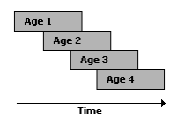
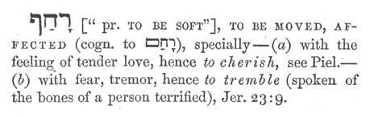
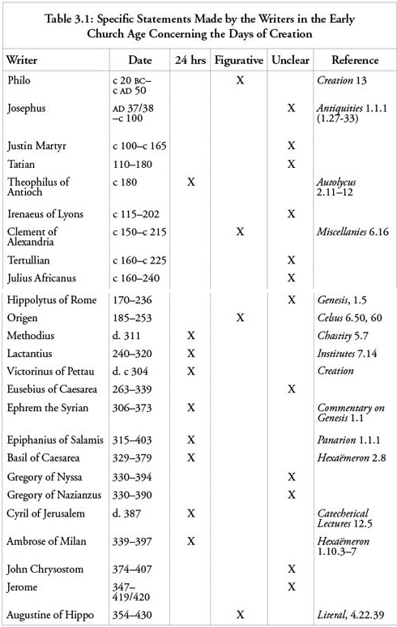
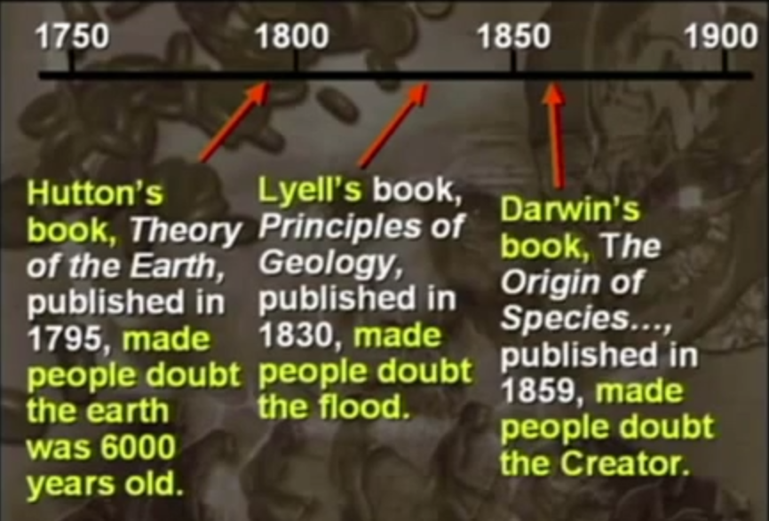

**v) Day-Age Interpretation**

Let’s go to the Day-Age Interpretation which is one that has been more widely held. The Day-Age Interpretation is one that has been suggested by a number of church fathers \[which?\] and other commentators down through history. It holds that the days are not literal 24-hour periods of time but rather these days are, in fact, long periods of time of unspecified duration. Though they are called days, they are not actually days; they are long time periods – *ages*. So what you have in the text is actually the description of God’s creation of life over six successive *ages* of indeterminate length.

As I pointed out, we do have in the text some suggestions that the days are not necessarily literal. You will recall what I had to say about God’s creation of the vegetation and the fruit trees on the third day where God commands the earth to bring forth these plants. We probably would be imagining things if we thought the author thought this was like a film being run on fast-forward – that it all happened in a 24-hour period of time. So I think there is some indication in the text that these days are not necessarily literal.\
*\[Ingmar\] And we discussed that accelerated growth is totally OK to believe in during creation week, making this an irrelevant objection.*\
On the other hand, the idea that the text intends us to take these days as six consecutive ages, especially ages of equal duration, is again something that is being read into the text rather than being read out of the text. I think there are indications in the text that the days may not be literal, but that doesn’t mean that it is intended to describe six consecutive ages especially of equal duration.

In fact, again, insofar as those who propose the Day-Age Interpretation are motivated by modern science to embrace this view, it really still does not fit with what modern science says in many respects. For example, the evidence doesn’t support the view that certain forms of life did not appear on the scene until the previous age was over. It is not as though you had to wait for one age to be complete before the animals or the plants in the next age came into existence. To give a specific example, according to the scientific evidence, terrestrial life appeared long before birds appeared on the scene. Yet, the text has birds being created during the third age prior to the creation of land animals in the fourth age. So you actually had birds before you had terrestrial life and that is completely contrary to the fossil record and the scientific evidence.[**2**](http://www.reasonablefaith.org/defenders-2-podcast/transcript/s9-05#_ftn2) Some interpreters have tried to escape this difficulty by saying perhaps the ages are not really consecutive ages. Maybe they are overlapping so that, for example, you would have age 1 and then you would have age 2 which might begin midway through age 1 and then age 3 and then age 4 so that you could have animals appearing midway through the previous age even though they are described as being in the succeeding age (see Figure 1).

Figure 1 - Overlapping Day-Ages

But I think we have to say that this hypothesis is clearly a contrivance which is trying to save the accuracy of the text and bring it into line with modern scientific evidence. It would be hopeless to try to discern in the text itself any suggestion that these days, or ages, are not consecutive. Not one after another but somehow begin in the middle of each other and continue. It is clearly, again, trying to read modern science back into the text and to make the text conform to modern science.

So while I would say that the Day-Age Interpretation is certainly a possibility – it is a possibility that the author did want us to think of this as six consecutive ages – nevertheless, apart from the fact that the days aren’t necessarily literal, there really isn’t much support in the text for thinking that the days are meant to represent ages. So if there are other interpretations that take the days non-literally as well, we’ll have to compare the Day-Age Interpretation with these other non-literal interpretations to try to discern which one is the most plausible interpretation of the text. But merely saying that the days aren’t literal doesn’t itself imply that the author intended us to be thinking of six consecutive ages during which things were created on earth.\
*\[Ingmar\] The only reason Craig gave us here for justifying non-literal is his problem with accelerated growth. So that is the strongest reason in his mind, but it actually is a very weak one.*

*Question:* I understand that when a verse reads “and there was evening and then morning” that this can mean there is a beginning of the age, or time, and there was an ending of the time. So that kind of shoots this steps idea or crossing over of ages \[*he is referring to Figure 1.*\]

*Answer:* You mean when it says “there was evening then there was morning” that that would suggest this is the evening and so the morning of the next age would begin right after it. That would seem to be the natural interpretation. If I understand you correctly, when you have age 1 then it says “and it was evening and it was morning, one day” and then the next day starts. And then it was evening and it was morning and then that was the next day. So the ages look consecutive, don’t they? I think clearly this idea \[*referring to Figure 1 and the overlapping of the ages*\], though clever, is really ad hoc or contrived. The natural language, I think, would be such as you have said.

*Followup:* So you are agreeing there are a beginning point and an end point to the verses?

*Answer:* Right, they look like consecutive ages. If these are ages, they would look consecutive to me and not this sort of staggered set of ages.

*Question:* The thought occurred to me that the Sabbath starts in the evening. Not the morning. So it goes from evening to morning, right? Is that why the Jewish faith took that position – because of what the Scripture says about evening and morning?

*Answer:* I would say it is rather the reverse. I think the reason that the Genesis narrative is written in terms of “it was evening and it was morning” is because this reflects the later Jewish ritual way of counting days where the day starts at 6pm in the evening with the setting of the sun and then it ends the next day at the setting of the sun. So the days don’t run as we think of starting in the morning at dawn. It goes from dusk to dusk rather than from morning to morning as we do in our Western culture. The narrative reflects that practice.

*Followup:* You are saying that the Jewish people believe that the day starts at sundown?

*Answer:* Right.[**3**](http://www.reasonablefaith.org/defenders-2-podcast/transcript/s9-05#_ftn3)

Day-Age Genesis Interpretation from Reasons to Believe

**Day 1\
[1](http://www.studylight.org/desk/?q=ge%201:1&t1=en_hcs&sr=1) In the beginning God created the heavens and the earth. [2](http://www.studylight.org/desk/?q=ge%201:2&t1=en_hcs&sr=1) Now the earth was formless and empty, darkness covered the surface of the watery depths, and the Spirit of God was hovering over the surface of the waters.**

Most people read the Genesis creation account without using the scientific method and, therefore, make assumptions that are not supported by the text. For example, the first rule of the scientific method is to establish the initial conditions, or the frame of reference. [Genesis 1:2](http://biblia.com/bible/nasb95/Genesis%201.2) clearly states that the frame of reference is "the surface of the waters" of the earth. Most people have made the mistake of assuming the frame of reference of Genesis 1 is heaven or somewhere above the earth.\
*\[Ingmar\] the surface of the waters is where the Holy spirit hovered. Father and son probably had a different frame of reference.*

What does the text specifically say? The heavens (universe, solar system, sun, earth, etc.) were already created before the first "day" ([Genesis 1:1](http://biblia.com/bible/nasb95/Genesis%201.1), ~14 x 10e9 years ago).\
*\[Ingmar\] it does not say “sun and stars”, only “heavens”. Claim that that means sun and stars also is interpretation beyond the text.\*
\
Science tells us that the entire planet was covered in a global sea soon after its creation ([3](http://www.godandscience.org/apologetics/day-age.html#n03)). In other verses, the Bible says that the earth is controlled by the heavens, refuting geocentrism ([4](http://www.godandscience.org/apologetics/day-age.html#n04)).\
*\[Ingmar\] Job 38:33 "Do you know the ordinances of the heavens, or fix their rule over the earth?" why would that refute geocentrism? The heavens refers to the spiritual realm where God dwells, so it does not relate to geocentrism at all. It just states that God and the angels control the earth. And even if, the stars controlling the earth could still be all around the earth with the earth in the middle. So this verse does not do anything for or against geocentrism.*\
\
In [Genesis 1:2](http://biblia.com/bible/nasb95/Genesis%201.2), God was "hovering or brooding" over the seas of the newly formed earth (4.4-3.8 x 10e9 years ago, [5](http://www.godandscience.org/apologetics/day-age.html#n05)). We know from science this is where the first unicellular life forms first appeared ([6](http://www.godandscience.org/apologetics/day-age.html#n06)). The Hebrew word, *rachaph*, translated as "hovering or brooding" is used only twice in the Old Testament. The second reference is to an eagle caring for its young ([7](http://www.godandscience.org/apologetics/day-age.html#n07)). Therefore, it seems likely that the use of the word *rachaph* in [Genesis 1:2](http://biblia.com/bible/nasb95/Genesis%201.2) may be referring to God creating the first life forms in the sea.\
\
\[Ingmar\] that is stretching this word a lot. According to the blue letter bible it is translated as:\

*It is used not twice but 3x in the Bible:\
hover/[move](http://www.blueletterbible.org/search/preSearch.cfm?Criteria=move*+H7363) (1x), [flutter](http://www.blueletterbible.org/search/preSearch.cfm?Criteria=flutter*+H7363) (1x) [shake](http://www.blueletterbible.org/search/preSearch.cfm?Criteria=shake*+H7363) (1x),\*

<table>
<colgroup>
<col style="width: 0%" />
<col style="width: 12%" />
<col style="width: 87%" />
</colgroup>
<thead>
<tr>
<th></th>
<th><a href="http://www.blueletterbible.org/Bible.cfm?b=Gen&amp;c=1&amp;v=2&amp;t=ESV#s=1002">Gen 1:2</a></th>
<th>The earth was without form and void, and darkness was over the face of the deep. And the Spirit of God was <strong>hovering</strong> over the face of the waters.</th>
</tr>
</thead>
<tbody>
<tr>
<td></td>
<td><a href="http://www.blueletterbible.org/Bible.cfm?b=Deu&amp;c=32&amp;v=11&amp;t=ESV#s=185011">Deu 32:11</a></td>
<td>Like an eagle that stirs up its nest, 
that <strong>flutters</strong> over its young, 
spreading out its wings, catching them, 
bearing them on its pinions,</td>
</tr>
<tr>
<td></td>
<td><a href="http://www.blueletterbible.org/Bible.cfm?b=Jer&amp;c=23&amp;v=9&amp;t=ESV#s=768009">Jer 23:9</a></td>
<td>Concerning the prophets: 
My heart is broken within me; 
all my bones <strong>shake</strong>; 
I am like a drunken man, 
like a man overcome by wine, 
because of the LORD 
and because of his holy words.</td>
</tr>
</tbody>
</table>

*None of that really sounds like creating first life forms is the water. And of course day 5 is dedicated to creating life in the waters. None of it suggests that there was already life in it for billions of years before that.*

**Day 1 (continued)**

**[3](http://www.studylight.org/desk/?q=ge%201:3&t1=en_hcs&sr=1) Then God said, “Let there be light,” and there was light. [4](http://www.studylight.org/desk/?q=ge%201:4&t1=en_hcs&sr=1) God saw that the light was good, and God separated the light from the darkness. [5](http://www.studylight.org/desk/?q=ge%201:5&t1=en_hcs&sr=1) God called the light “day,” and He called the darkness “night.” Evening came, and then morning: one day.**

Both science and the Bible ([8](http://www.godandscience.org/apologetics/day-age.html#n08)) have told us that at the earth's creation, it was covered with a dense layer of clouds and gases which would have made it dark at its surface. [Genesis 1:2](http://biblia.com/bible/nasb95/Genesis%201.2) says, "darkness was over the surface of the deep." Next, God removed much of the cloud cover, when He stated, "Let there be light" ([Genesis 1:3](http://biblia.com/bible/nasb95/Genesis%201.3)) This was the light of the Sun (already created) which now "separated light from darkness" ([Genesis 1:4](http://biblia.com/bible/nasb95/Genesis%201.4)). It is very clear from the text that the sun had already been created and the earth was rotating on its axis, since there was light (day) and darkness (night) ([Genesis 1:5](http://biblia.com/bible/nasb95/Genesis%201.5)).

*\[Ingmar\] that is not clear at all. It easily could have been other directional light that God commanded into existence.\
\*
**Day 2**

**[6](http://www.studylight.org/desk/?q=ge%201:6&t1=en_hcs&sr=1) Then God said, “Let there be an expanse between the waters, separating water from water.” [7](http://www.studylight.org/desk/?q=ge%201:7&t1=en_hcs&sr=1) So God made the expanse and separated the water under the expanse from the water above the expanse. And it was so. [8](http://www.studylight.org/desk/?q=ge%201:8&t1=en_hcs&sr=1) God called the expanse “sky.” Evening came, and then morning: the second day. [9](http://www.studylight.org/desk/?q=ge%201:9&t1=en_hcs&sr=1) Then God said, “Let the water under the sky be gathered into one place, and let the dry land appear.” And it was so. [10](http://www.studylight.org/desk/?q=ge%201:10&t1=en_hcs&sr=1) God called the dry land “earth,” and He called the gathering of the water “seas.” And God saw that it was good.**

[Genesis 1:6-10](http://biblia.com/bible/nasb95/Genesis%201.6-10) describe the initiation of a stable water cycle ([9](http://www.godandscience.org/apologetics/day-age.html#n09)) and formation of continents ([10](http://www.godandscience.org/apologetics/day-age.html#n10)) through tectonic activity (~2.7 x 109 years ago) ([11](http://www.godandscience.org/apologetics/day-age.html#n11)).\
*\[Ingmar\] the stable water cycle is not mentioned here. Just imposed on the text. And tectonic activity as described by popular science is a multi-billion year process.*

**Day 3**

**11 Then God said, “Let the earth produce vegetation: seed-bearing plants, and fruit trees on the earth bearing fruit with seed in it, according to their kinds.”\[5\] And it was so. 12 The earth brought forth vegetation: seed-bearing plants according to their kinds and trees bearing fruit with seed in it, according to their kinds. And God saw that it was good. 13 Evening came, and then morning: the third day.**

Plant life was created on the third day ([Genesis 1:11-13](http://biblia.com/bible/nasb95/Genesis%201.11-13), ~1.0 x 10e9 years ago). These verses are probably the strongest argument for the day-age interpretation. The verse says quite clearly that the earth sprouted (or brought forth) vegetation and fruit trees bearing fruit. The English word translated "vegetation" on the third day comes from the Hebrew word *deshe'*, which refers to small plants, such as grasses and herbs. The other word, *‛eśeb*, translated "plants" is even more generic, referring to any kind of green plant. So, the "day" encompasses the time from the formation of the first plants until the formation of the angiosperms. The process described is clearly similar to what we see today. Fruit trees take years to bear fruit, testifying that the third "day" could not possibly be just 24 hours long, as claimed by young earth creationists. Recent scientific evidence shows that plant life began on the land ~1 billion years ago ([12](http://www.godandscience.org/apologetics/day-age.html#n12))

*\[Ingmar\] So this is the strongest argument: “I cannot believe God can command accelerated growth” ? Quite weak.*

**Day 4**

**14 Then God said, “Let there be lights in the expanse of the sky to separate the day from the night. They will serve as signs for festivals and for days and years. 15 They will be lights in the expanse of the sky to provide light on the earth.” And it was so. 16 God made the two great lights—the greater light to have dominion over the day and the lesser light to have dominion over the night—as well as the stars. 17 God placed them in the expanse of the sky to provide light on the earth, 18 to dominate the day and the night, and to separate light from darkness. And God saw that it was good. 19 Evening came, and then morning: the fourth day.**

Next the translucent cloud layer was removed so that the sun, moon and stars shown through.\
Notice the unusual construction in [Genesis 1:14](http://biblia.com/bible/nasb95/Genesis%201.14) which states, "Then God said, 'Let there be lights in the expanse of the heavens to separate the day from the night, and let them be for signs, and for seasons, and for days and years;'" "Let there be" is an unusual way to describe *de novo* creation (see also verse 1:3). I believe that at this point God removed the translucent cloud cover from the planet to allow the stars, moon, and Sun to be seen from the surface of the earth (the frame of reference of all Genesis 1).\
*\[Ingmar\] So God first made the sun, but hid it from the earth surface with dust and clouds, then on day 1 he removed enough of the dust and clouds that we can have day and night, but not enough to be able to identify the sun moon and stars. And for 4 billion years the dust and clouds stayed that way. Until finally on day four, after 4 billion years God clears the sky some more so that one can see the sun and moon and stars. Now that is contrived!*

The text then reiterates what God had already done in [Genesis 1:1](http://biblia.com/bible/nasb95/Genesis%201.1) regarding the creation of the sun, moon, and stars.\
*\[Ingmar\] that means verse 16 is not talking about day 4 but about day 1, even though it is in the middle of the day 4 description. That is totally against all other writing structure in Genesis 1 and very ad hoc.*

The time frame describes events over days, seasons, and years - obviously more than 24 hours long.\
*\[Ingmar\] not at all. God made them as signs for days, seasons, and years. What they signify takes long, but the making of the sign does not have to take long at all.*

**Day 5**

**20 Then God said, “Let the water swarm with living creatures, and let birds fly above the earth across the expanse of the sky.” 21 So God created the large sea-creatures and every living creature that moves and swarms in the water, according to their kinds. \[He also created\] every winged bird according to its kind. And God saw that it was good. 22 So God blessed them, “Be fruitful, multiply, and fill the waters of the seas, and let the birds multiply on the earth.” 23 Evening came, and then morning: the fifth day.**

Birds ([13](http://www.godandscience.org/apologetics/day-age.html#n13)) (~70 x 10e6 years ago), whales ([14](http://www.godandscience.org/apologetics/day-age.html#n14)) (~50 x 10e6 years ago) and sea mammals ("swarms of living creatures," where "creatures" is the Hebrew word *nephesh*, referring to soulish animals - those that can form relationships with humans) were created on the "fifth" day ([Genesis 1:20-21](http://biblia.com/bible/nasb95/Genesis%201.20-21)), which would correspond to the end of the Cretaceous period/beginning of the Tertiary.\
The fifth day describes a period of time longer than 24 hours as swarms of living creatures are multiplying in the sea.\
*\[Ingmar\] God blessed them and commanded them to multiply. Indeed the process of multiplying over several generations is longer than 24h, but that is not what is described here. Described is God’s action of commanding them. That takes only a minute or less.*

**Day 6**

**24 Then God said, “Let the earth produce living creatures according to their kinds: livestock, creatures that crawl, and the wildlife of the earth according to their kinds.” And it was so. 25 So God made the wildlife of the earth according to their kinds, the livestock according to their kinds, and creatures that crawl on the ground according to their kinds. And God saw that it was good.**

On the sixth day God created the "beasts of the earth" (in [Genesis 1:25](http://biblia.com/bible/nasb95/Genesis%201.25) the Hebrew word is *chayyah*, which is best translated as "wild animal," usually referring to carnivorous mammals ([15](http://www.godandscience.org/apologetics/day-age.html#n15)) (the extinct families *Miacidae* and *Viverravidae*, appeared ~50 x 106 years ago or current families *Canidae*, *Felidae*, *Mustelidae*, and *Viverridae* appeared ~30 x 106 years ago )

*\[Ingmar\] wild carnivorous animal is a wild stretch of the word:*

*chay Outline of Biblical Usage:\
adj: living, alive, green (of vegetation), flowing, fresh (of water), lively, active (of man), reviving (of the springtime)\
n m: relatives, life (abstract emphatic), life sustenance, maintenance\
n f: living thing, animal, life, appetite, revival, renewal, community*

*And on the same day 6 in verse 30 God said:* **30 for all the wildlife of the earth, for every bird of the sky, and for every creature that crawls on the earth—everything having the breath of life in it. \[I have given\]\* every green plant for food.” And it was so.\**
*That clearly states that there were no carnivorous animals on day 6, only vegetarians.*

and the cattle (the Hebrew word is *behemah*, from which we get the word behemoth, the artiodactyls (large grazing mammals) appeared ~15 x 106 years ago) and the rodents (mammals that "creep on the ground"). Therefore, the wild and domesticated mammals and rodents were created on the sixth day.

**Day 6 (continued)**

**26 Then God said, “Let Us make man in Our image, according to Our likeness. They will rule the fish of the sea, the birds of the sky, the livestock, all the earth, and the creatures that crawl on the earth.” 27 So God created man in His own image; He created him in the image of God; He created them male and female.**

The last creation of God was mankind, who was also created at the end of the sixth day. What about humans and three million year old fossil remains of bipedal [primates](http://www.godandscience.org/apologetics/day-age.html)? I believe in a literal Adam and Eve, although I do not believe they lived millions of years ago. The Bible indicates that Adam and Eve had a relationship with God (Genesis 2-3) and the text says that unique among all the animals, humans are endowed with a spirit (Hebrew, *ruach*, Greek, *pneuma*), by which they are able to communicate with and love God. Scientists have found no evidence of religious artifacts before about 25,000 to 50,000 years ago ([16](http://www.godandscience.org/apologetics/day-age.html#n16)), which is the point at which I propose God created Adam and Eve. The Bible states that the covenant and laws of God have been proclaimed to a "thousand generations" ([17](http://www.godandscience.org/apologetics/day-age.html#n17)). A biblical generation, described as being 40 years, would represent at least 40,000 years of human existence. However, since the first dozen or more generations were nearly 1,000 years, this would make humans nearly 50,000 years old, which agrees very well with dates from paleontology and molecular biology (see [Descent of Mankind Theory: Disproved by Molecular Biology](http://www.godandscience.org/evolution/descent.html)). Therefore, I believe that bipedal [primates](http://www.godandscience.org/apologetics/day-age.html) that existed before Adam and Eve, were just part of the animal kingdom, and were not endowed with the characteristics that make humans distinct from animals.

**"Know therefore that the LORD your God, He is God, the faithful God, who keeps His covenant and His loving kindness to a thousandth generation with those who love Him and keep His commandments;" (Deuteronomy 7:9)**

**Remember His covenant forever, The word which He commanded to a thousand generations, (1 Chronicles 16:15)**

**He has remembered His covenant forever, The word which He commanded to a thousand generations, (Psalm 105:8)**

*\[Ingmar\] None of these three verses states that the thousand generations have already passed. They just say how long God keeps a covenant. In addition it is not clear that the 1000 generations are the exact end of God’s keeping the covenant. It might very well be a symbolic meaning here of “God keeps his covenant much longer than any human, with no end in sight, e.g. forever.” The only reason to consider that the covenant has ended is to see it as old vs new testament covenant.\
But then, with 1000 generations from Adam to Jesus, the genealogies in the Gospels would be 97% incomplete. That is quite unreasonable. And the genealogies are clear and easy to understand, they should be the ones helping to interpret the harder 1000 generation passages. Thus most likely 1000 generations means just “really long”.*

Historically, it is interesting to note that many of the church fathers and the rabbis down through history did not take Genesis 1 to refer to literal 24-hour days. People like Augustine *\[Safarti\] He believed in instant creation, and \<6000 years since then* and Origen *\[Safarti\] He did not say long ages, did think Genesis was allegory* and Justin Martyr *\[Safarti\] NO* and others of the church fathers took these to be not 24-hour periods of time. There has always been, among the church fathers and among Jewish rabbis, a latitude of interpretation – a recognition of alternative interpretations. Some \[nine\] of the church fathers and rabbis did take this passage literally, but others \[four\] took it figuratively. *\[Ingmar\] Note, Craig is mentioning 24h days and figuratively, but not literal long ages. Actually, none of the church fathers believed in literal long ages, making the idea of billions of year long days a novel post Darwin interpretation, thus likely not in the text but forced onto it.*

\[Ingmar\] The best alternative to a 24h day interpretation would be a dual meaning interpretation. That the days were indeed 24h days, but that in addition they have symbolic meaning as well. At least as pattern for the human work week, and maybe as pattern for the crop cycle, and maybe other patterns. But I see no evidence for a purely symbolic meaning, nor for a meaning of millions and billions of years.

**\**

1)  **Day-Age Interpretation**

2)  **Revelation-Day Interpretation**

3)  **Literary Framework Interpretation**

4)  **Functional Creation Interpretation**

5)  **Hebrew Creation Myth Interpretation**

<!-- -->

1)  **Summary and Implications**

<!-- -->

1)  **Concord with Evolutionary Biological Theories**

    1)  **Introduction**

    2)  **Compatibility of Biblical Theism With Evolutionary Biology**

        1)  **Random Mutations**

        2)  **Methodological Naturalism**

    3)  **Origin of Life**

    4)  **Evolution of Biological Complexity**

        1)  **Distinguishing the Different Senses of “Evolution”**

        2)  **Common Ancestry**

        3)  **Scientific Extrapolation**

        4)  **Mechanisms of Biological Evolution**

2)  **Theological Synthesis**

    1)  **Scientific Considerations**

    2)  **Theological Considerations**

    3)  **Putting It All Together**
