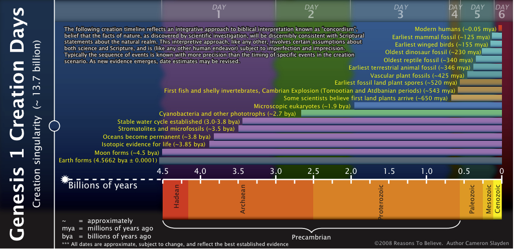
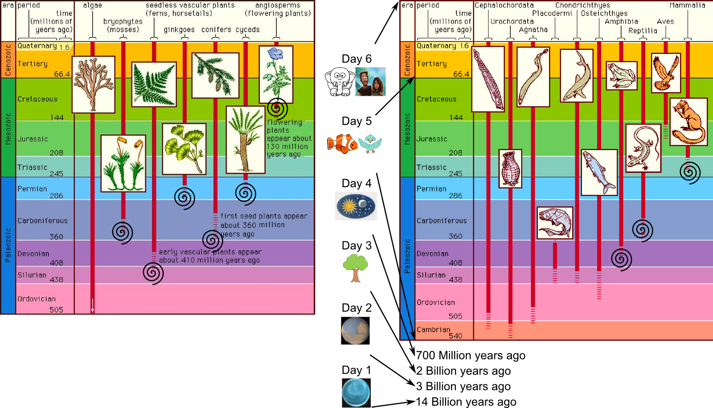
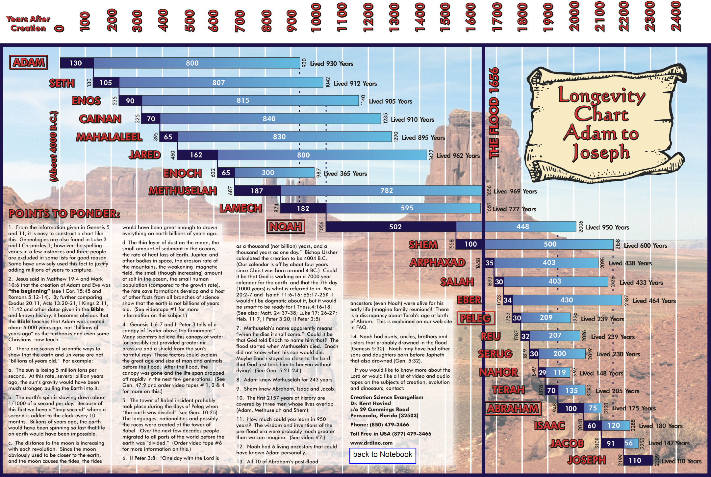
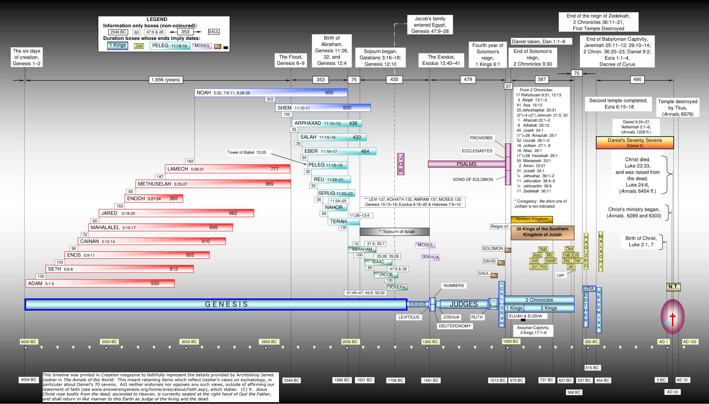
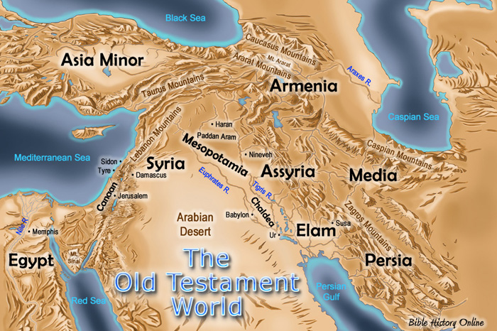
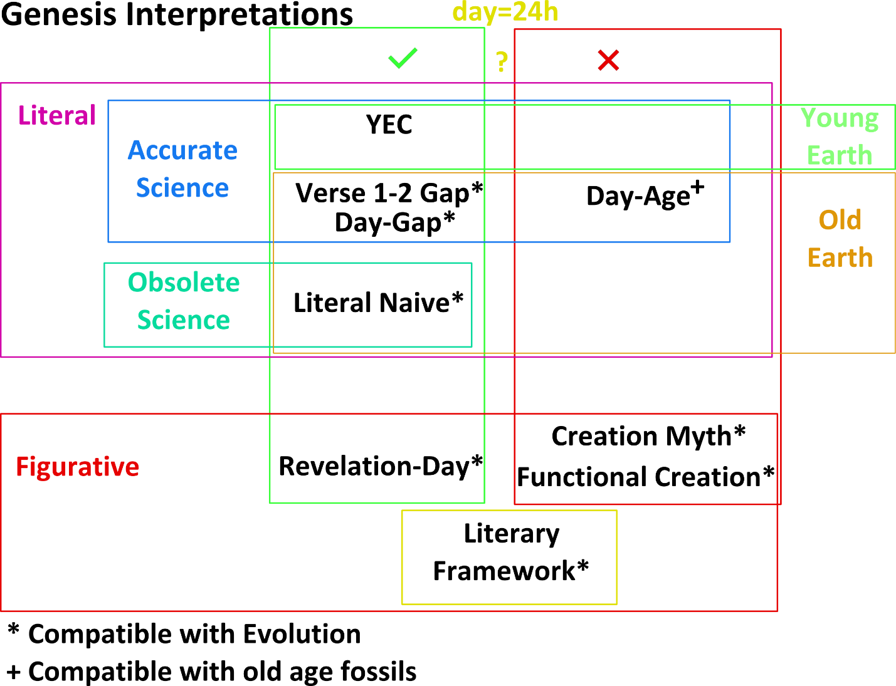
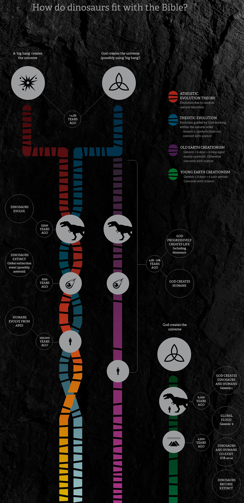
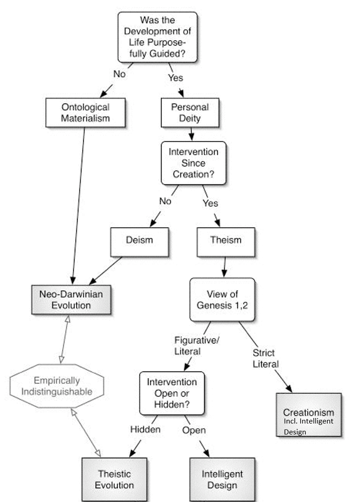

1)  **Interpretation of Genesis 1**

Exegesis – figuring out what the text means on its own

Eisegesis – adding one’s own ideas into the text

Concordism – reading modern science back into the text.

1)  **Hermeneutical Principles**

Need to read and interpret any writing, especially Genesis, according to the literary genre the book was written in and within the historical context it was written in. How would the author and his original audience have understood the text?

Genesis has an historical account, careful wording, high use of structure, and symbolic meaning all in the same book, even all in chapter 1: An artful combination of literal and symbolic aspects.

Historical: Adam and Eve were real historical people with a lineage of descendants all the way to Jesus. God was a real historical creator, making all the stuff during creation week.\
Symbolic: Adam = man, Eve = mother of all living, God breathing the breath of life into Adam, God walking with Adam

One rule of thumb is “when the plain sense makes common sense, take no other sense, lest it be nonsense”.

2)  **Rival Interpretations**

    1)  **Literal naïve 24h-day Interpretation**

God created everything in 6 literal 24h days, and Moses described it using the limited scientific knowledge of his time.\
Problems: Moses was not there. How could he describe anything of it in his own words? The content of Genesis 1 only makes sense if it is God’s account that was revealed to Moses. And God does not have limited scientific knowledge.

2)  **Literal accurate 24h-day Interpretation, Young Earth Creationism**

God created everything in 6 literal 24h days, and Moses recorded God’s historical accurate account of this, as it was revealed to him by God.

Yom – 24h or age? Always 24h when with a number (359x in OT), always 24h when with evening and morning (19x in OT)\
[Zechariah 14:7](https://www.biblegateway.com/passage/?search=Zechariah%2014&version=HCSB); [Hosea 6:2](https://www.biblegateway.com/passage/?search=Hosea%206&version=HCSB);

Could not have been expressed more explicitly, but many other option for age or long time were available.

Naming all few hundred animals walking past Adam in one day was easy in 1-2h.

Accelerated growth of plants on day three is no problem.

Light and dark for day and night before the sun is easy, with God making directional light on day 1.

Standard interpretation was always 24h day. Never before Darwin was in a long time. Only Augustine and followers thought it was symbolic.

In the 10 commandments the creation week is used as example for our workweek, and why to keep the Sabbath. That only makes sense if creation week had normal 24h days. [Exodus 20:9-11](https://www.biblegateway.com/passage/?search=Exodus+20%3A9-11&version=HCSB); [Exodus 31:12-17](https://www.biblegateway.com/passage/?search=Exodus+31%3A12-17+&version=HCSB);

**Most reasonable interpretation: There are two meanings in creation week:\
(1) The historical accurate account, that God created for six 24h days, then rested for one 24h day.\
(2) The symbolic meaning of being an example for our work week.**

3)  **Gap Interpretation** (Thomas Chalmers 1780-1847, Scofield Reference Bible 1909)

Between Genesis verses 1 and 2 is a billions of years long gap in which Satan fell and God made and destroyed all the animals we find in the fossil record today. After that the six creation days were literal 24h-days.

This would explain the fossil record and the long ages measured for them. But not for the age of the starlight, since God recreated those as well. So it does not really match popular scientific accounts. And more importantly, there is nothing in the local or global Bible context suggesting that this happened.

And it includes in the “very good” state of the world on day six that Satan was already fallen, that death and disease were already in the world.

4)  **Day-Gap Interpretation**

Between Genesis verses 1 and 2 there is no gap, and the six creation days were 24h-days, but between those six days were gaps of billions or millions of years.

This would explain the claimed old age of fossils, but not for the age difference between the first arrivals of certain types of fossils, e.g. dinosaurs and mammals would be created on the same day, but their fossil ages are millions of years different. And all birds were made by God before dinosaurs, but their fossils are dated more recent. So it does not really match popular scientific accounts. And more importantly, there is nothing in the local or global Bible context suggesting that this happened.

And it includes in the “very good” state of the world on day six that death and disease were already in the world.

This view is held by John Lennox, and presented in his book, *Seven Days that Divide the World\*
However, he does not actually defend why that view fits with the actual text in Genesis 1.\
See <http://creation.com/review-lennox-seven-days>

5)  **\**

6)  **Day-Age Interpretation**

God created everything in 6 long periods of time - ages. 

Day 1: 14-3 billion years ago. v1: Sun moon and stars are made. v2: The frame of reference is “the Spirit of God was hovering over *the surface of the waters”* thus, the sun, that was already created, could not be seen through dust and clouds. On this day first simple single cell life was created. v3,4,5: God made light by removing dust and some of the clouds, enough for bright-isch days, but not enough to actually see the sun, moon and stars.

Day 2: 3-2 Billion years ago: initiation of a stable water cycle (incl. rain), continent formation through tectonics

Day 3: 2-0.7 Billion years ago: any kind of green plant

Day 4: 700-600 Million years ago: Sun, moon and stars are made visible by clearing up the clouds, dedication as signs for days, season, and years.

Day 5: 700-60 Million years ago: Fish and birds were made in the form we have them as species today

Day 6: 60 Million to 50 Thousand years ago: mammals and Adam & Eve.

Day 7: 50,000 years till today: God is still resting, the 7th day has not yet ended

**Consecutive or Overlapping days: “The opinions differ within RTB”:** That means there are really good arguments against long+consecutive and also against long+overlapping. The first fails because then plants would appear in the fossil record on days 3, 4, and 5, fish and birds on days 5 and 6, land animals on days 5 and 6. The second fails because “evening and the morning” clearly speaks of the beginning and end of the days before and after. And the work week analogy in Exodus does not allow for overlap either.

**Day 1**: creation of sun, moon and stars is read into “made the heavens and the earth”. It is not clear from the text that when making the heavens God also filled that space with sun, moon and stars. Creation of first single cell life is completely without textual support, but also not explicitly denied by the text either. Why interpret this way? “RTB: Because only then the day-age interpretation works“\
Why is “hovering over the surface of the waters” the frame of reference for the complete creation week? “RTB: Because only then the day-age interpretation works“: The principle at work is: assume the science interpretation of history in the day-age theory is correct, then find ways to make the Bible interpretation fit – even if it has to be stretched LOT. This is most obvious with the word for day: yom:

yom alone can mean 24h day or age, which is defined by the context.\
The general context in creation week is 24h.\
… In addition, with the number as immediate context it means 24h all of the 359 times in the Bible.\
… In addition when with evening morning it 24h all of the 29 times in the Bible.\
… In addition until 200 years ago nobody (incl. Church fathers) thought of it of millions of years, and until 75 years ago nobody thought of it of billions of years.\
… In addition it would break the match to the work week & Sabbath command in Exodus\
… In addition it would make Jesus lie in *Matthew 19:4 and Mark 10:6: From the beginning of Creation God made them male and female.*\
… In addition, if the day-age theory was correct and only modern science can reveal the true meaning of Genesis, then Moses, David, and the apostles were not able to understand Genesis correctly.

**Day 2**: A stable water cycle would include rain and therefore cloudy and non-cloudy times. How can it be overcast and cloudy for hundreds of millions of years? Never clear enough to see the sun? How could there have been rain if Gen 2:5 tells us that by the time he made Adam and Eve there was no rain yet?

**Day 3**: all kinds of plants are finished by 700 Million years ago? What about the mosses, ferns, ginkgoes, conifers, cycads and flowering plants that all only have fossils much more recent than that, as recent as 130 Million years (Day 5)?\
How did pollination work when plants need animals for that?\
Plate tectonics means continents are formed via horizontal movement. v9 tells us the water moved and the land appeared. Sounds more like the land did not move horizontally by thousands of kilometers. And how do we get marine fossils on Mount Everest if mountains where formed before the flood?

**Day 4**: v14,15 God designates sun, moon & stars as signs (let there be … for …). V16 (And God made) is telling us He did it. V17,18 affirms they were made as the designated signs. For the day age interpretation to work, we must believe v14,15 happened on **day 4**, v16 on **day 1**, v17,18 on **day 4**. And that in all the 6 creation days this is the only one where in the middle of its description one verse jumps to describe what happened 5 billion years earlier?!

**Day 5**: Fish and birds as species today: but we can observe speciation today! This cannot be right. Creation of original kinds that speciate after makes more sense.\
Also birds fossils start after land fossils, so it does not match the popular scientific dates.

**Day 6**: mammals only starting 60 million years ago, but mammal fossils are as old as 250 million years!? Adam 200-50,000 years ago excludes Neandertals (300,000 years ago) from humanity, but “humans are less diverse than many other species and Neandertal still fits in \[to modern man variability\] \[…\] two living chimpanzees can be farther from one another than Neandertal is from modern human”

And for the time of Adam to today day-age has up to 194,000 years extra compared to YEC. Those extra years cannot come from the Patriarchs, because for those we have exact ages at birth of each son:

Nor can the extra gap be from the time since Jesus. So it must be between Joseph and Jesus. But Joseph was in Egypt, and secular archeology does not allow for Egyptian settlements by the Nile River earlier than 6000 BC. So we can accommodate for at most 2000 extra years, not 194,000.

But even that much wiggle room really does not exist. There were only 38 generations from Joseph to Jesus according to Matthew chapter 1. At 45 years per generation that puts Joseph at 1700 BC. Here is what Archbishop James Ussher charted more detailed:

**Vegetarian animals:\**
*chayyah* is not a *wild carnivorous animal*, see blue letter bible: adj living, alive\
n m: relatives, life (abstract emphatic), life, sustenance, maintenance\
n f: living thing, animal, life, appetite, revival, renewal, community

Gen 2:29 God also said, “Look, I have given you every seed-bearing **plant** on the surface of the entire earth, and every tree whose fruit contains seed. This **food will be for you**, 30 **for** **all the wildlife** of the earth, for every bird of the sky, and for every creature that crawls on the earth—everything having the breath of life in it. \[I have given\] every green **plant for food**.” And it was so.\
Gen 9:3 Every living creature will be food for you; as \[I gave\]\* the green plants, I have given you everything.

So for humans Gen 2:29 commands plant food, and in Gen 9:3 this is expanded to plant and animal food. Hence God did not allow anything other than plant food in Gen 2:29. Gen 2:30 is right after 2:29 and has parallel content for animals, so for them it must have also been plants only. Being carnivores did not start until after the fall. But fossils show animals eating each other, so fossils cannot be from before the fall.

Thus: Day age teaching is wrong

**Day 7**: In the work week commandment in exodus God does not tell us to rest indefinitely after 6 days, but only for 1 day and does so by analogy to creation week. Thus day 7 must be over now. And all 7 days must be 24h each.

**Death at the fall:\**
Gen 2:17 but you must not eat from the tree of the knowledge of good and evil, for **when** you eat from it, you will certainly die.

Gen 3:2 The woman said to the serpent, “We may eat the fruit from the trees in the garden. 4 But about the fruit of the tree in the middle of the garden, God said, ‘You must not eat it or touch it, or you will die.’ ”

The **when** is **on-the-day (yom)**, a three word grammatical construct meaning **when** or **at the time** indicating the start of a process. Thus, this is an example where the context of yom makes it clear that it does not mean 24h. Thus there is no problem with Adam and Eve not dropping dead that day.

So then is the death penalty at the fall spiritual, physical, or both?

Rom 5:6 Jesus died (physically) 5:7 someone died (physically) 5:8 Jesus died (physically) 5:9 Jesus gave his life blood (physically) 5:10 Jesus died (physically) 5:11 Therefore, just as sin entered the world through one man, and **death** through sin, in this way **death** spread to all men, because all sinned. 5:14 Nevertheless, **death** reigned from Adam to Moses, even over those who did not sin in the likeness of Adam’s transgression.

… so the whole section talks about the same concept of death, and it clearly includes physical death. It may also include spiritual death. Therefore the death penalty in Genesis 2/3 must include physical death, too, but day-age teaches it is only spiritual.

Was there death before the fall?\
We all agree there was no human death before the fall, since Adam and Eve were the first humans. But with physical death as penalty it means without the fall Adam and Eve would have lived forever, contrary to day-age teaching.

**What about animal death?** Day-age teaching is that animals died for millions of years before the fall, and even before God said Gen 1:31 God saw all that He had made, and **it was very good**. Evening came, and then morning: the sixth day. Thus day-age attributes animal death, animal suffering, and natural disasters all to the state of “very good”.\
*Gen 3:14: “\[…\] to the serpent: \[…\] you are cursed more than any livestock and more than any wild animal \[…\]”* What changed for the livestock and wild animals? On the day-age view: Nothing!

On the 24h day young earth interpretation there was no animal death and no natural disasters during creation week. So when God said it was very good it really was. On this view animal death, suffering and natural disasters are all symptoms of a fallen world. Much more reasonable!

**There was no physical animal or human death before the fall, it was introduced as penalty for sin.**

**Thorns are a punishment for the first sin\**
Gen 3:17 And He said to Adam, “Because you listened to your wife’s voice and ate from the tree about which I commanded you, ‘Do not eat from it’: **The ground is cursed** because of you. You will eat from it by means of painful labor all the days of your life. 18 **It will produce thorns** and thistles for you, and you will eat the plants of the field.

Since there are fossils of plants with thorns those must have been formed after the fall, but day-age teaches they were created on day 3. That cannot be true.

**Local flood?** Why? Gen 7:19-23 sounds very global:\
[19](http://www.studylight.org/desk/?q=ge%207:19&t1=en_hcs&sr=1) Then the waters surged even higher on the earth, and **all** the **high** mountains under the **whole sky** were covered. [20](http://www.studylight.org/desk/?q=ge%207:20&t1=en_hcs&sr=1) The mountains were **covered** as the waters surged \[above them\]\* more than 20 feet.\[1\] [21](http://www.studylight.org/desk/?q=ge%207:21&t1=en_hcs&sr=1) **All** flesh perished—creatures that crawl on the earth, birds, livestock, wildlife, and **all** creatures that swarm\[2\] on the earth, as well as **all** mankind. [22](http://www.studylight.org/desk/?q=ge%207:22&t1=en_hcs&sr=1) **Everything** with the breath of the spirit of life in its nostrils—**everything** on dry land died. [23](http://www.studylight.org/desk/?q=ge%207:23&t1=en_hcs&sr=1) He wiped out **every** living thing that was on the surface of the ground, from mankind to livestock, to creatures that crawl, to the birds of the sky, and **they were wiped off the earth**. **Only** Noah was left, and those that were with him in the ark.

The mountains were **covered**: “RTB: covered means they got whet as the rain ran down on them.”\
Blue Letter Bible dictionary: to cover, conceal, hide; to cover, clothe; to cover, conceal; to cover (for protection); to cover over, spread over; to cover, overwhelm\
… does sound a lot more like submerged than just wet. Even Gleason Archer agrees (he allows long days)\
… if only local, what was the point of sending the animals? They would survive globally anyway. Why send local birds, they could fly to dry land. Why did Noah’s story not use one of the four possible words for a local flood? How could global have been mode more clear? Why did all church fathers think it was a global flood? Why did the water not run over the edges of Mesopotamia?

Paul Davis founding Day-Age proponent that abandoned belief in it in favor of YEC

And RC Sproul is now YEC, after favoring the frame work hypothesis before.

7)  **Revelation-Day Interpretation**

God created everything over long ages well before creation week. Then during the 6 literal consecutive 24h days of creation week He revealed to Moses what He did, each day revealing what we read for that day.

8)  **Literary Framework Interpretation**

Genesis 1 is not a record of what actually happened, but the literary framework within which God teaches us about himself and His creation. No chronology is implied in the day numbers.

It is claimed that one aim of this framework is to teach the theology of six days of work plus the Sabbath. This is back to front — Exodus 20: 8– 11 makes it clear that the Sabbath was based on the historical events of Genesis, not vice versa.

<table>
<colgroup>
<col style="width: 50%" />
<col style="width: 50%" />
</colgroup>
<thead>
<tr>
<th>1 In the beginning God created the <strong>heavens</strong> and the <strong>earth</strong>. 2 Now the earth was formless and empty, darkness covered the surface of the watery depths, and the Spirit of God was hovering over the surface of the waters. 3 Then God said, “<strong>Let there be light</strong>,” and there was light. 4 God saw that the light was good, and God separated the light from the darkness. 5 God called the <strong>light “day,”</strong> and He called the <strong>darkness “night.”</strong> Evening came, and then morning: the <strong>first day</strong>.</th>
<th>14 Then God said, “Let there be <strong>lights in the expanse of the sky</strong> to <strong>separate the day from the night</strong>. They will serve as signs for festivals and for days and years. 15 They will be <strong>lights in the expanse of the sky</strong> to provide light on the earth.” And it was so. 16 God made the two great lights—the greater light to have dominion over the day and the lesser light to have dominion over the night—as well as the stars. 17 God placed them in <strong>the expanse of the sky</strong> to provide light on the earth, 18 to dominate the day and the night, and to separate light from darkness. And God saw that it was good. 19 Evening came, and then morning: the <strong>fourth day</strong>.</th>
</tr>
</thead>
<tbody>
<tr>
<td>6 Then God said, “<strong>Let there be an expanse</strong> between the waters, separating water from water.” 7 So God made the <strong>expanse</strong> and separated the water under the <strong>expanse</strong> from the water above the <strong>expanse</strong>. And it was so. 8 God called the <strong>expanse “sky.”</strong> Evening came, and then morning: the <strong>second day</strong>.</td>
<td>20 Then God said, “Let the <strong>water</strong> <strong>swarm with living creatures</strong>, and let <strong>birds fly</strong> above the earth <strong>across the expanse of the sky</strong>.” 21 So God created the large <strong>sea-creatures</strong> and every living creature that moves and swarms in the <strong>water</strong>, according to their kinds. [He also created]* every winged <strong>bird</strong> according to its kind. And God saw that it was good. 22 So God blessed them, “Be fruitful, multiply, and <strong>fill the waters of the seas</strong>, and let the <strong>birds multiply</strong> on the earth.” 23 Evening came, and then morning: the <strong>fifth day</strong>.</td>
</tr>
<tr>
<td>Creation 
Mythoaeu9 Then God said, “Let the <strong>water</strong> under the sky be gathered into one place, and let the <strong>dry land</strong> appear.” And it was so. 10 God called the <strong>dry land “earth,”</strong> and He called the gathering of the <strong>water “seas.”</strong> And God saw that it was good. 11 Then God said, “Let the earth produce <strong>vegetation</strong>: seed-bearing plants, and fruit trees on the earth bearing fruit with seed in it, according to their kinds.” And it was so. 12 The earth brought forth <strong>vegetation</strong>: seed-bearing plants according to their kinds and trees bearing fruit with seed in it, according to their kinds. And God saw that it was good. 13 Evening came, and then morning: the <strong>third day</strong>.</td>
<td>24 Then God said, “Let the earth produce living creatures according to their kinds: <strong>livestock</strong>, creatures that crawl, and the <strong>wildlife</strong> of the earth according to their kinds.” And it was so. 25 So God made the <strong>wildlife</strong> of the earth according to their kinds, the <strong>livestock</strong> according to their kinds, and creatures that crawl on the ground according to their kinds. And God saw that it was good. 26 Then God said, “<strong>Let Us make man</strong> in Our image, according to Our likeness. They will rule the fish of the sea, the birds of the sky, the livestock, all the earth, and the creatures that crawl on the earth.” 27 So God created man in His own image; He created him in the image of God; He created them male and female. 28 God blessed them, and God said to them, “Be fruitful, multiply, fill the earth, and subdue it. Rule the fish of the sea, the birds of the sky, and every creature that crawls on the earth.” 29 God also said, “Look, I have given you every seed-bearing plant on the surface of the entire earth, and every tree whose fruit contains seed. This food will be for you, 30 for all the wildlife of the earth, for every bird of the sky, and for every creature that crawls on the earth—everything having the breath of life in it. [I have given]* every green plant for food.” And it was so. 31 God saw all that He had made, and it was very good. Evening came, and then morning: the <strong>sixth day</strong>.</td>
</tr>
</tbody>
</table>

9)  **Functional Creation Interpretation**

God created everything before creation week, then during the 6 literal consecutive 24h days of creation week He declared for the already existing stuff what their official purpose and function is, so that the world or the cosmos becomes his temple in which he takes residence finally on the seventh day.

<table>
<colgroup>
<col style="width: 24%" />
<col style="width: 23%" />
<col style="width: 23%" />
<col style="width: 28%" />
</colgroup>
<thead>
<tr>
<th colspan="4"><strong>Bring into existence causes</strong></th>
</tr>
</thead>
<tbody>
<tr>
<td>John Walton</td>
<td>Aristotle</td>
<td>Ingmar</td>
<td>Example</td>
</tr>
<tr>
<td>Material creation</td>
<td>Efficient cause</td>
<td>Build from parts</td>
<td>Building a house out of Legos</td>
</tr>
<tr>
<td></td>
<td>Material cause</td>
<td>The pieces of the whole</td>
<td>The Lego pieces</td>
</tr>
<tr>
<td></td>
<td>Formal cause</td>
<td>The design / pattern</td>
<td>The house blueprint</td>
</tr>
<tr>
<td>Functional creation</td>
<td>Final cause</td>
<td>The purpose / function</td>
<td>A home for Lego people</td>
</tr>
</tbody>
</table>

Walton: Genesis1 talks only a bout the last row: creating purpose / function. All others are not in Gen.1

bara: supposed to create only purpose / function, not bring into existence (wrong)

Verse1 is only a title (wrong)

All of these did NOT happen during creation week: the earth was formless and void, separation of light/dark, appearance of dry land, gathering of waters in the sees, son moon and stars being made, vegetation being brought forth, fish being made, birds being made, land animals being made, humans being made. – wow! What a stretch! And Walton calls that a literal interpretation!

Days 1-3 establish functions: needed to not have to believe in a firmament (that in concordism)\
(Walton teaches early in his book that concordism is bad)\
Days 4-6 establish the functionaries: e.g. sun and moon are functionaries for time measurement (why would that exclude their Efficient creation)

Day 7 is not a day of rest, because days 1-6 did create anything there was no need for rest. Instead rest means coming to reside in the universe as his temple.

Pro: Reminds us that God had a purpose in mind for everything He created

Con: totally misses the actual description in Genesis 1; has mislead common people (Amazon.com review of 40 year mature Christian: “Best Interpretation of Genesis I have ever read”; has mislead Christian scientists (Francis Collins, Human Gnome Director -\> NIH director)

10) **Hebrew Creation Myth Interpretation**

The creation story was not intended to be true, only the theological truths that it embodies are important. The creation days are there just to partition the narrative into sections.

The Egyptian theology has many gods and forming the earth out of preexisting stuff. Genesis was supposedly written to correct the theology only.

Genesis 1 was just a title: *wrong*\
The similarities from Egyptian stories and Genesis mean that Genesis copied from them: *wrong, and not even that similar*

1)  **Summary and Implications**

There are many different interpretations of Genesis 1. For each there is at least one otherwise well respected Christian leader defending it. And all of them are saved and will go to heaven. Thus this is not an issue that needs to be resolved before coming to Christ, and it is wise to avoid discussing it with non-Christians. However, many of the views are mutually exclusive, so they cannot be all true. Only YEC was able to answer all objections raised against it.

1)  **Concord with Evolutionary Biological Theories**

## The Theories

1)  **Creation** (mutation + natural selection + 1 × common design )

God created each kind ~6000 years ago. Since than mutation and natural selection have led to adaptation and species diversification, although the process has been losing DNA information content and gaining DNA errors.

2)  **Progressive Creation** (mutation + natural selection + ∞ × common design )

God created each species over millions of years. Since than mutation and natural selection have led to adaptation but not to species diversification.

3)  **Theistic Evolution, BioLogos** (mutation + natural selection + common descent + 1 × God)

God created the world with everything setup such that evolution would bring about mankind. He never got involved after setting it up.

4)  **Progressive Evolution** (mutation + natural selection + common descent + ∞ × God)

God created the world with everything setup such that evolution would bring about mankind. He miraculously caused beneficial mutations along the way, when regular natural processes were incapable of getting evolution to the next level.

5)  **Neo-Darwinian Evolution** (mutation + natural selection + common descent)

There is no God. Mutation and natural selection have led to adaptation and species diversification. This process, starting from the first living cell, over millions of years, led to all biological diversity we observe today.

**Methodological Naturalism, Scientism**: explain evidences with only natural causes\
**Metaphysical Naturalism**: all that exists is material only

**Engineering**: Creation of stuff for people using scientific knowledge\
**Science**: the systematic thinking of theories on how the world works\
**Operational science**: … through repeatable experiments (Physics, Chemistry)\
**Historical Science**: … through inference to the best explanation (Archeology, Forensics)\
**Evolution** (common descent) is part of Historical Science\
**Creation** (common design) is part of Historical Science

**Religion, Worldview**: ~~Study of God~~ A Belief that answers of origin, destiny, purpose, morality\
**Christianity**: is a religion\
**Atheism** (-\> **Evolutionism**): is a religion

1)  **Introduction**

2)  **Compatibility of Biblical Theism With Evolutionary Biology**

    1)  **Random Mutations**

    2)  **Methodological Naturalism**

3)  **Origin of Life**

4)  **Evolution of Biological Complexity**

    1)  **Distinguishing the Different Senses of “Evolution”**

    2)  **Common Ancestry**

    3)  **Scientific Extrapolation**

    4)  **Mechanisms of Biological Evolution**

<!-- -->

2)  **Theological Synthesis**

    1)  **Scientific Considerations**

    2)  **Theological Considerations**

    3)  **Putting It All Together\**
        **\**
        
